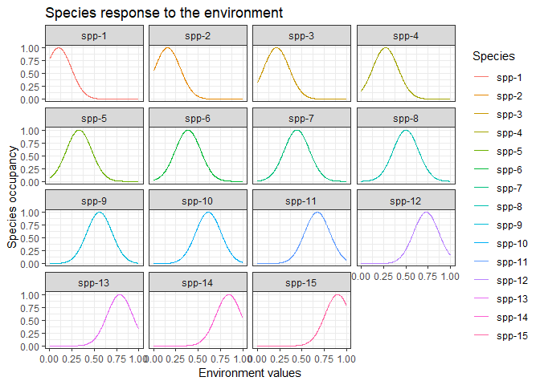
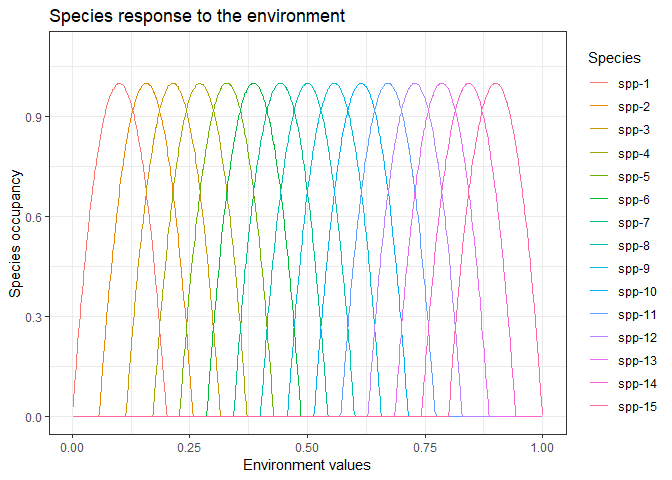
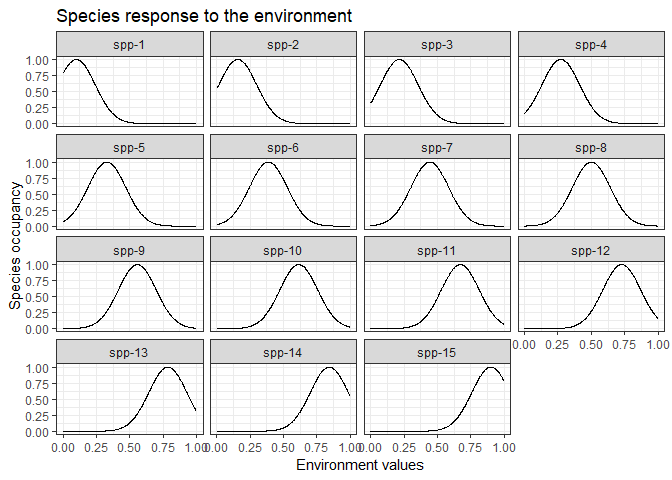
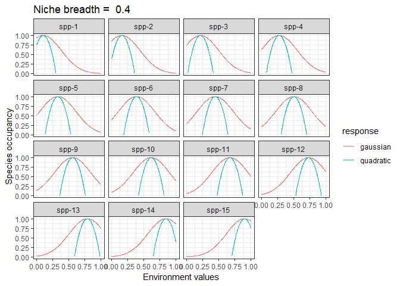
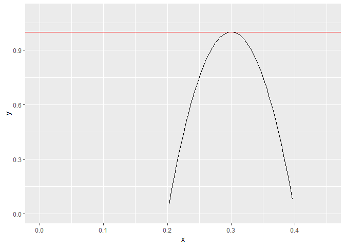

Gaussian vs quadratic term
================
Javiera Rudolph
March 5, 2019

``` r
# Environment -------------------------------------------------------------
# The effect of the environment on the local performance and colonization

S_f <- function(E, u_c, s_c) {
  R <- ncol(u_c)
  N <- nrow(E)
  D <- ncol(E)
  S <- matrix(1, nr = N, nc = R)
  for(i in 1:D){
    optima <- matrix(u_c[i,],nrow = N,ncol = R,byrow = TRUE)
    breadth <- matrix(s_c[i,],nrow = N,ncol = R,byrow = TRUE)^2
    S <- S*exp(-(E[,i]-optima)^2 / breadth)
  }
  return(S)
}
```

The original parameters

``` r
D <- 1
R <- 15

u_c <- matrix(nrow = D, ncol = R)
u_c[1,] <- seq(0.1, 0.9, length = R)

s_c <- matrix(0.2, nrow = D, ncol = R)

E <- readRDS("testingHMSCv2/outputs/fixedLandscapes/orig-no-seed-E.RDS")
```

Result: effect on environment on the local performance and colonization:

``` r
data <- S_f(E = E, u_c = u_c, s_c = s_c)
```

We get a matrix in which each row is a site, with it's environmental variable, and each column is a species. When I look at these, they don't look normal. So, now I'm confused.

``` r
hist(data[,3])
```



Edit the data structure so I can use ggplot:

``` r
longformatData <- as.data.frame(data, row.names = c(1:1000)) %>% 
  set_names(., c(paste0("spp-", 1:15))) %>% 
  mutate(., Evalues = E) %>% 
  gather(., key = "Species", value = "occupancy", -Evalues) %>% 
  mutate(., Species = factor(Species, levels = unique(Species)))
```

With organized data I can plot it and see by species:

``` r
longformatData %>% 
  ggplot(., aes(x = Evalues, y = occupancy, color = Species)) +
  geom_line() +
  labs(title = "Species response to the environment",
       x = "Environment values", 
       y = "Species occupancy") +
  theme_bw()
```



Same data, different visualization:

``` r
longformatData %>% 
  ggplot(., aes(x = Evalues, y = occupancy, group = Species)) +
  geom_line() +
  labs(title = "Species response to the environment",
       x = "Environment values", 
       y = "Species occupancy") +
  theme_bw() +
  facet_wrap(~Species)
```



Now, the task is to change this to a parabola instead. I need to define the maximum amplitude to be 1, as the maximum occupancy... and I guess we need to determine the other values as to how spread it will be? based on the breadth. Seems straightforward.

``` r
# Environment -------------------------------------------------------------
# The effect of the environment on the local performance and colonization

S_f_v2 <- function(E, u_c, s_c) {
  R <- ncol(u_c)
  N <- nrow(E)
  D <- ncol(E)
  S <- matrix(1, nr = N, nc = R)
  for(i in 1:D){
    optima <- matrix(u_c[i,],nrow = N,ncol = R,byrow = TRUE)
    breadth <- matrix(s_c[i,],nrow = N,ncol = R,byrow = TRUE)
    S <- S * ((-1 / (0.5 * breadth)^2) * (E[,i]-optima)^2 + 1)
  }
  return(S)
}
```

Generate data

``` r
data <- S_f_v2(E = E, u_c = u_c, s_c = s_c)


longformatData_v2 <- as.data.frame(data, row.names = c(1:1000)) %>% 
  set_names(., c(paste0("spp-", 1:15))) %>% 
  mutate(., Evalues = E) %>% 
  gather(., key = "Species", value = "occupancy", -Evalues) %>% 
  mutate(., Species = factor(Species, levels = unique(Species)))
```

Plot

``` r
longformatData_v2 %>% 
  ggplot(., aes(x = Evalues, y = occupancy, color = Species)) +
  geom_line() +
  labs(title = "Species response to the environment",
       x = "Environment values", 
       y = "Species occupancy") +
  theme_bw()
```



``` r
ggplot(data = data.frame(x = seq(from = 0, to = 0.45, by = 0.01)), aes(x = x)) +
  stat_function(fun = function(x){(-1/0.01) * (x-0.3)^2 + 1}) +
  lims(y = c(0,1.1), x = c(0, 0.45)) +
  geom_hline(yintercept = 1, color = "red")
```

    ## Warning: Removed 57 rows containing missing values (geom_path).


