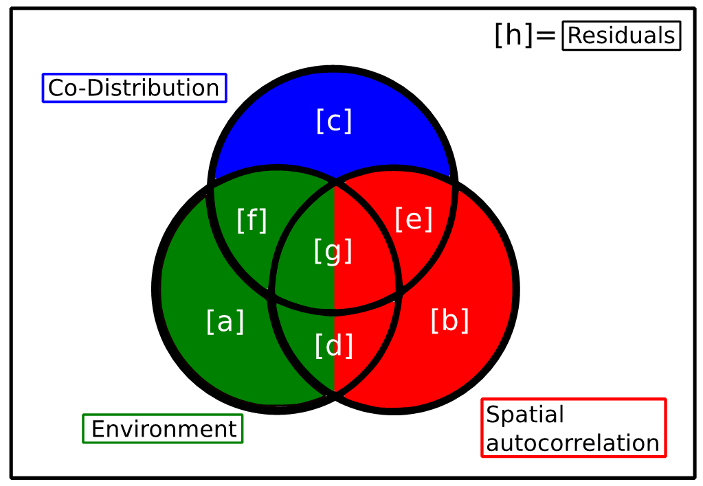
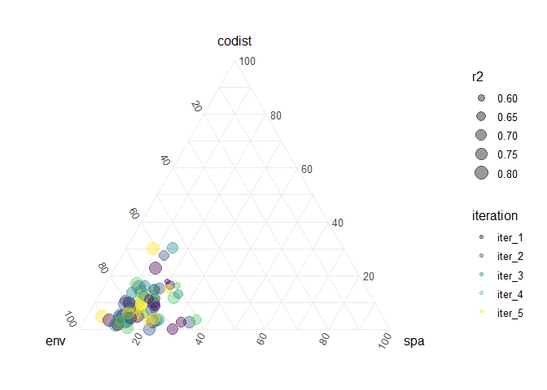
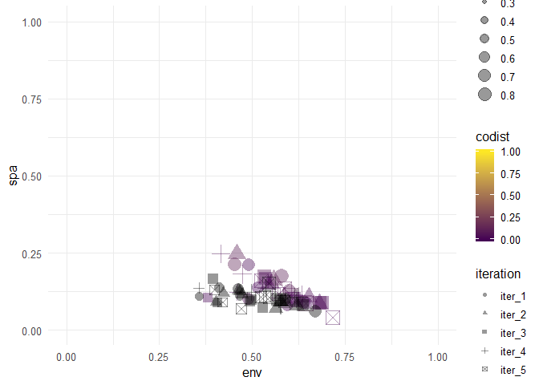
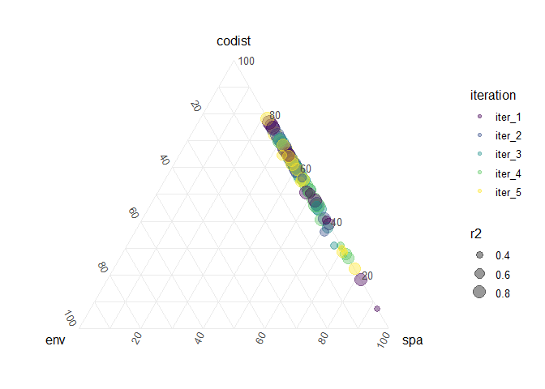

Visualizing VP
================
Javiera Rudolph
February 15, 2019

We will use thi document to explore alternatives to visualizing the data. As an example I will use the data for scenario 1 Figure2a. The RDS file needed to run this markdown document needs to be in the same directory for this to work.

Plot data for Figure 2a
-----------------------

Using the VP data for Figure 2a as an example, I am organizing the data and creating a function to automate plotting later on.

Organize the list to calculate the actual variables needed and organize for plotting. The VP output has each of the variables in the variation partitioning analysis, and I've labeled them according to FigureA1. Setting the names to match figure A1 in the appendix makes it easier to calculate the partition for environment, space and co-distribution.



``` r
VPdata %>% 
  set_names(imap(., ~ paste0("iter_", .y))) -> VPdata

VPdata[[1]] %>% 
  map(as_tibble) %>%
  bind_cols() %>% 
  set_names(c("c", "b", "a", "e", "f", "d", "g")) %>% 
  transmute(env = a + f + 0.5 * d + 0.5 * g,
            env = ifelse(env < 0, 0, env),
            spa = b + e + 0.5 * d + 0.5 * g,
            spa = ifelse(spa < 0, 0, spa),
            codist = c,
            codist = ifelse(codist < 0, 0, codist),
            r2 = env + spa + codist,
            iteration = names(VPdata[1]))
```

    ## # A tibble: 15 x 5
    ##      env    spa codist    r2 iteration
    ##    <dbl>  <dbl>  <dbl> <dbl> <chr>    
    ##  1 0.451 0.214  0.0194 0.685 iter_1   
    ##  2 0.600 0.127  0.0366 0.764 iter_1   
    ##  3 0.638 0.0908 0.0367 0.766 iter_1   
    ##  4 0.595 0.0821 0.0751 0.752 iter_1   
    ##  5 0.588 0.103  0.0315 0.723 iter_1   
    ##  6 0.463 0.133  0.0546 0.651 iter_1   
    ##  7 0.468 0.111  0.0725 0.651 iter_1   
    ##  8 0.356 0.109  0.102  0.568 iter_1   
    ##  9 0.411 0.139  0.108  0.657 iter_1   
    ## 10 0.489 0.102  0.175  0.765 iter_1   
    ## 11 0.514 0.137  0.0722 0.723 iter_1   
    ## 12 0.647 0.0852 0.0147 0.747 iter_1   
    ## 13 0.670 0.0611 0.0256 0.757 iter_1   
    ## 14 0.580 0.174  0.0206 0.775 iter_1   
    ## 15 0.491 0.212  0      0.703 iter_1

Ternary plot for Figure 2a. I have included transparency to visualize greater density of points. Unlike the previous figures, the axes go from 0-100 instead of 0-1, so I still need to figure out how to change that.



Trying to find an alternative way to visualize our variation data.



Test with another RDS file, scenario for Figure2d




