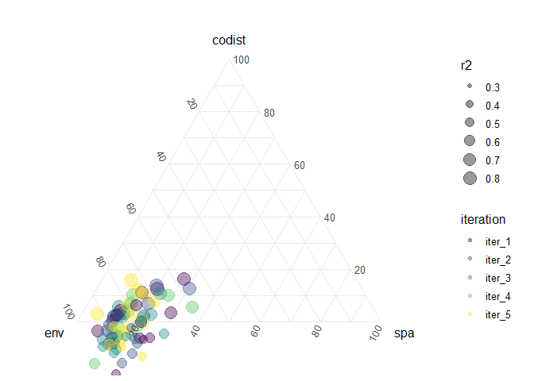

Visualizing VP
================
Javiera Rudolph
February 15, 2019

We will use thi document to explore alternatives to visualizing the data. As an example I will use the data for scenario 1 Figure2a. The RDS file needed to run this markdown document needs to be in the same directory for this to work.

``` r
VPdata <- readRDS("VP Fig2a.RDS")
```

Understand the structure of the data
------------------------------------

Organize the list to calculate the actual variables needed and organize for plotting.

``` r
plotData <- list()

for(i in 1:5){
  
  plotData[[i]] <- VPdata[[i]] %>% 
    map(as_tibble) %>%
    bind_cols() %>% 
    set_names(c("c", "b", "a", "e", "f", "d", "g")) %>% 
    transmute(env = a + f + 0.5 * d + 0.5 * g,
              spa = b + e + 0.5 * d + 0.5 * g,
              codist = g,
              r2 = env + spa + codist,
              iteration = names(VPdata[i]))
}

plotData %>% bind_rows() -> plotData
str(plotData)
```

    ## Classes 'tbl_df', 'tbl' and 'data.frame':    75 obs. of  5 variables:
    ##  $ env      : num  0.451 0.6 0.638 0.595 0.588 ...
    ##  $ spa      : num  0.214 0.1269 0.0908 0.0821 0.103 ...
    ##  $ codist   : num  0.1305 0.0933 0.0329 0.018 -0.0519 ...
    ##  $ r2       : num  0.796 0.82 0.762 0.695 0.64 ...
    ##  $ iteration: chr  "iter_1" "iter_1" "iter_1" "iter_1" ...

``` r
plotData %>%
  arrange(., desc(r2)) %>% 
  ggtern(aes(x = env, z = spa, y = codist)) +
  geom_point(aes(size = r2, color = iteration), alpha = 0.4) +
  scale_color_viridis_d() +
  theme_minimal()
```



``` r
plotData %>% 
  arrange(desc(r2)) %>% 
  ggplot(aes(env, spa)) +
  geom_point(aes(colour = codist, size = r2, shape = iteration), alpha = 0.4) + 
  scale_color_gradient(low = "#440154FF", high = "#FDE725FF", limits=c(0, 1), 
                      na.value = "black") +
  lims(x = c(0,1),
       y = c(0,1)) +
  theme_minimal()
```


why am I getting all these NAs?

``` r
plotData %>% 
  select(codist)
```

    ## # A tibble: 75 x 1
    ##     codist
    ##      <dbl>
    ##  1  0.131 
    ##  2  0.0933
    ##  3  0.0329
    ##  4  0.0180
    ##  5 -0.0519
    ##  6 -0.0358
    ##  7 -0.0960
    ##  8 -0.0287
    ##  9 -0.0309
    ## 10  0.0410
    ## # ... with 65 more rows
