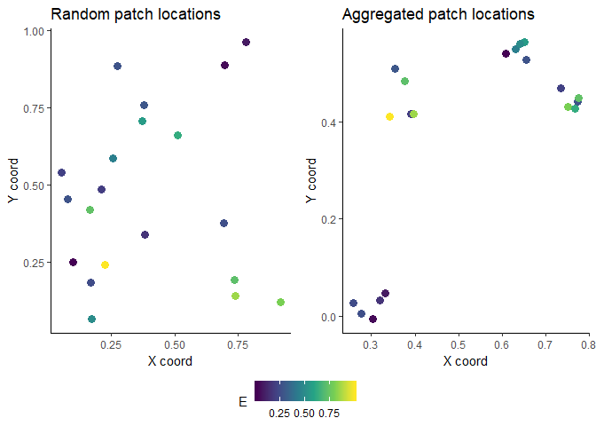
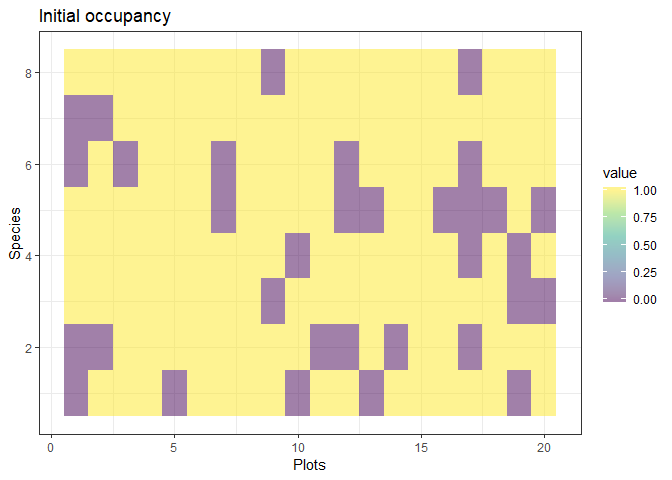
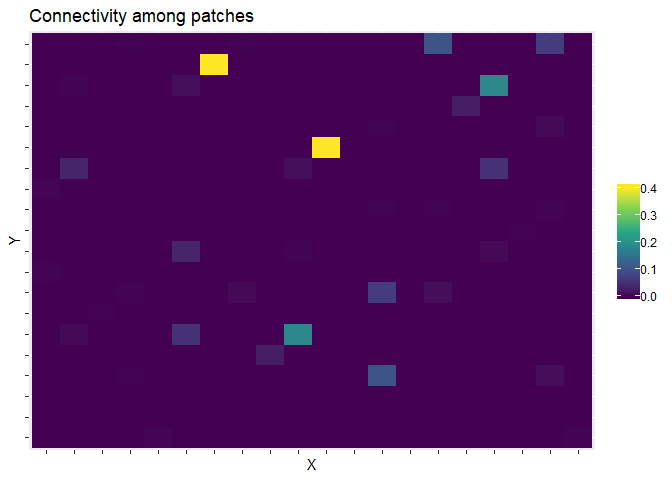
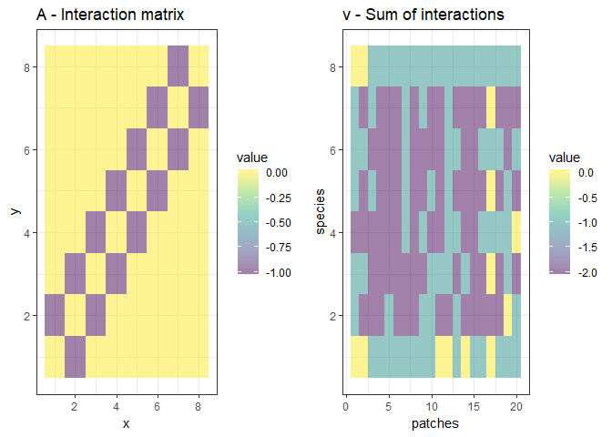
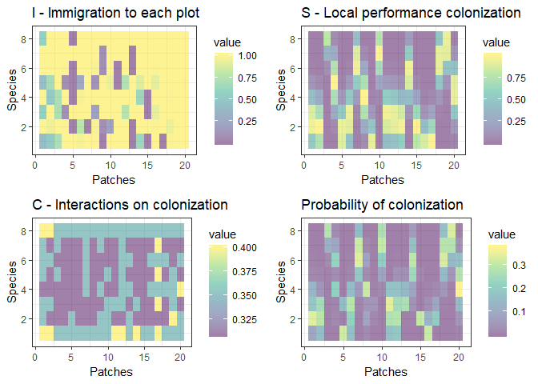
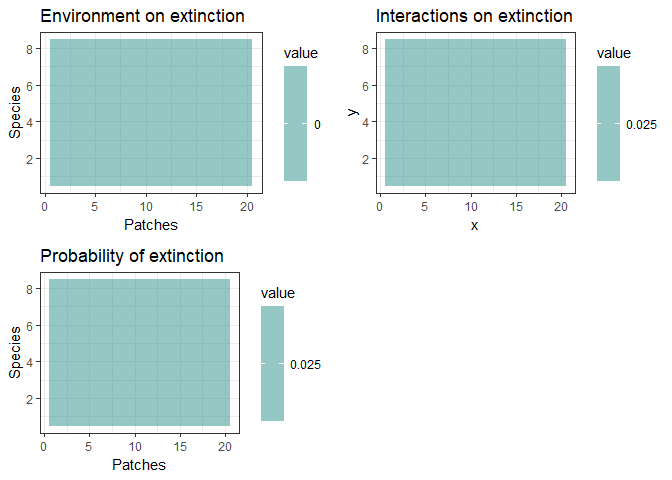
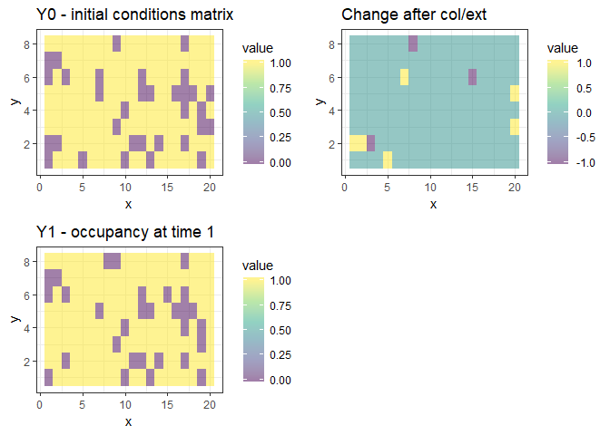

Metacommunity Simulation Functions
================
Javiera Rudolph
February 8, 2019

*Text is edited from the appendix: **Rethinking Metacommunity Ecology**, by Mathew A. Leibold, Pedro Peres-Neto, Dominique Gravel, Luc De Meester, Lauren Shoemaker, Florian Hartig, F. Guillaume Blanchet, Jonathan M. Chase *

Model Description
=================

Patch and Environment
---------------------

In this model, the metacommunity consists of *N* patches distributed over a spatially heterogeneous landscape, with multiple environmental variables (actually, the current simulations only have one environmental variable *D*) that could either be randomly distributed or spatially autocorrelated. Each patch has a set of coordinates in a two-dimensional space, and all possible coordinates are feasible such that this is a continuous space model that is not restricted to a lattice or some other kind of regular spatial arrangement of spatial units. The functions used to create these environmental variables and the coordinates for each patch are as follows:

``` r
set.seed(227)
# Random XY coordinates
# Each coordinate is drawn from a random uniform distribution
get_XY = function(N) cbind(runif(N),runif(N))

# Aggregation of XY coordinates
get_XY_agg = function(N, Nclusters, sd_xy) {
  
  Xclust = runif(Nclusters)
  Yclust = runif(Nclusters)
  
  X = rnorm(N, rep(Xclust,N/Nclusters), sd_xy)
  Y = rnorm(N, rep(Yclust,N/Nclusters), sd_xy)
  
  cbind(X,Y)
}

# Random uniform environmental values
get_E = function(D, N) matrix(runif(D*N), nr = N, nc = D)
```

The following example shows the scenario for 20 patches and one environmental variable. In the aggregated case, we determined four clusters. The value of the environmental variable for each patch is shown with the color hue. In this case, the environmental variable is randomly distributed.

``` r
N <- 20
D <- 1

rXY <- get_XY(N)
agXY <- get_XY_agg(N, 4, 0.02)
E <- get_E(D = D, N = N)
```



Species occupancy
-----------------

A patch may be empty, or be occupied by a single or by several species. We define *X*<sub>*i*, *z*, *t*</sub> as a stochastic variable representing the occurrence of species *i* at location *z* and time *t*. In this case, *X*<sub>*i*, *z*, *t*</sub> takes a value of 1 when species *i* is present and a value of 0 when it is absent. Similarly, we define **Y**<sub>*z*, *t*</sub> = (*X*<sub>1, *z*, *t*</sub>, *X*<sub>2, *z*, *t*</sub>, …, *X*<sub>*R*, *z*, *t*</sub>) as a vector containing the presence-absence of each species from the regional pool *R*. <!-- I can use the example of setting the initial conditions matrix here -->

For example, to create the initial conditions, *t* = 0, of presence absence, the following code is used. Species occupancy is drawn from a random uniform distribution, and values smaller than 0.8 are considered as species presence. Patches or locations *z* are represented by rows in the matrix, whereas each species is a column. Each cell in the matrix is *X*<sub>*i*, *z*, *t*</sub> and each row is **Y**<sub>*z*, *t*</sub> for *t* = 0.

``` r
#Get your initial conditions:
R <- 8
Y0 = matrix(0, nr = N, nc = R)
rand = matrix(runif(N*R), nr = N, nc = R)
Y0[rand < 0.8] = 1

rastPlot(Y0, title = "Initial occupancy", x = "Plots", y = "Species")
```



The model only tracks the occupancy of the patches (not population densities). Spatial dynamics occur because of colonization events, in both empty patches and patches that are occupied by other species, and because of extinction events. The emerging species co-(distributions) are a result of a dynamic balance between these events. Ecological interactions can impact either or both the colonization and the extinction probabilities. For instance, the presence of a competitor pre-empting a patch can reduce the colonization probability by another competitor. Alternatively, the presence of a competitor in a patch could increase the extinction probability of another species. Similarly, the environment could influence both the colonization and the extinction probabilities.

Patch Colonization
------------------

We consider a discrete-time Markovian process to represent the dynamics of presence-absence of all species. We incorporate the effect of dispersal, environmental filtering and ecological interactions in such a way that we could cover all possible scenarios wherein species differ in any combination of ways. We include interspecific competition along with other types of spatial dynamics such as predator-prey interactions (Gravel et al. 2011), priority effects (Shurin et al. 2004), or mutualistic interactions (e.g. Gilarranz et al. 2015).

Following a colonization event from time *t* to *t* + *Δ* corresponds to:

*P*(*X*<sub>*i*, *z*, *t* + *Δ**t*</sub>=1│*X*<sub>*i*, *z*, *t*</sub>=0) = *I*<sub>*i*, *z*, *t*</sub>*S*<sub>*i*, *z*, *t*</sub>*C*<sub>*i*, *z*, *t*</sub>

where *I*<sub>*i*, *z*, *t*</sub> is the number of immigrants of species *i* reaching patch *z* at time *t*, *S*<sub>*i*, *z*, *t*</sub> is the effect of environmental filtering on the probability of establishing a viable local population and *C*<sub>*i*, *z*, *t*</sub> is the effect of ecological interactions on the establishment probability. We note that because we represent a stochastic process, the product of these three functions has to be bounded between 0 and 1. We consequently define these quantities:

### Immigration

The effect of immigration is given by:
$$I\_{i,z,t}=\\frac{\\sum k(z,\\omega) X\_{i,\\omega,t}}{\\sum k(z,\\omega)}$$

which is a weighted average of the occurrence probability of species *i* in the neighborhood of *z*. The function *k*(*z*, *ω*) is a dispersal kernel that depends on the location of patch *z* and the neighborhood *ω*. For convenience, we consider an exponential function of the Euclidean distance between localities. We add to the kernel a low distance and neighborhood-independent constant *m* in order to account for immigration from outside the simulated metacommunity. This assumption is required to prevent total extinction by drift under perfectly neutral dynamics.

In the `functions.R` file, *I*<sub>*i*, *z*, *t*</sub> is calculated:

``` r
# Compute the propagule pressure
I_f = function(Y, K, m) I = (1-m)*(K%*%Y)/(K%*%matrix(1,nr=N,nc=R)) + m
```

The arguments for this function are: `Y, K, m`. We calculated `Y`, species presence or absence, in the previous section with the case for initial conditions. Argument `m` is set in the parameters as a value `m = 0.001` and the connectivity matrix `K` is calculated below.

#### Connectivity matrix

The argument `K` is the connectivity matrix. The argument `XY` corresponds to the patch coordinates, whereas `alpha` is the dispersal parameter associated to the exponential distribution used for dispersal. It can be computed with the following function:

``` r
# Compute the connectivity matrix
get_K = function(XY, alpha) {
    N = nrow(XY)
    distMat = as.matrix(dist(XY, method = "euclidean", upper = T, diag = T))
    ConMat = exp(-1/alpha*distMat)
    diag(ConMat) = 0
    return(ConMat)
}
```

For example, using the aggregated XY coordinates calculated in the 'Patch and Environment' section, for 20 patches and our initial occupancy matrix with 8 species,

``` r
# We can use the aggregated XY coordinates for this example:
XY <- agXY

# Connectivity matrix
alpha <- 0.005
K <- get_K(XY, alpha)
```

We can see the connectivity between patches, and calculate the contribution of immigration from each species to each patch. 

and the contribution of immigration from each species to each patch

### Environmental filtering

In the section above, it is refered to the effect of environmental filtering on the probability of establishing a viable local population. The effect of the environment is given by a product of the establishment performance over all environmental variables *E*<sub>*n*</sub>:
*S*<sub>*i*, *z*, *t*</sub> = ∏*f*(*E*<sub>*n*, *z*</sub>, *μ*<sub>*i*, *n*</sub>, *σ*<sub>*i*, *n*</sub>)

In our simulations, for convenience, we consider that the function *f* has a Gaussian form for all species and all environmental variables, though the model is flexible enough to consider other responses that also differ among species.

``` r
# Compute the local performance of propagules
S_f = function(E, u_c, s_c) {
    R = ncol(u_c)
    N = nrow(E)
    D = ncol(E)
    S = matrix(1, nr = N, nc = R)
    for(i in 1:D) S = S*exp(-(E[,i]-matrix(u_c[i,],nr=N,nc=R,byrow=TRUE))^2 / matrix(s_c[i,],nr=N,nc=R,byrow=TRUE)^2)
    return(S)
}
```

Parameters and are calculated as:

``` r
# Understood as niche optima for each species, for each environmental variable
  u_c = matrix(nr = D, nc = R)
  u_c[1,] = seq(0.1,0.9, length=R)
# Understood as niche breadth
  s_c = matrix(0.2, nr = D, nc = R)
```

Example:

``` r
# Local performance, colonization
S <- S_f(E, u_c, s_c)
plot_S <- rastPlot(S, title = "S - Local performance colonization", x = "Patches", y = "Species")
```

### Ecological interactions on establishment probability

To incorporate all possible ecological interactions, we start by representing the interaction network by a community matrix **A** of *R* species. The elements *α*<sub>*i**j*</sub> of **A** quantify the effect of species *j* on the dynamics of species *i*. When *α*<sub>*i**j*</sub> is negative, the colonization probability of species *i* decreases and/or its extinction probability increases when *j* is found locally. Inversely, when *α*<sub>*i**j*</sub> is positive, the colonization probability increases and/or the extinction probability decreases. Example from `scenario1Fig2.R` to create matrix **A**:

``` r
  # # Interaction matrix
  A = matrix(0,nr=R,nc=R)
  d = as.matrix(dist(c(1:R),upper=TRUE,diag=T))
  A[d<=1] = -1
  diag(A) = 0
  
  plot_A <- rastPlot(A, title = "A - Interaction matrix")
```

To account for the cumulative effects of local interactions on transition probabilities, we make colonization and extinction probabilities community dependent. As explained above, at a time *t*, the **Y**<sub>*z*, *t*</sub> vector gives the local assemblages. We calculate the sum of interactions at any time and for each species as *ν* = **A**<sub>*z*, *t*</sub>**Y**<sub>*z*, *t*</sub>. Our approach can be interpreted as a spatial analogue to the generalized Lotka–Volterra model because it takes into account the impact of the whole network of interactions on each species dynamics and can deal with any type of interaction.

``` r
# Compute the sum of ecological interactions for every location and every species
sum_interactions = function (A, Y) t(A%*%t(Y))
# this is considered to be "v"
v <- sum_interactions(A, Y)

plot_v <- rastPlot(v, title = "v - Sum of interactions", x = "patches", y = "species")

ggarrange(plot_A, plot_v, ncol = 2)
```



We now define the function
*C*<sub>*i*, *z*, *t*</sub> = *g*(*ν*<sub>*i*</sub>, *z*, *t*)
 representing the total effect of ecological interactions on the colonization probability. For convenience, we will use a sigmoid function, with *g* ranging between *c*<sub>*m**i**n*</sub> at high negative interactions and *c*<sub>*m**a**x*</sub> at high positive interactions, where *c*<sub>*m**a**x*</sub> should be interpreted as the maximal colonization probability when the environmental conditions are optimal and there are no dispersal limitations.

``` r
# Effect of ecological interactions on colonization probability
C_f = function(v, d_c, c_0, c_max) c_max*(1 +(1/c_0 - 1)*exp(-v*d_c))^-1
```

The arguments for this function are `v` as the resulting matrix from the sum of interactions, `d_c` as the sensitivity to interactions, `c_0` and `c_max` as the colonization parameters:

``` r
  # # Colonization function
  c_0 = rep(0.4, R) # Colonization at 0 interactions
  c_max = rep(1, R) # Colonization at max interactions

  # # Sensitivity to interactions
  d_c = 0.2
```

Example:

``` r
C <- C_f(v, d_c, c_0, c_max)
plot_C <- rastPlot(C, title = "C - Interactions on colonization", x = "Patches", y = "Species")
```

With all the components calculated, we can now compute the colonization probability *P*(*X*<sub>*i*, *z*, *t* + *Δ**t*</sub>=1│*X*<sub>*i*, *z*, *t*</sub>=0) = *I*<sub>*i*, *z*, *t*</sub>*S*<sub>*i*, *z*, *t*</sub>*C*<sub>*i*, *z*, *t*</sub>



Patch Extinction
----------------

The definition of the extinction probability follows exactly the same rules as for colonization, except that extinction is independent of the neighborhood composition. We follow the same logic to define the effect of ecological interactions and of variation in the environment. Consequently, we get the Markovian process:
*P*(*X*<sub>*i*, *z*, *t* + *Δ**t*</sub>=1│*X*<sub>*i*, *z*, *t*</sub>=0) = *M*<sub>*i*, *z*, *t*</sub>*E*<sub>*i*, *z*, *t*</sub>

where *M*<sub>*i*, *z*, *t*</sub> and *E*<sub>*i*, *z*, *t*</sub> are the responses of the extinction probability to the local environment and to ecological interactions, respectively. The difference with the colonization functions defined in the previous section is that the extinction probability must be larger when interactions are negative and smaller when they are positive. In addition, the extinction rate should be minimal (instead of maximal) at environmental optimum.

``` r
# Effect of the environment on the extinction
M_f = function(E, u_e, s_e) {
    R = ncol(u_e)
    N = nrow(E)
    D = ncol(E)
    M = matrix(1, nr = N, nc = R)
    for(i in 1:D) M = M*(1-exp(-(E[,i]-matrix(u_e[i,],nr=N,nc=R,byrow=TRUE))^2 / matrix(s_e[i,],nr=N,nc=R,byrow=TRUE)^2))
    return(M)   
}
```

With the arguments computed as:

``` r
  # # Effect of the environment on extinction
  u_e = matrix(nr = D, nc = R)
  u_e[1,] = rep(0.5, R)
  s_e = matrix(Inf, nr = D, nc = R)
  
  #u_e
  #head(s_e)
```

``` r
# Effect of ecological interactions on extinction
E_f = function(v, d_e, e_0, e_min) {

    e_min_mat = matrix(e_min, nr = N, nc = R, byrow=TRUE)

    e_min_mat+(1/(1-e_min_mat)+(1/(e_0-e_min_mat)-1/(1-e_min_mat))*exp(d_e*v))^-1

}
```

With the arguments computed as:

``` r
# # Extinction function
  e_0 = rep(0.025, R) # Extinction at 0 interactions
  e_min = rep(0, R) # Exinction at max interactions

  # # Sensitivity to interactions

  d_e = 0
```

We can now compute the probability of extinction *P*(*X*<sub>*i*, *z*, *t* + *Δ**t*</sub>=1│*X*<sub>*i*, *z*, *t*</sub>=0) = *M*<sub>*i*, *z*, *t*</sub>*E*<sub>*i*, *z*, *t*</sub>

 The way parameters are set, the extinction component is the same for all species in every patch.

### Testing and changes

``` r
# Perform the test
delta <- matrix(0, nr = N, nc = R)
rand <- matrix(runif(N*R), nr = N, nc = R)
delta[Y == 0 & rand < P_col] <- 1

# Perform the test
rand = matrix(runif(N*R), nr = N, nc = R)
delta[Y == 1 & rand < P_ext] = - 1
```



Interpretation
--------------

To interpret the model, note that, at steady state, for each species, we obtain the expected occurrence probability $\\left( \\hat{P}\\right)$ at each site as:
$$\\frac{\\hat{P^{iz}}}{1-\\hat{P^{iz}}} = \\frac{I^{iz} \\cdot S^{iz} \\cdot C^{iz}}{M^{iz} \\cdot E^{iz}}$$
 After a log transformation, this yields:

$$\\log \\left( \\frac{\\hat{P^{iz}}}{1-\\hat{P^{iz}}}\\right) = \\log\\left(I^{iz}\\right) + \\log\\left(\\frac{S^{iz}}{M^{iz}}\\right) + \\log\\left(\\frac{C^{iz}}{E^{iz}}\\right)$$

The last equation can be interpreted as a macroscopic description of the expected species distribution pattern (Thuiller et al. 2013). In this formulation, log(*I*) describes the tendency of a patch to resemble other nearby patches due to the spatial contagion by dispersal, $\\log\\left(\\frac{S}{M}\\right)$ describes the tendency of sites to be occupied by species with similar fitness responses to environmental gradients, and $\\log\\left(\\frac{C}{E}\\right)$ describes the remaining influence of other species on co-occurrence due to interactions among species. The values for these indices will depend on what choices are made for the components of eq. 1 (see Supporting Information for details on how we implemented this simulations model).

This modeling framework can represent the classical archetypes (Box 1), but also permits more intricate (and likely far more realistic) metacommunity scenarios and predictions. For example, we could use the model to examine how species traits (and environmental context) link to metacommunity dynamics. Moreover, continuous mixtures of different metacommunity extremes (archetypes) can be represented by appropriate choices for dispersal, competitive abilities, and environmental preferences. For instance, species sorting would require a relatively large colonization to extinction ratio along with species-specific environmental requirements and regional similarity (sensu Mouquet and Loreau, 2002). Alternatively, coexistence within competition-colonization trade-offs requires species to have similar responses to the environment and appropriate heterogeneities in the *I*, *C* and *E* functions, but no environmental preferences.

The implemented mechanisms in the simulation model can be partly mapped onto variation partitioning components. For instance, at equilibrium, we could expect dispersal limitation (the log(*I*) term in equation 3) to create positive spatial autocorrelation at the dispersal scale (the \[S/E\] fraction in variation partitioning). Environmental filtering (the $\\log\\left(\\frac{S}{M}\\right)$ term in equation 3) should lead to a correlation between composition and environment (the \[E/S\] fraction in variation partitioning). The last term in equation 3, however, describing the effect of interactions on distribution (the $\\log\\left(\\frac{C}{E}\\right)$), is novel and has no equivalent in the context of classical variation partitioning.

Parameterization and Simulation Scenarios
-----------------------------------------

We simulated metacommunity dynamics with a landscape of 1000 patches over 200 time steps and an initial occupancy of 0.8. Patches were placed randomly in a two-dimensional plane with coordinates drawn from a uniform distribution with a minimum of 0 and a maximum of 1. The environment varied spatially, with values drawn from a random distribution between 0 and 1. In the specific simulations we studied in the paper, colonization was the only component of the species that were affected by the environment (i.e. E\_(i,z,t) = 1). Specifically, colonization reacted to the environment following a Gaussian curve.
