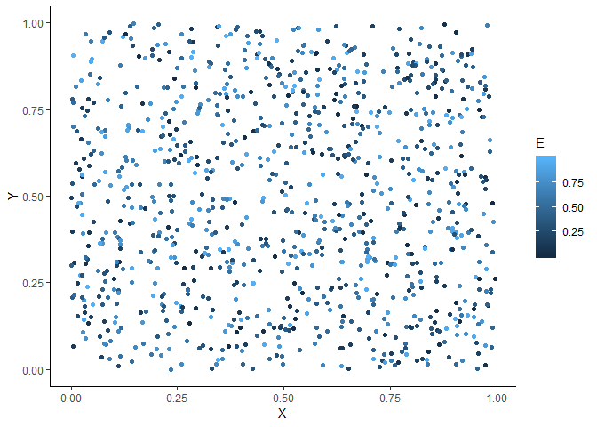
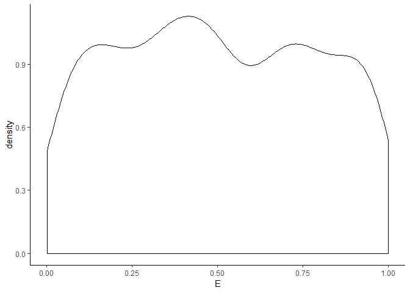

What does our landscape look like?
================
Javiera Rudolph
February 14, 2019

In all of the simulations done previously, two .txt files were associated to them. These corresponded to the environmental variable and the xy coordinate of pathces.

I don't know how these were obtained or how they are arranged in space

Here it is how they look visually for the 1000 patches considered:

``` r
N <- 1000
XY <- read.table("XY.txt")[1:N,]
E <- read.table("E.txt")[1:N,]

plotData <- cbind.data.frame(XY, E)
names(plotData) <- c("X", "Y", "E")


ggplot(plotData, aes(x = X, y = Y, color = E)) +
  geom_point() +
  theme_classic()
```



The sites, or plots, are randomly distributed and so is the value of the environmental variable.

``` r
ggplot(plotData) +
  geom_density(aes(x = E)) +
  theme_classic()
```


