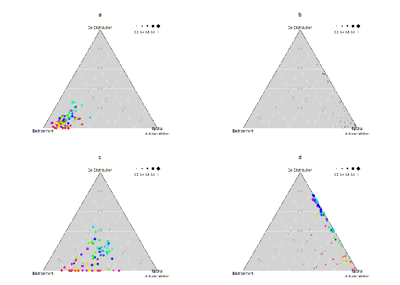
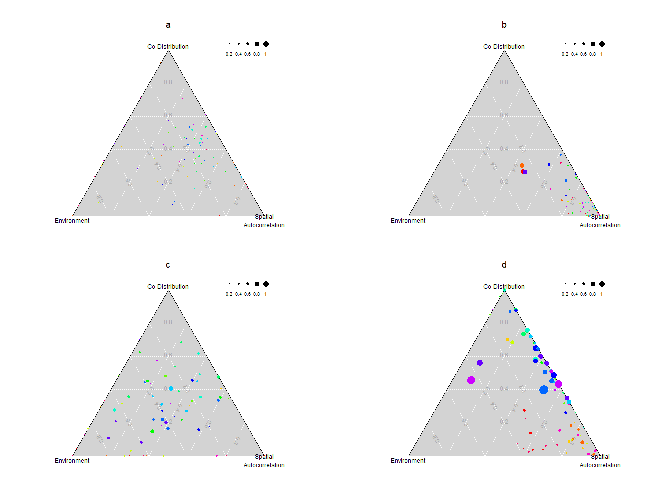
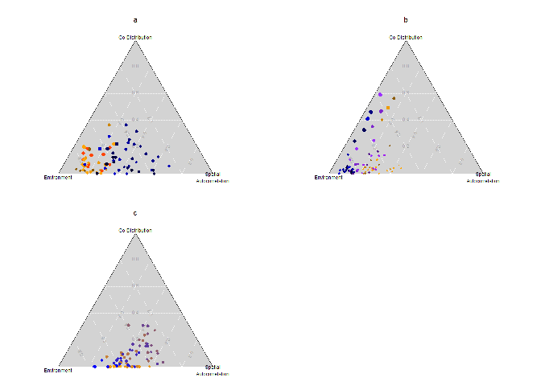
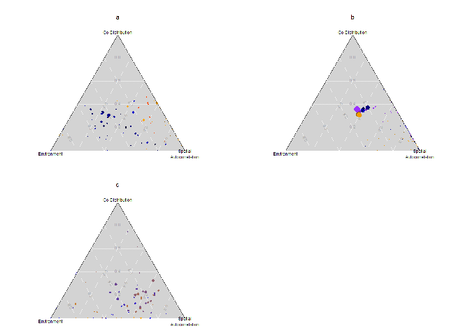

#### Available scripts and files
The scripts 'functions.R', 'lanscape.R', and 'main.R' were provided in the dropbox folder along with two text files for the environment variable and location of patches ('E.txt' and 'XY.txt').  

R scripts named after the scenario and corresponding figure were also provided and I was able to run them to simulate the communities. Each one of these R scripts gives an RDS file as an output, which is later used in the Variation partitioning scripts. 


```r
scn1Fig2a <- readRDS(file = "Fig2a_run.RDS")
str(scn1Fig2a)
```

```
## List of 5
##  $ : num [1:1000, 1:15] 0 0 0 0 1 0 0 0 0 0 ...
##  $ : num [1:1000, 1:15] 0 0 0 0 1 0 0 0 0 1 ...
##  $ : num [1:1000, 1:15] 0 0 0 0 1 0 0 0 0 1 ...
##  $ : num [1:1000, 1:15] 1 0 0 0 1 0 0 0 0 1 ...
##  $ : num [1:1000, 1:15] 0 1 0 0 1 0 0 0 0 0 ...
```

Each one of these simulations will give a list as an output, with each element within the list being a matrix with occurrence data for 15 species in 1000 patches. The number of iterations is set to 5, therefore the list is length 5. 


```r
head(scn1Fig2a[[1]])
```

```
##      [,1] [,2] [,3] [,4] [,5] [,6] [,7] [,8] [,9] [,10] [,11] [,12] [,13]
## [1,]    0    1    1    1    1    1    1    1    0     0     0     0     0
## [2,]    0    0    0    1    1    1    1    1    1     1     0     0     0
## [3,]    0    0    0    0    0    0    0    1    0     0     1     1     1
## [4,]    0    0    0    0    0    0    0    0    0     0     1     1     0
## [5,]    1    1    1    1    1    1    1    0    0     0     0     0     0
## [6,]    0    0    0    0    0    0    0    0    0     0     1     1     1
##      [,14] [,15]
## [1,]     0     0
## [2,]     0     0
## [3,]     0     1
## [4,]     0     0
## [5,]     0     0
## [6,]     1     1
```


The parameters set for these scripts are as follows:

Table: Original parameters used in provided scripts for simulation of communities for Figure2

Description          Param   Fig2a   Fig2b   Fig2c   Fig2d           
-------------------  ------  ------  ------  ------  ----------------
Number of Patches    N       1000    1000    1000    1000            
Environmental vars   D       1       1       1       1               
Species Richness     R       15      15      15      15              
Niche breadth        s_c     0.2     1       0.2     0.5             
Dispersal            alpha   0.005   0.005   0.005   0.005           
Colonization         c_0     0.4     0.4     0.4     0.1 , 0.4 , 0.7 
Interactions c       d_c     0       0       1.5     1.5             
Interactions e       d_e     0       0       1.5     1.5             

Figures were created after running the 'VP .R' scripts for figures 2 and 3, and using the 'Draw figures.R' as a baseline.


To load these figures, make sure that the script 'Draw_for_md.R' has run and produced the png files.
you can check if the figures are in the directory.

```r
fig2png <- list.files(pattern = ".png")
fig2png
```

```
##  [1] "fig2a.png"     "fig2b.png"     "fig2c.png"     "fig2d.png"    
##  [5] "fig3a.png"     "fig3b.png"     "fig3c.png"     "purefig2a.png"
##  [9] "purefig2b.png" "purefig2c.png" "purefig2d.png" "purefig3a.png"
## [13] "purefig3b.png" "purefig3c.png"
```

```r
# If the files are available, you can display them
```


<!-- -->

To create the figures that include only the "pure" fractions of variation, I used only the first overlap form the vp objects that result from the variPart function. The code to make these figures is also in the 'Draw_for_md.R' script and it shows the code sections that were commented out. 

<!-- -->


Parameters for figure3

Table: Original parameters used for Figure3

Description          Param   Fig3a           Fig3b                   Fig3c           
-------------------  ------  --------------  ----------------------  ----------------
Number of Patches    N       1000 / 1000     1000 / 1000 / 1000      1000            
Environmental vars   D       1 / 1           1 / 1 / 1               1               
Species Richness     R       7 / 8           5 / 5 / 5               15              
Niche breadth        s_c     0.2 / 0.2       0.2 / 0.2 / 0.2         0.2             
Dispersal            alpha   0.005 / 0.005   0.001 / 0.005 / 0.015   0.005           
Colonization         c_0     0.4 / 0.4       0.4 / 0.4 / 0.4         0.7 , 0.1 , 0.4 
Interactions c       d_c     0 / 1.5         0 / 0 / 0               1.5             
Interactions e       d_e     0 / 1.5         0 / 0 / 0               1.5             

<!-- -->

Individual fractions only

<!-- -->


