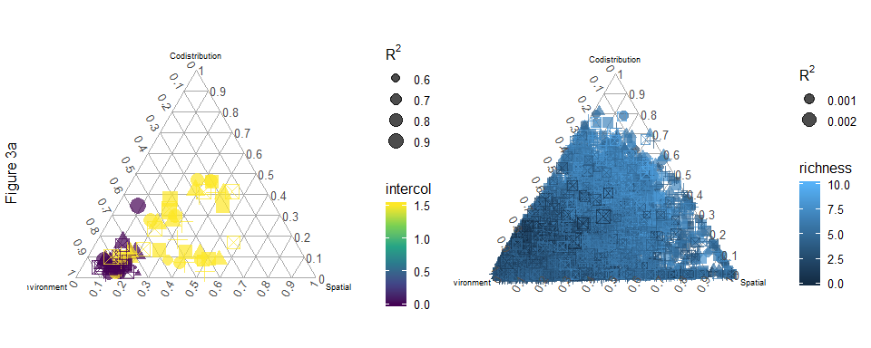
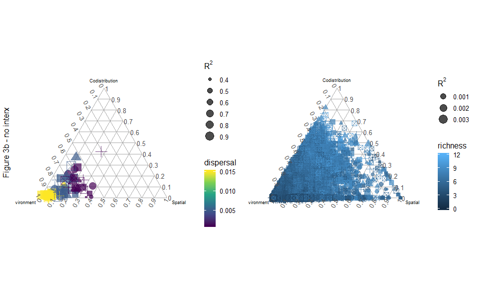
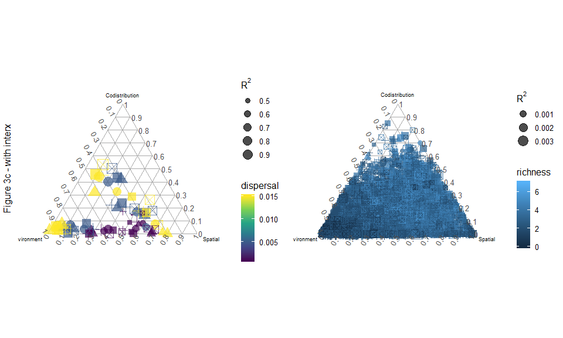
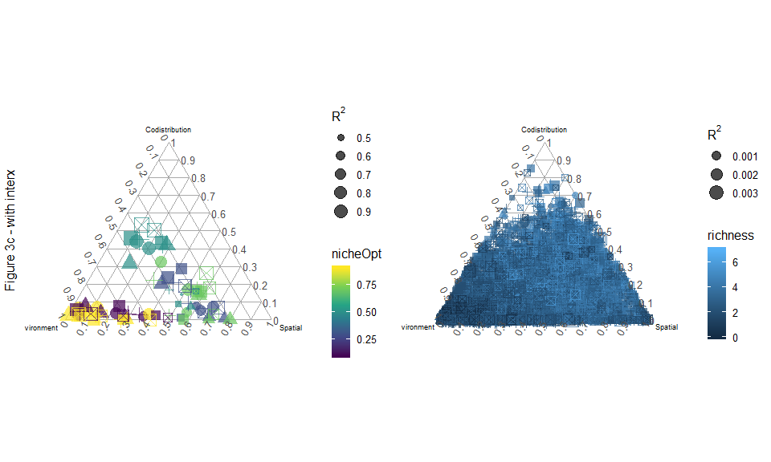

Figure 3 - updated
================
Javiera Rudolph
March 21, 2019

Scenario1 - Figure 3a
=====================

|  nicheBreadth|  colProb|  dispersal|  intercol|  interext|
|-------------:|--------:|----------:|---------:|---------:|
|           0.8|      0.4|      0.005|       0.0|       0.0|
|           0.8|      0.4|      0.005|       1.5|       1.5|

Scenario2 - Figure 3b
=====================

|  nicheBreadth|  colProb|  dispersal|  intercol|  interext|
|-------------:|--------:|----------:|---------:|---------:|
|           0.8|      0.4|      0.001|         0|         0|
|           0.8|      0.4|      0.005|         0|         0|
|           0.8|      0.4|      0.015|         0|         0|

Scenario3 - Figure 3c
=====================

|  nicheBreadth|  colProb|  dispersal|  intercol|  interext|
|-------------:|--------:|----------:|---------:|---------:|
|           0.8|      0.4|      0.001|       1.5|       1.5|
|           0.8|      0.4|      0.005|       1.5|       1.5|
|           0.8|      0.4|      0.015|       1.5|       1.5|

