Manuscript Figures
================
Javiera Rudolph
March 25, 2019

All of these results come from using a quadratic response to the environment

Figure 2
========

Option1
-------

All figures are color coded by iteration. The *R*2 scales are shared by figures at the species level and a separate scale is shared at the sites level.

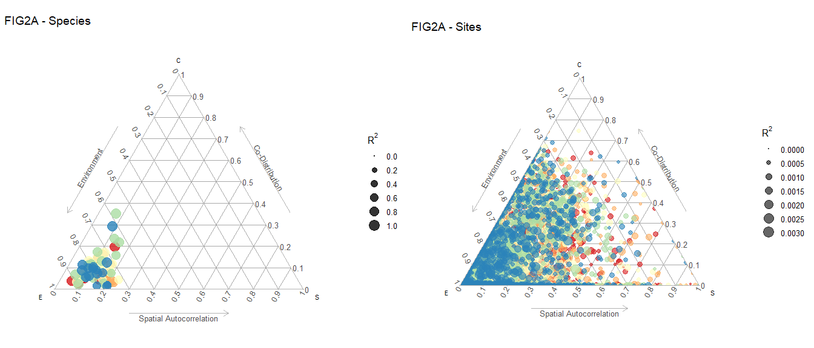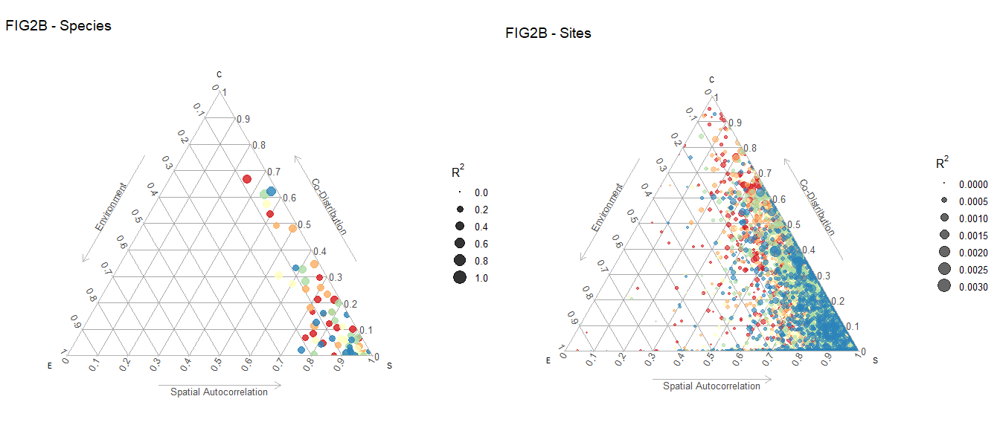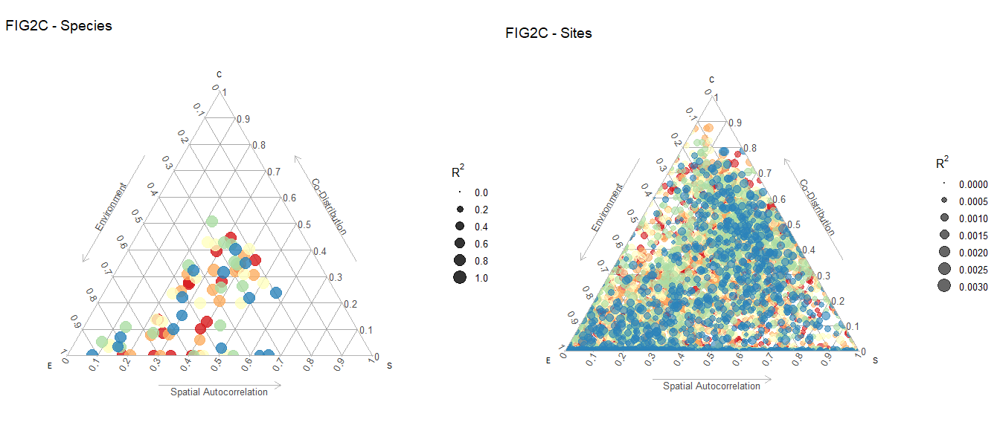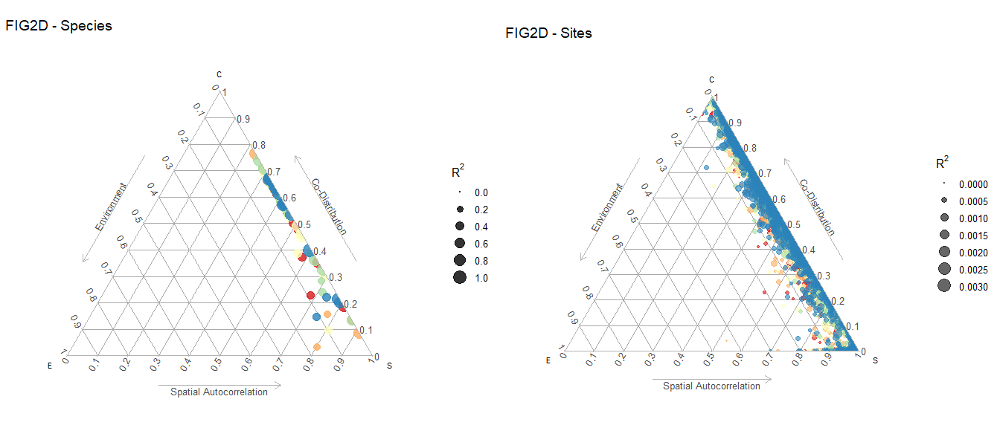

Option 2
--------

Same results, but using a density plot for the sites level data. A higher "density" of sites is represented by the lighter color on the scale. 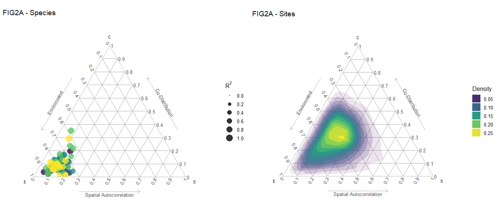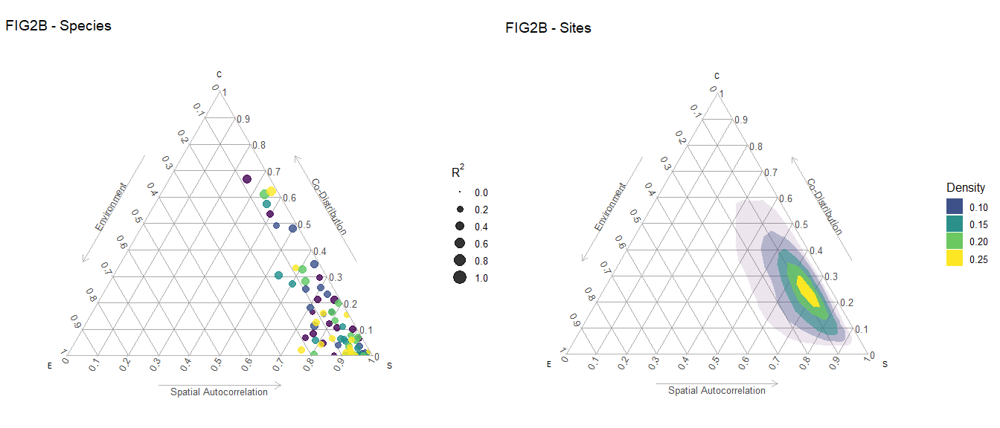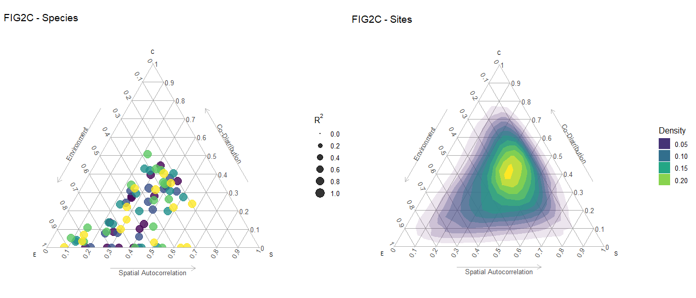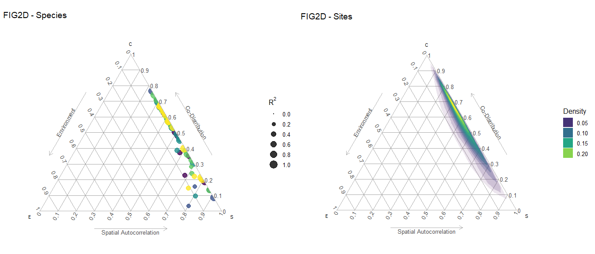

Figure 3
========

Option1
-------

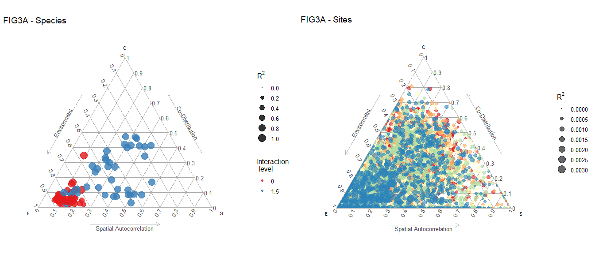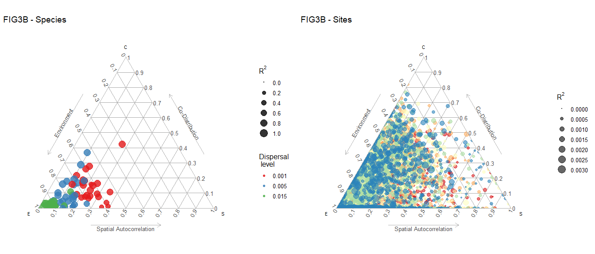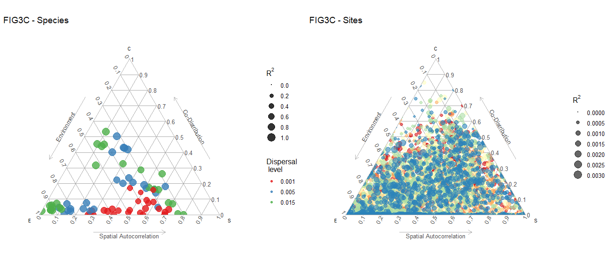

Option 2
--------

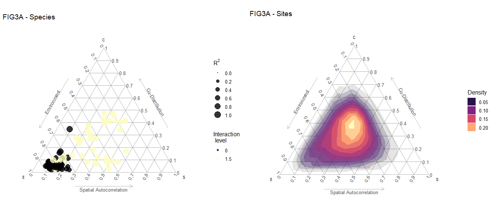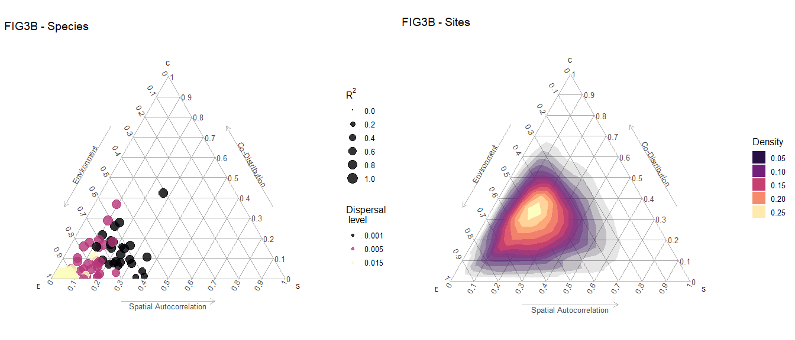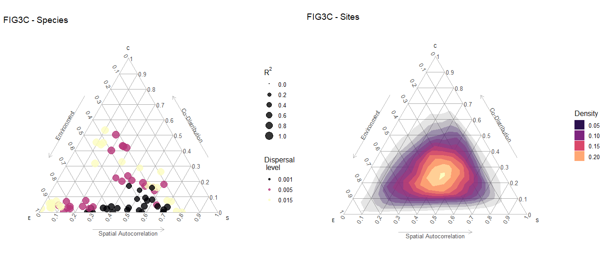
