Two species niche comparisons between gaussian and quadratic response to environment
================
Javiera Rudolph
March 12, 2019

Scenario 1 - Parameters
=======================

| species |  nicheOpt|  nicheBreadth|  colProb|  dispersal|  intercol|  interext|
|:--------|---------:|-------------:|--------:|----------:|---------:|---------:|
| 1       |       0.5|           0.2|      0.4|      0.005|         0|         0|
| 2       |       0.5|           0.2|      0.4|      0.005|         0|         0|

Scenario 1 - Gaussian response
==============================

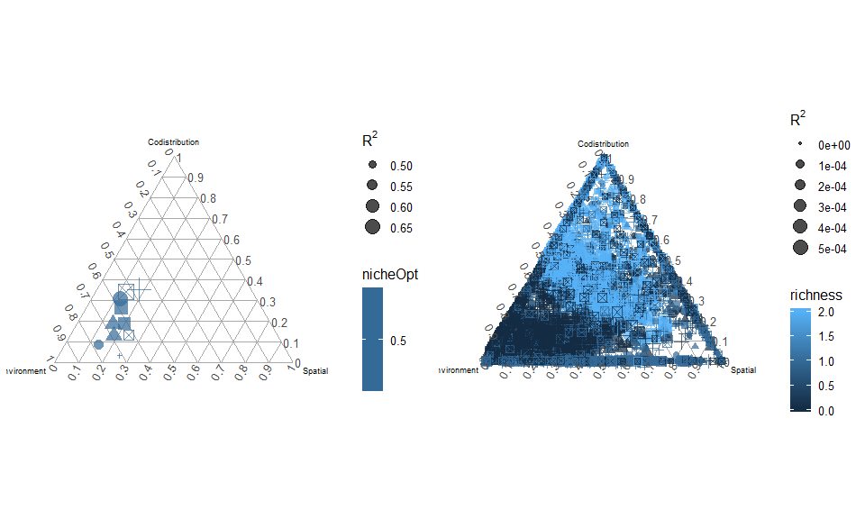

Scenario 1 - Quadratic response
===============================

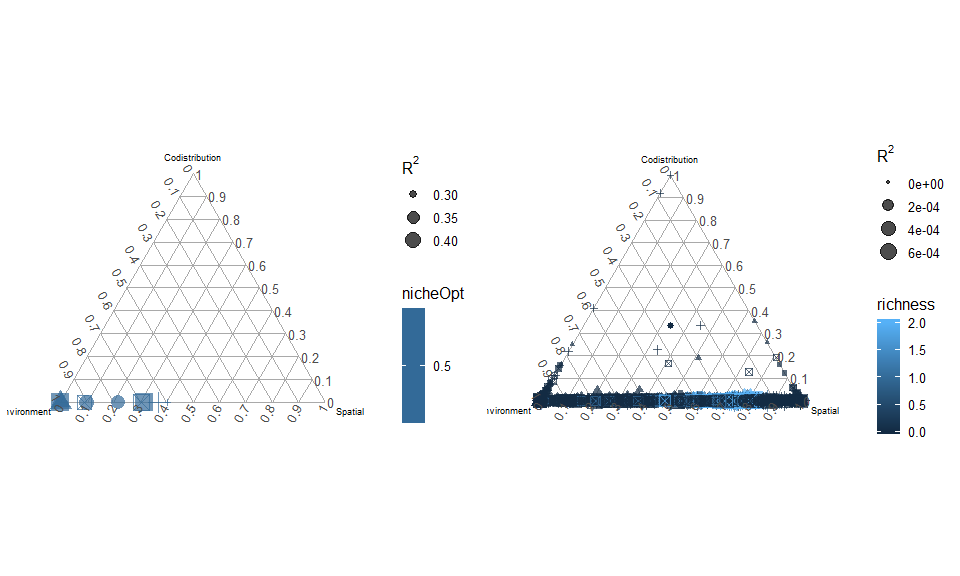

Scenario 2 - Parameters
=======================

| species |  nicheOpt|  nicheBreadth|  colProb|  dispersal|  intercol|  interext|
|:--------|---------:|-------------:|--------:|----------:|---------:|---------:|
| 1       |      0.55|           0.2|      0.4|      0.005|         0|         0|
| 2       |      0.45|           0.2|      0.4|      0.005|         0|         0|

Scenario 2 - Gaussian response
==============================

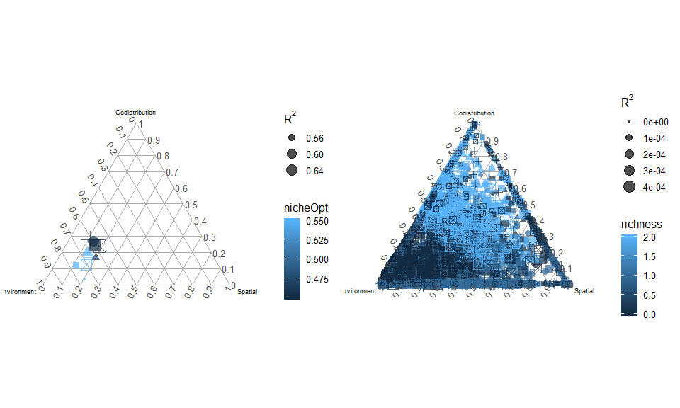

Scenario 2 - Quadratic response
===============================

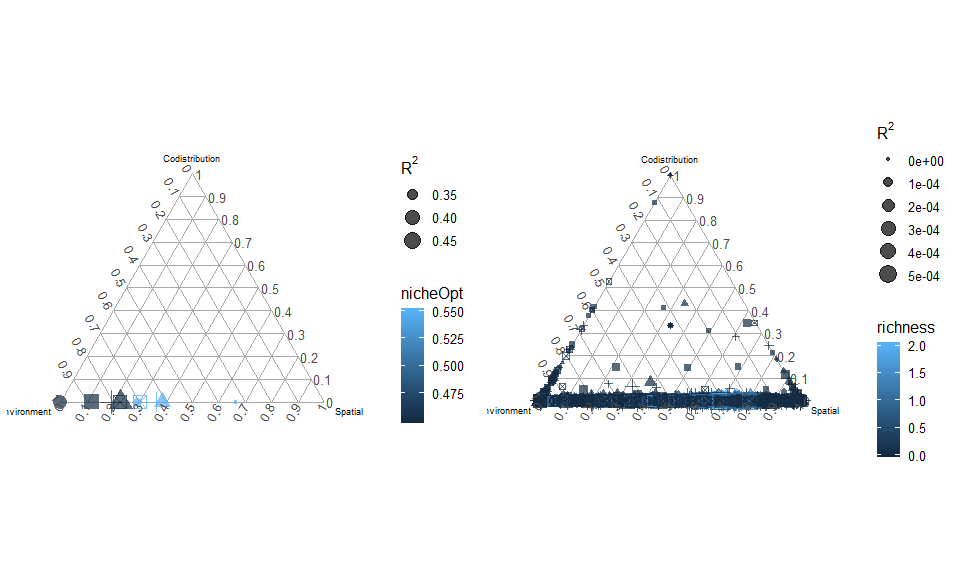

Scenario 3 - Parameters
=======================

| species |  nicheOpt|  nicheBreadth|  colProb|  dispersal|  intercol|  interext|
|:--------|---------:|-------------:|--------:|----------:|---------:|---------:|
| 1       |       0.6|           0.2|      0.4|      0.005|         0|         0|
| 2       |       0.4|           0.2|      0.4|      0.005|         0|         0|

Scenario 3 - Gaussian response
==============================

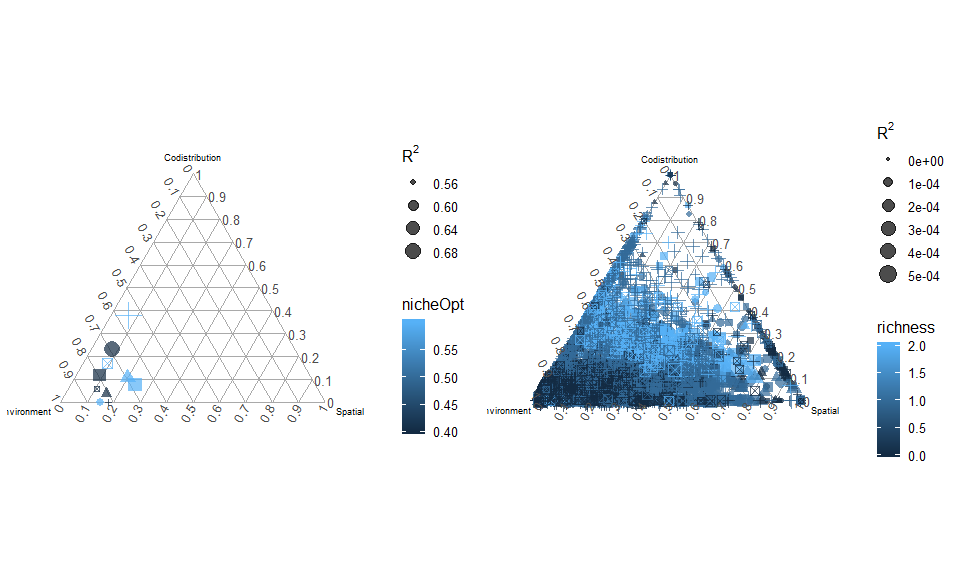

Scenario 3 - Quadratic response
===============================

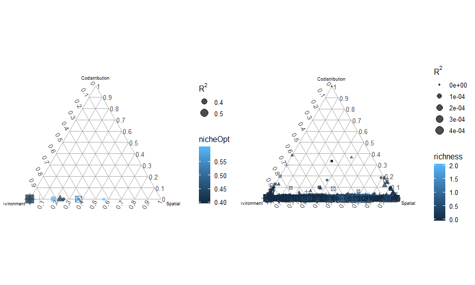

Scenario 4 - Parameters
=======================

| species |  nicheOpt|  nicheBreadth|  colProb|  dispersal|  intercol|  interext|
|:--------|---------:|-------------:|--------:|----------:|---------:|---------:|
| 1       |      0.65|           0.2|      0.4|      0.005|         0|         0|
| 2       |      0.35|           0.2|      0.4|      0.005|         0|         0|

Scenario 4 - Gaussian response
==============================

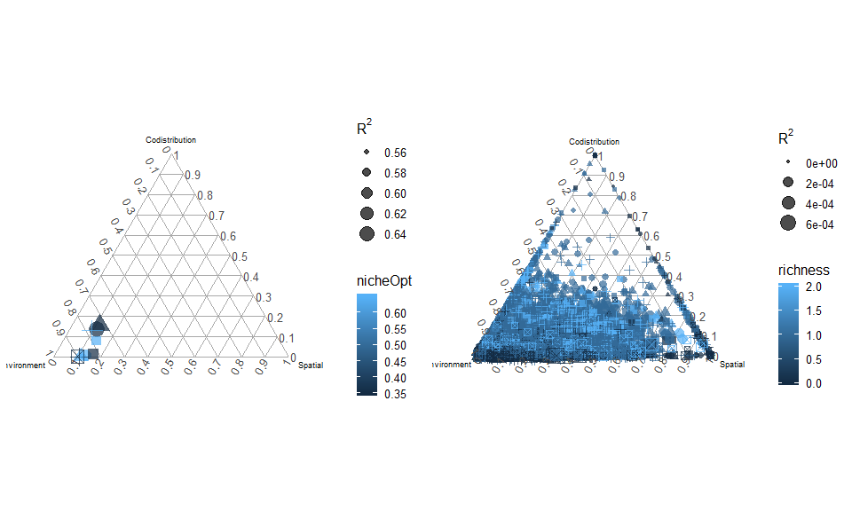

Scenario 4 - Quadratic response
===============================

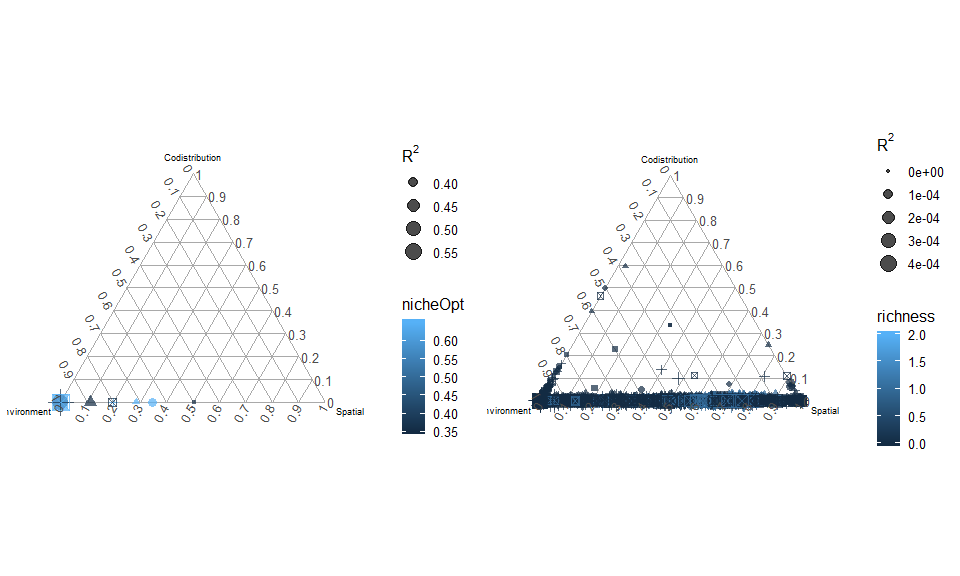

Scenario 5 - Parameters
=======================

| species |  nicheOpt|  nicheBreadth|  colProb|  dispersal|  intercol|  interext|
|:--------|---------:|-------------:|--------:|----------:|---------:|---------:|
| 1       |       0.7|           0.2|      0.4|      0.005|         0|         0|
| 2       |       0.3|           0.2|      0.4|      0.005|         0|         0|

Scenario 5 - Gaussian response
==============================

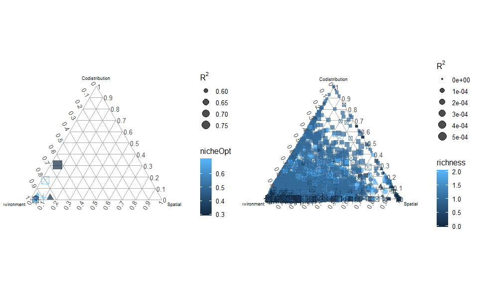

Scenario 5 - Quadratic response
===============================

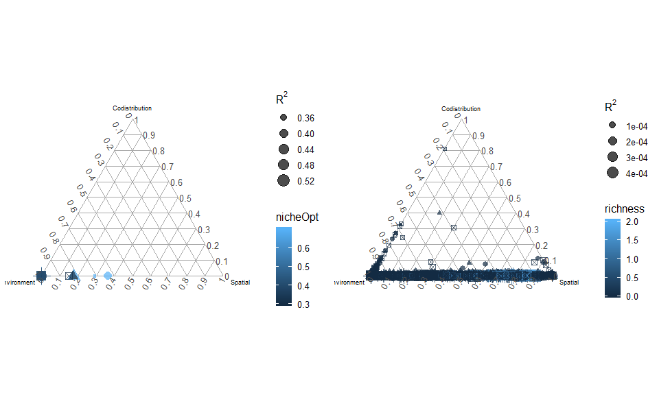

Scenario 6 - Parameters
=======================

| species |  nicheOpt|  nicheBreadth|  colProb|  dispersal|  intercol|  interext|
|:--------|---------:|-------------:|--------:|----------:|---------:|---------:|
| 1       |      0.75|           0.2|      0.4|      0.005|         0|         0|
| 2       |      0.25|           0.2|      0.4|      0.005|         0|         0|

Scenario 6 - Gaussian response
==============================

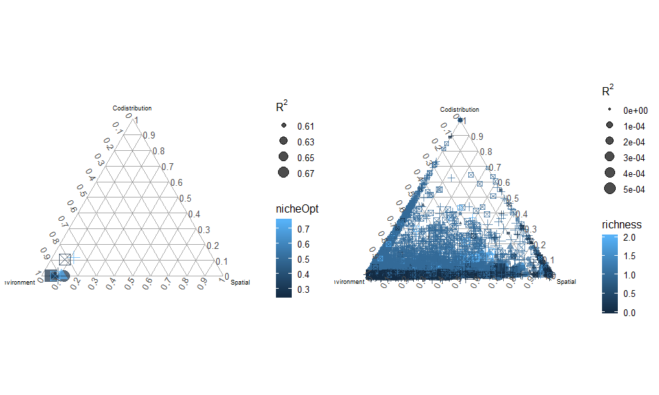

Scenario 6 - Quadratic response
===============================

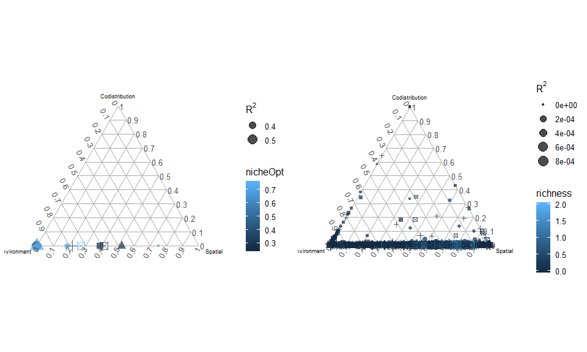

Scenario 7 - Parameters
=======================

| species |  nicheOpt|  nicheBreadth|  colProb|  dispersal|  intercol|  interext|
|:--------|---------:|-------------:|--------:|----------:|---------:|---------:|
| 1       |       0.8|           0.2|      0.4|      0.005|         0|         0|
| 2       |       0.2|           0.2|      0.4|      0.005|         0|         0|

Scenario 7 - Gaussian response
==============================

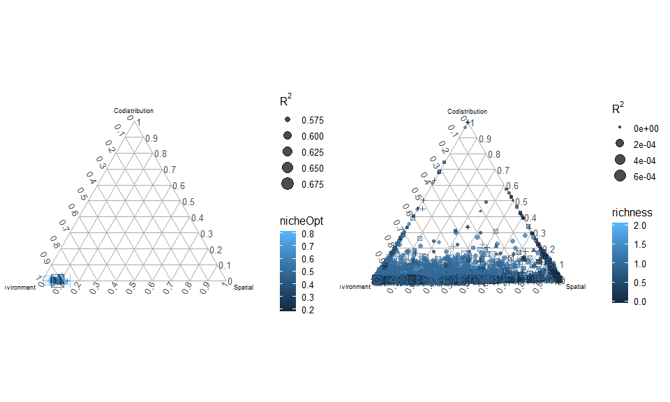

Scenario 7 - Quadratic response
===============================

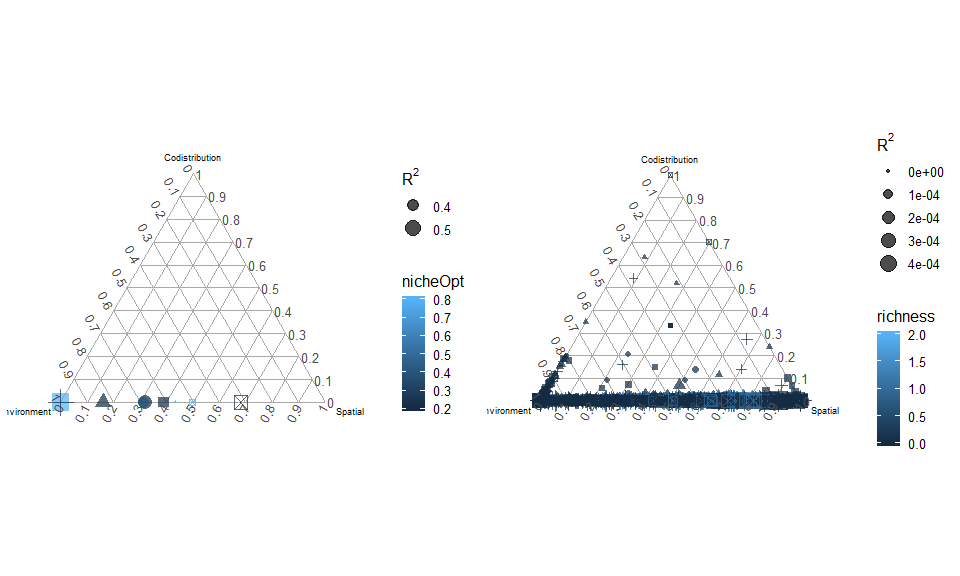

Scenario 8 - Parameters
=======================

| species |  nicheOpt|  nicheBreadth|  colProb|  dispersal|  intercol|  interext|
|:--------|---------:|-------------:|--------:|----------:|---------:|---------:|
| 1       |      0.85|           0.2|      0.4|      0.005|         0|         0|
| 2       |      0.15|           0.2|      0.4|      0.005|         0|         0|

Scenario 8 - Gaussian response
==============================

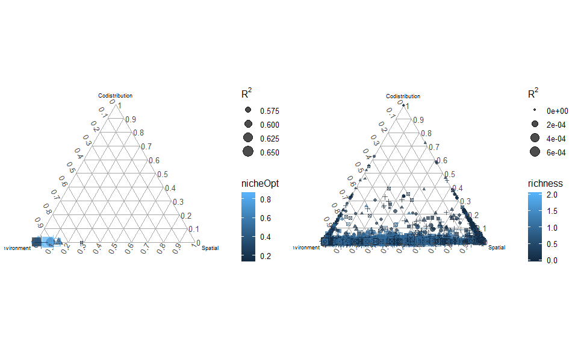

Scenario 8 - Quadratic response
===============================

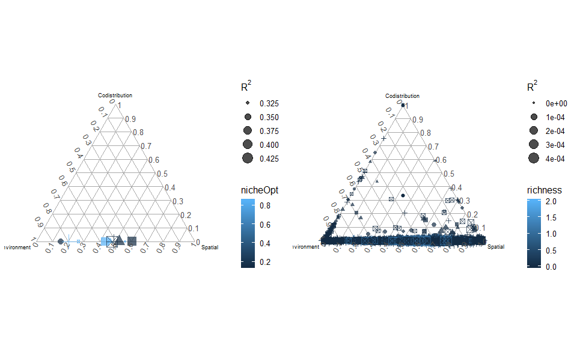

Scenario 9 - Parameters
=======================

| species |  nicheOpt|  nicheBreadth|  colProb|  dispersal|  intercol|  interext|
|:--------|---------:|-------------:|--------:|----------:|---------:|---------:|
| 1       |       0.9|           0.2|      0.4|      0.005|         0|         0|
| 2       |       0.1|           0.2|      0.4|      0.005|         0|         0|

Scenario 9 - Gaussian response
==============================

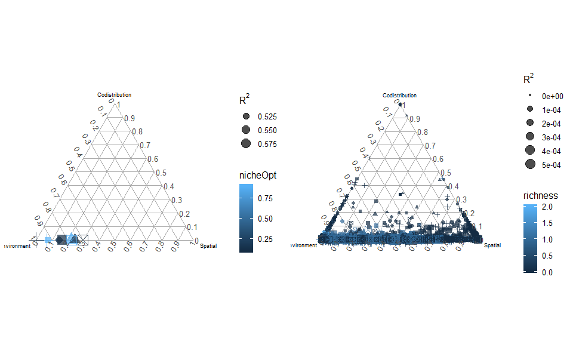

Scenario 9 - Quadratic response
===============================

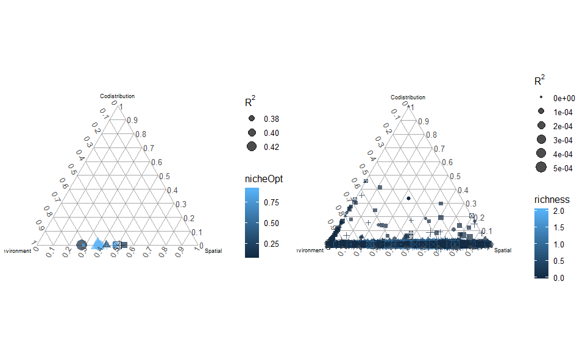
