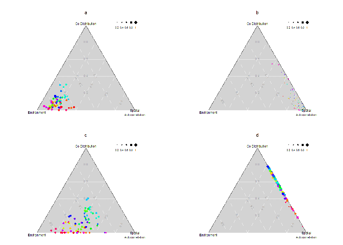
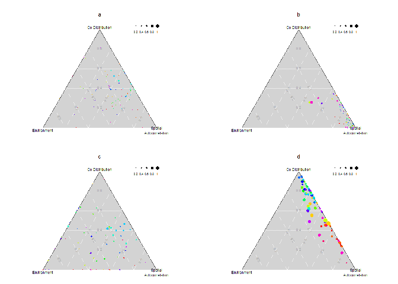
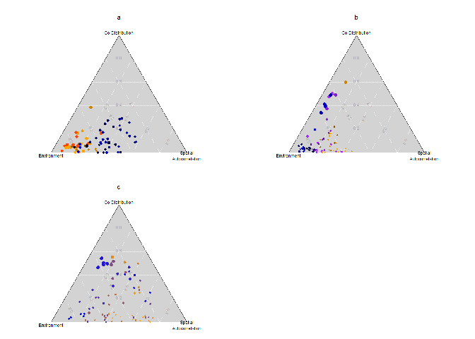
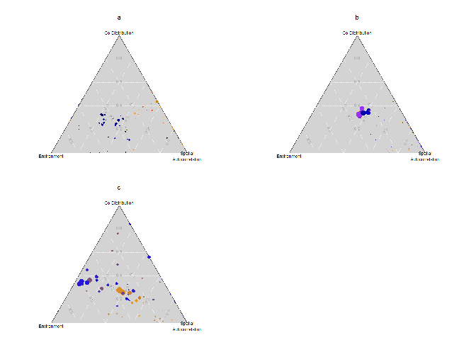
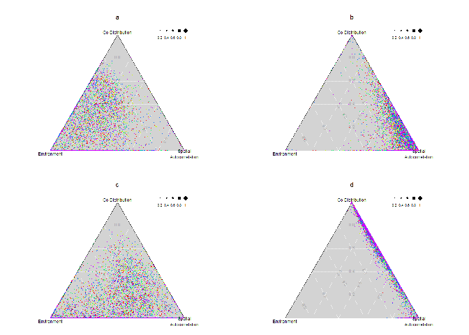
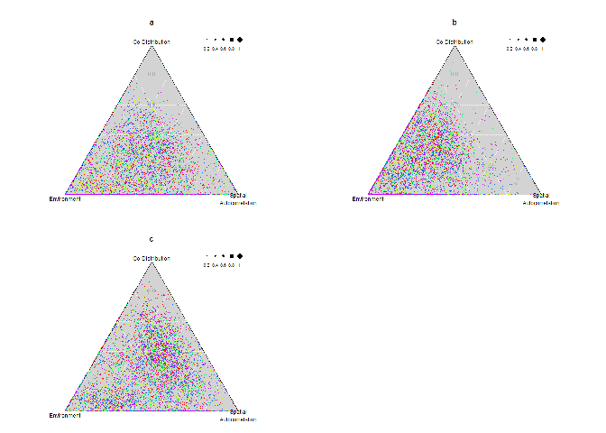
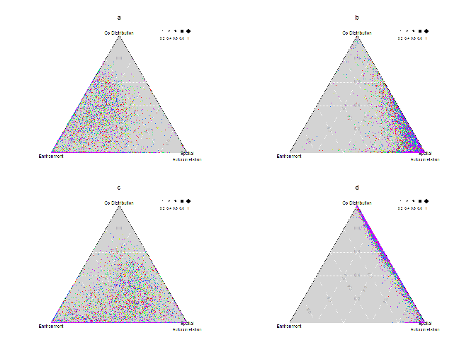
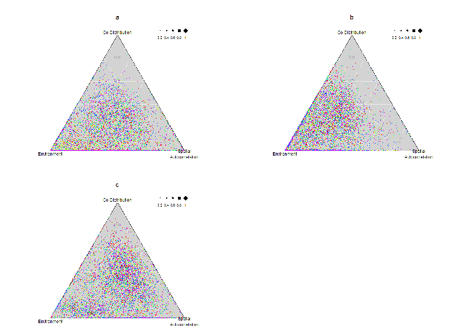

## Update
We changed the parameters from the original scripts. In the case of figure 2, we focused on niche breadth and species interactions. For this reason, figures a) and b) correspond to communities without competition, and the comparison is between narrow and wide niche breadth. For the case of figures c) and d), species interactions are included with an effect on both the colonization and extinction probabilities. 


Description          Param   Fig2a   Fig2b   Fig2c   Fig2d 
-------------------  ------  ------  ------  ------  ------
Number of Patches    N       1000    1000    1000    1000  
Environmental vars   D       1       1       1       1     
Species Richness     R       15      15      15      15    
Niche breadth        s_c     0.2     1       0.2     1     
Dispersal            alpha   0.005   0.005   0.005   0.005 
Colonization         c_0     0.4     0.4     0.4     0.4   
Interactions c       d_c     0       0       1.5     1.5   
Interactions e       d_e     0       0       1.5     1.5   

To load these figures, make sure that the script 'Draw_for_md.R' has run and produced the png files. The following chunk of code lets you can check if the figures are in the directory.


```r
figpng <- list.files(pattern = ".png")
figpng
```

```
##  [1] "fig2a.png"           "fig2b.png"           "fig2c.png"          
##  [4] "fig2d.png"           "fig3a.png"           "fig3b.png"          
##  [7] "fig3c.png"           "purefig2a.png"       "purefig2b.png"      
## [10] "purefig2c.png"       "purefig2d.png"       "purefig3a.png"      
## [13] "purefig3b.png"       "purefig3c.png"       "sitesfig2a.png"     
## [16] "sitesfig2b.png"      "sitesfig2c.png"      "sitesfig2d.png"     
## [19] "sitesfig3a.png"      "sitesfig3b.png"      "sitesfig3c.png"     
## [22] "sitesMeansfig2a.png" "sitesMeansfig2b.png" "sitesMeansfig2c.png"
## [25] "sitesMeansfig2d.png" "sitesMeansfig3a.png" "sitesMeansfig3b.png"
## [28] "sitesMeansfig3c.png"
```


The following figures were generated using the original code from the 'Draw figures.R' script, and they use the variation partition as shown in Figure A1, from the appendix of the original manuscript. 


<!-- -->


An additional approach considered only the variation partition components, [a] environment, [b] spatial autocorrelation, and [c] co-distribution. The code used to generate these figures can be found in the 'Draw_for_md.R' script. Essentially, only overlap1 was considered, which included the pure, or individual, fractions only. 

<!-- -->


### Figure 3

The parameters used for these communities are shown in the table. We changed these from the original code provided so that figure 3c would consider one third of the species to have low, medium and high dispersal, all of them with species interactions. 


Description          Param   Fig3a           Fig3b                   Fig3c                 
-------------------  ------  --------------  ----------------------  ----------------------
Number of Patches    N       1000 / 1000     1000 / 1000 / 1000      1000 / 1000 / 1000    
Environmental vars   D       1 / 1           1 / 1 / 1               1 / 1 / 1             
Species Richness     R       7 / 8           5 / 5 / 5               5 / 5 / 5             
Niche breadth        s_c     0.2 / 0.2       0.2 / 0.2 / 0.2         0.2 / 0.2 / 0.2       
Dispersal            alpha   0.005 / 0.005   0.001 / 0.005 / 0.015   0.001 / 0.005 / 0.015 
Colonization         c_0     0.4 / 0.4       0.4 / 0.4 / 0.4         0.4 / 0.4 / 0.4       
Interactions c       d_c     0 / 1.5         0 / 0 / 0               1.5 / 1.5 / 1.5       
Interactions e       d_e     0 / 1.5         0 / 0 / 0               1.5 / 1.5 / 1.5       


<!-- -->

Individual fractions only:

<!-- -->


### Patch contribution variation partitioning analysis
variPart function, the indSite argument was set to TRUE

Example output:


```r
vp <- readRDS("VPsiteFig2a.RDS")
str(vp[[1]])
```

```
## List of 3
##  $ overlap1: num [1:1000, 1:15, 1:3] 7.07e-04 -3.09e-05 1.54e-04 -5.28e-04 7.44e-04 ...
##   ..- attr(*, "dimnames")=List of 3
##   .. ..$ : chr [1:1000] "site1" "site2" "site3" "site4" ...
##   .. ..$ : chr [1:15] "y1" "y2" "y3" "y4" ...
##   .. ..$ : chr [1:3] "random" "spa" "env"
##  $ overlap2: num [1:1000, 1:15, 1:3] 3.22e-05 -8.36e-05 6.34e-06 -2.27e-04 1.62e-04 ...
##   ..- attr(*, "dimnames")=List of 3
##   .. ..$ : chr [1:1000] "site1" "site2" "site3" "site4" ...
##   .. ..$ : chr [1:15] "y1" "y2" "y3" "y4" ...
##   .. ..$ : chr [1:3] "spa-random" "env-random" "env-spa"
##  $ overlap3: num [1:1000, 1:15] -7.82e-04 6.87e-05 5.23e-05 2.61e-04 -5.29e-04 ...
##   ..- attr(*, "dimnames")=List of 2
##   .. ..$ : chr [1:1000] "site1" "site2" "site3" "site4" ...
##   .. ..$ : chr [1:15] "y1" "y2" "y3" "y4" ...
```

* Each "overlap"" has the data for 1000 patches and 15 species
* Overlap 1 includes the random, spatial and environment fractions only
* Overlap 2 has the pair interactions: spatial-random, env-random, env-spatial
* Overlap 3 has the interaction between the three of them: spatial-random-environment
* Since we are interested in this at the patch level, we could either add or take the mean across all the species in a given patch?

Not sure what the color scheme was supposed to be for these. I just set one color for each of the iterations.

#### Figure 2 - for the sites  

<!-- -->

#### Figure 3 - for the sites

<!-- -->

### Take the mean across species instead of the sum
#### Figure 2 - for the sites  

<!-- -->

#### Figure 3 - for the sites

<!-- -->
