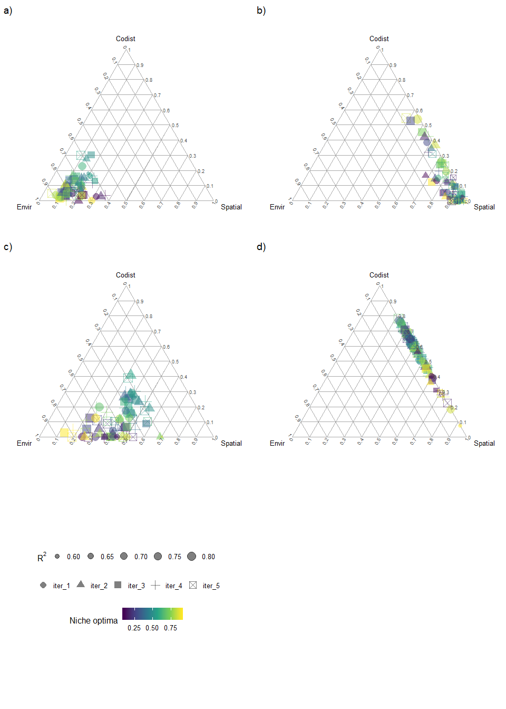
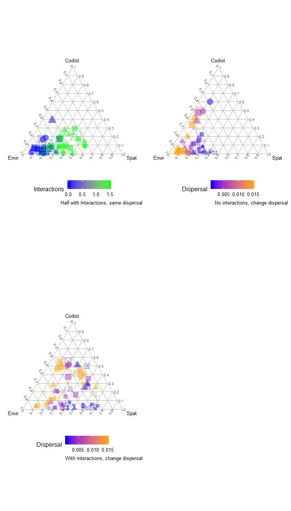

Manuscript Figures
================
Javiera Rudolph
February 20, 2019

| Description        | Param | Fig2a | Fig2b | Fig2c | Fig2d |
|:-------------------|:------|:------|:------|:------|:------|
| Number of Patches  | N     | 1000  | 1000  | 1000  | 1000  |
| Environmental vars | D     | 1     | 1     | 1     | 1     |
| Species Richness   | R     | 15    | 15    | 15    | 15    |
| Niche breadth      | s\_c  | 0.2   | 1     | 0.2   | 1     |
| Dispersal          | alpha | 0.005 | 0.005 | 0.005 | 0.005 |
| Colonization       | c\_0  | 0.4   | 0.4   | 0.4   | 0.4   |
| Interactions c     | d\_c  | 0     | 0     | 1.5   | 1.5   |
| Interactions e     | d\_e  | 0     | 0     | 1.5   | 1.5   |

### Figure 3

| Description        | Param | Fig3a         | Fig3b                 | Fig3c                 |
|:-------------------|:------|:--------------|:----------------------|:----------------------|
| Number of Patches  | N     | 1000 / 1000   | 1000 / 1000 / 1000    | 1000 / 1000 / 1000    |
| Environmental vars | D     | 1 / 1         | 1 / 1 / 1             | 1 / 1 / 1             |
| Species Richness   | R     | 7 / 8         | 5 / 5 / 5             | 5 / 5 / 5             |
| Niche breadth      | s\_c  | 0.2 / 0.2     | 0.2 / 0.2 / 0.2       | 0.2 / 0.2 / 0.2       |
| Dispersal          | alpha | 0.005 / 0.005 | 0.001 / 0.005 / 0.015 | 0.001 / 0.005 / 0.015 |
| Colonization       | c\_0  | 0.4 / 0.4     | 0.4 / 0.4 / 0.4       | 0.4 / 0.4 / 0.4       |
| Interactions c     | d\_c  | 0 / 1.5       | 0 / 0 / 0             | 1.5 / 1.5 / 1.5       |
| Interactions e     | d\_e  | 0 / 1.5       | 0 / 0 / 0             | 1.5 / 1.5 / 1.5       |

