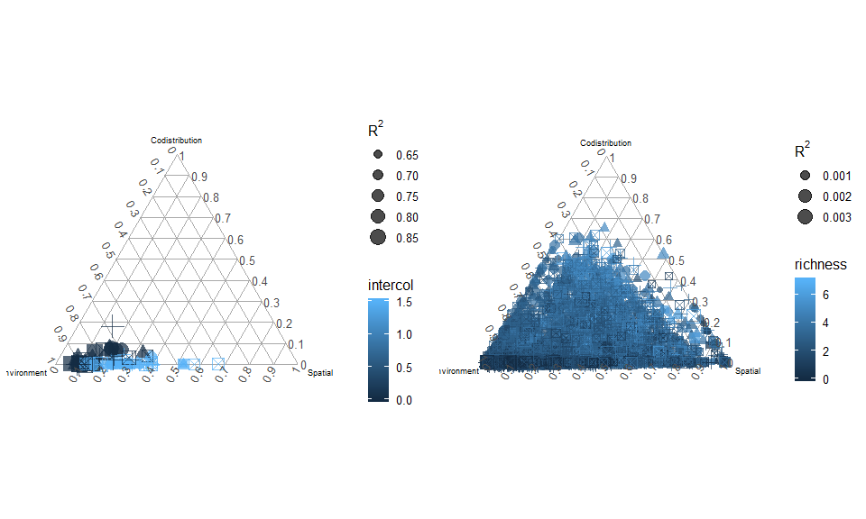
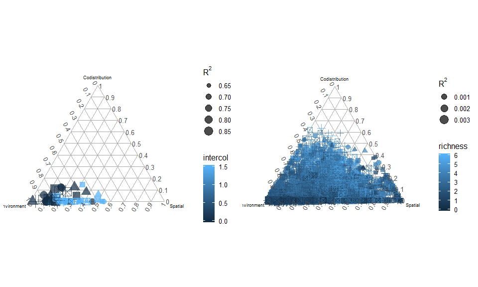
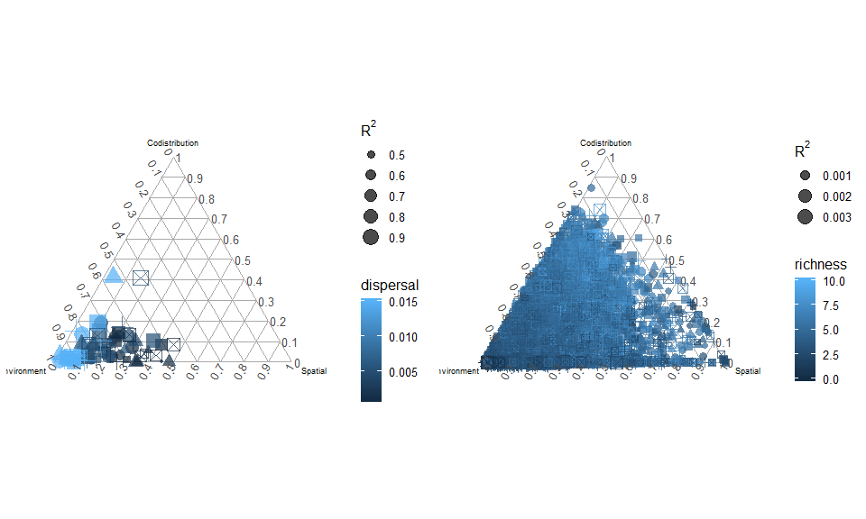
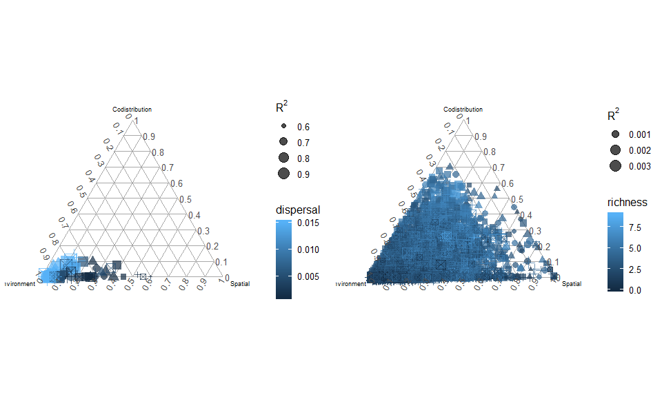
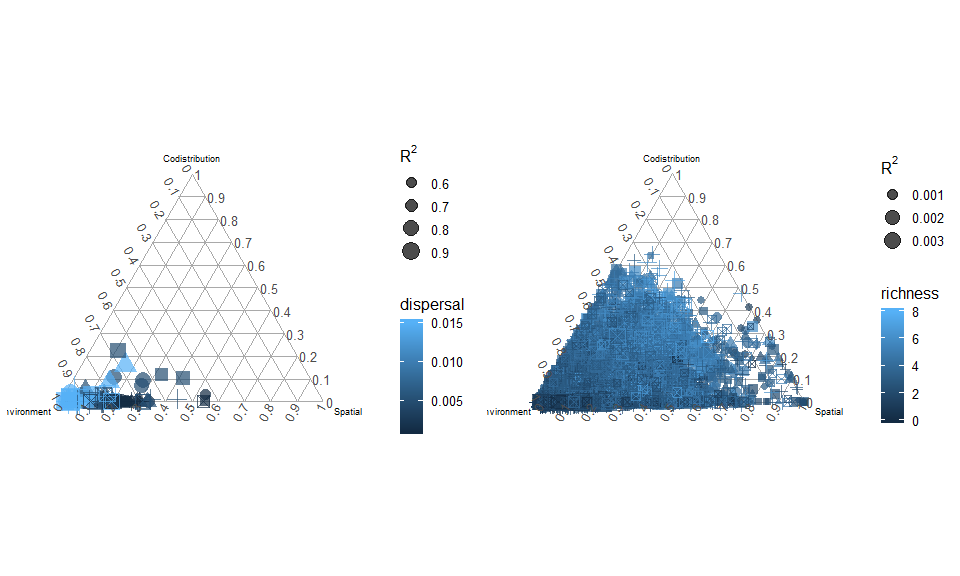
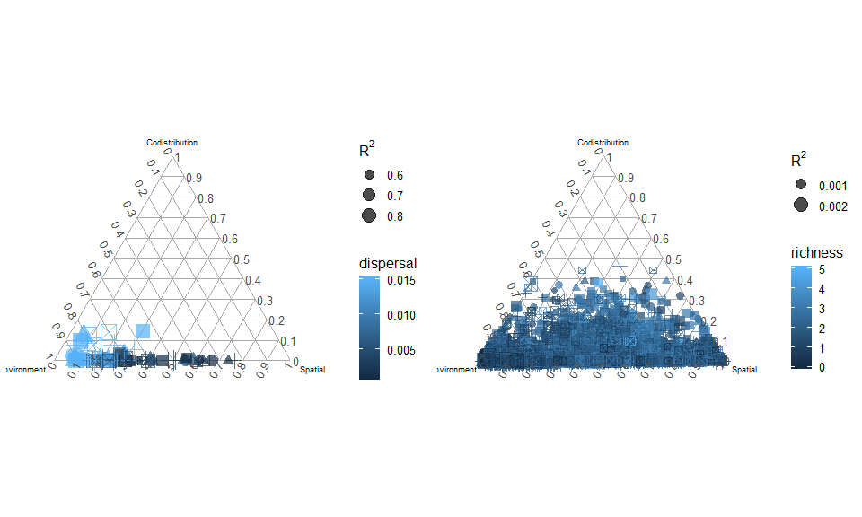
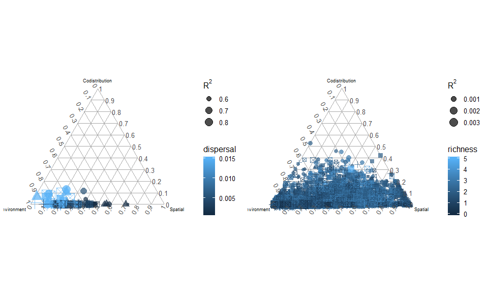

Figure 3 - Comparisons between gaussian and quadratic response to the environment
================
Javiera Rudolph
March 13, 2019

The results in this document correspond to the comparisons between gaussian and quadratic responses to the environment. We realized that using the same niche breadth in the gaussian and quadratic responses was dramatically different. The area under the curve of the parabola is significantly smaller, making the response to the environment extremely restricted. Therefore, we modified the parameters so that we could mantain a similar response when using a quadratic and gaussian response. Specifically, the quadratic function uses a larger niche breadth so keep a similar area under the curve as the gaussian response. When editing this function (S\_f: response to environment), using a parabola would give us negative values for areas outside the range of occurence. This might influence interactions, so we decided to rerun the scripts with all negative values in the response to environment set equal to zero. This is shown in the third figure of each scenario.

Scenario 1
==========

Scenario 1 - Gaussian response
==============================

|  nicheBreadth|  colProb|  dispersal|  intercol|  interext|
|-------------:|--------:|----------:|---------:|---------:|
|           0.2|      0.4|      0.005|       0.0|       0.0|
|           0.2|      0.4|      0.005|       1.5|       1.5|

Scenario 1 - Quadratic response
===============================

|  nicheBreadth|  colProb|  dispersal|  intercol|  interext|
|-------------:|--------:|----------:|---------:|---------:|
|           0.5|      0.4|      0.005|       0.0|       0.0|
|           0.5|      0.4|      0.005|       1.5|       1.5|

### No negative values in the response to environment

Scenario 2
==========

Scenario 2 - Gaussian response
==============================

|  nicheBreadth|  colProb|  dispersal|  intercol|  interext|
|-------------:|--------:|----------:|---------:|---------:|
|           0.2|      0.4|      0.001|         0|         0|
|           0.2|      0.4|      0.005|         0|         0|
|           0.2|      0.4|      0.015|         0|         0|

Scenario 2 - Quadratic response
===============================

|  nicheBreadth|  colProb|  dispersal|  intercol|  interext|
|-------------:|--------:|----------:|---------:|---------:|
|           0.5|      0.4|      0.001|         0|         0|
|           0.5|      0.4|      0.005|         0|         0|
|           0.5|      0.4|      0.015|         0|         0|

### No negative values in the response to environment

Scenario 3
==========

Scenario 3 - Gaussian response
==============================

|  nicheBreadth|  colProb|  dispersal|  intercol|  interext|
|-------------:|--------:|----------:|---------:|---------:|
|           0.2|      0.4|      0.001|       1.5|       1.5|
|           0.2|      0.4|      0.005|       1.5|       1.5|
|           0.2|      0.4|      0.015|       1.5|       1.5|

Scenario 3 - Quadratic response
===============================

|  nicheBreadth|  colProb|  dispersal|  intercol|  interext|
|-------------:|--------:|----------:|---------:|---------:|
|           0.5|      0.4|      0.001|       1.5|       1.5|
|           0.5|      0.4|      0.005|       1.5|       1.5|
|           0.5|      0.4|      0.015|       1.5|       1.5|

### No negative values in the response to environment

