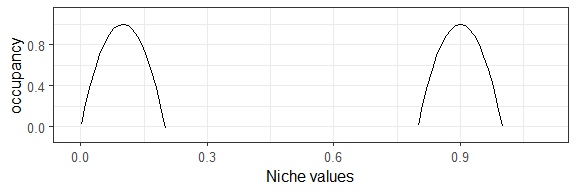
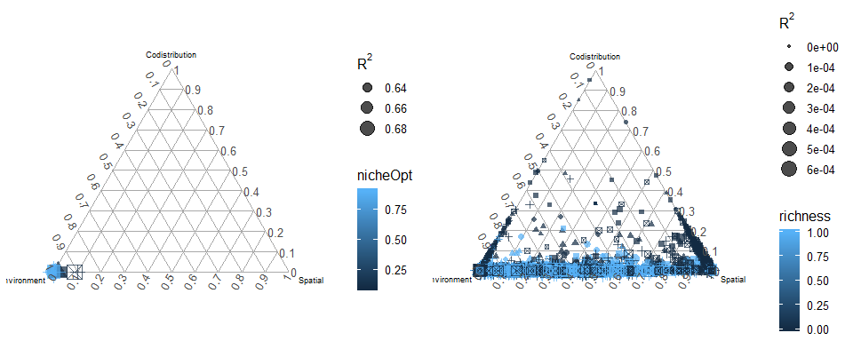
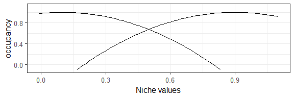
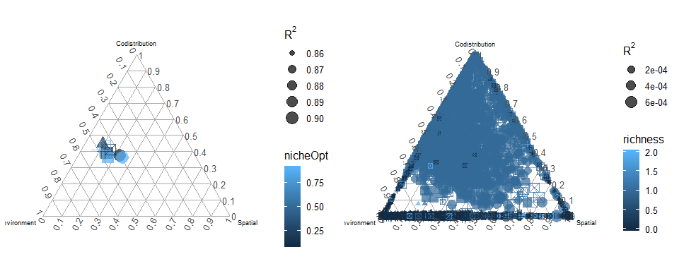

Fig2c - whend does niche breadth allow interaction?
================
Javiera Rudolph
March 18, 2019

We tried changing the niche breadth (increase) to allow for interactions to play a role in the Figure2c scenario. It didn't work so now we are trying to test a range of niche breadths to see at which point we are able to see interactions.

Scenario1
=========

| species |  nicheOpt|  nicheBreadth|  colProb|  dispersal|  intercol|  interext|
|:--------|---------:|-------------:|--------:|----------:|---------:|---------:|
| 1       |       0.1|           0.2|      0.4|      0.005|       1.5|       1.5|
| 2       |       0.9|           0.2|      0.4|      0.005|       1.5|       1.5|

No negatives

Scenario2
=========

| species |  nicheOpt|  nicheBreadth|  colProb|  dispersal|  intercol|  interext|
|:--------|---------:|-------------:|--------:|----------:|---------:|---------:|
| 1       |       0.1|           0.4|      0.4|      0.005|       1.5|       1.5|
| 2       |       0.9|           0.4|      0.4|      0.005|       1.5|       1.5|

No negatives

Scenario3
=========

| species |  nicheOpt|  nicheBreadth|  colProb|  dispersal|  intercol|  interext|
|:--------|---------:|-------------:|--------:|----------:|---------:|---------:|
| 1       |       0.1|           0.6|      0.4|      0.005|       1.5|       1.5|
| 2       |       0.9|           0.6|      0.4|      0.005|       1.5|       1.5|

No negatives

Scenario4
=========

| species |  nicheOpt|  nicheBreadth|  colProb|  dispersal|  intercol|  interext|
|:--------|---------:|-------------:|--------:|----------:|---------:|---------:|
| 1       |       0.1|           0.8|      0.4|      0.005|       1.5|       1.5|
| 2       |       0.9|           0.8|      0.4|      0.005|       1.5|       1.5|

No negatives

Scenario5
=========

| species |  nicheOpt|  nicheBreadth|  colProb|  dispersal|  intercol|  interext|
|:--------|---------:|-------------:|--------:|----------:|---------:|---------:|
| 1       |       0.1|             1|      0.4|      0.005|       1.5|       1.5|
| 2       |       0.9|             1|      0.4|      0.005|       1.5|       1.5|

No negatives

Scenario6
=========

| species |  nicheOpt|  nicheBreadth|  colProb|  dispersal|  intercol|  interext|
|:--------|---------:|-------------:|--------:|----------:|---------:|---------:|
| 1       |       0.1|           1.2|      0.4|      0.005|       1.5|       1.5|
| 2       |       0.9|           1.2|      0.4|      0.005|       1.5|       1.5|

No negatives

Scenario7
=========

| species |  nicheOpt|  nicheBreadth|  colProb|  dispersal|  intercol|  interext|
|:--------|---------:|-------------:|--------:|----------:|---------:|---------:|
| 1       |       0.1|           1.4|      0.4|      0.005|       1.5|       1.5|
| 2       |       0.9|           1.4|      0.4|      0.005|       1.5|       1.5|

No negatives

Scenario8
=========

| species |  nicheOpt|  nicheBreadth|  colProb|  dispersal|  intercol|  interext|
|:--------|---------:|-------------:|--------:|----------:|---------:|---------:|
| 1       |       0.1|           1.6|      0.4|      0.005|       1.5|       1.5|
| 2       |       0.9|           1.6|      0.4|      0.005|       1.5|       1.5|

No negatives

Scenario9
=========

| species |  nicheOpt|  nicheBreadth|  colProb|  dispersal|  intercol|  interext|
|:--------|---------:|-------------:|--------:|----------:|---------:|---------:|
| 1       |       0.1|           1.8|      0.4|      0.005|       1.5|       1.5|
| 2       |       0.9|           1.8|      0.4|      0.005|       1.5|       1.5|

No negatives

Scenario10
==========

| species |  nicheOpt|  nicheBreadth|  colProb|  dispersal|  intercol|  interext|
|:--------|---------:|-------------:|--------:|----------:|---------:|---------:|
| 1       |       0.1|             2|      0.4|      0.005|       1.5|       1.5|
| 2       |       0.9|             2|      0.4|      0.005|       1.5|       1.5|

No negatives

