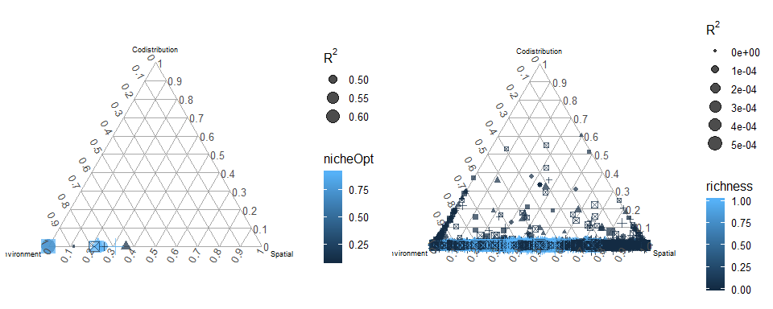
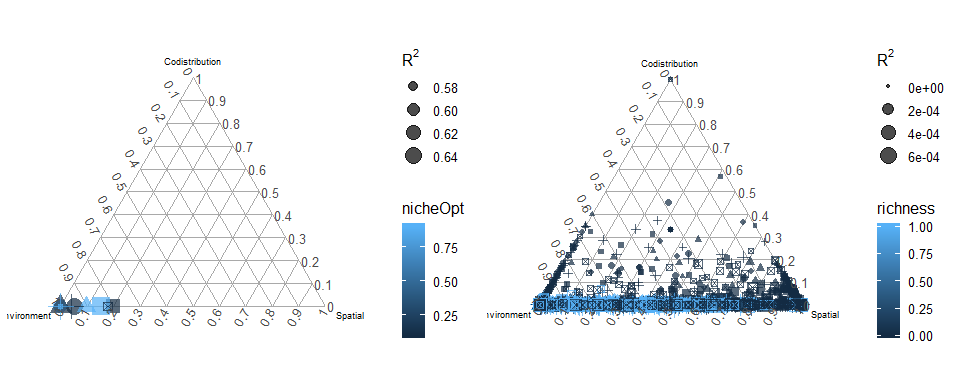
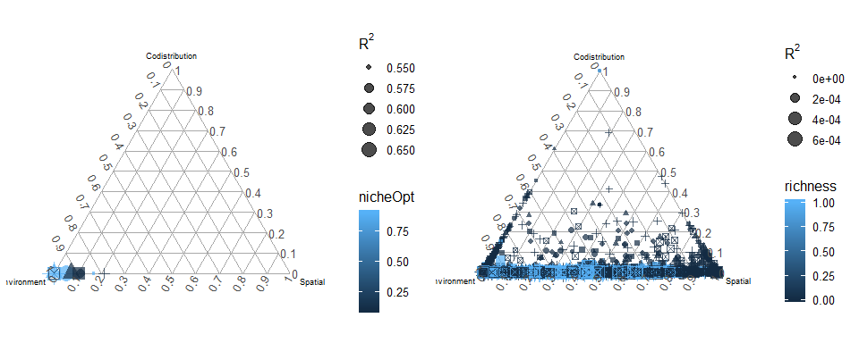
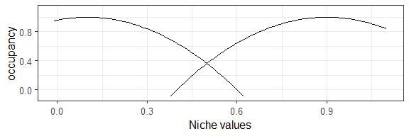
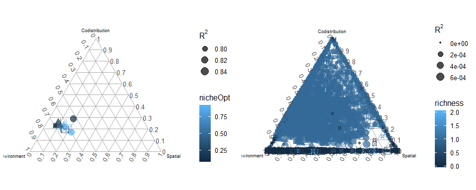
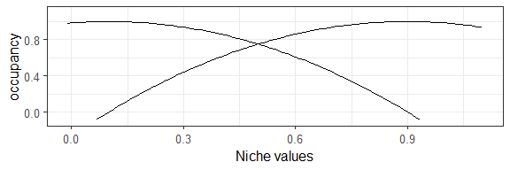

Two species - when does niche breadth allow interaction?
================
Javiera Rudolph
March 18, 2019

We tried changing the niche breadth (increase) to allow for interactions to play a role in the Figure2c scenario. It didn't work so now we are trying to test a range of niche breadths to see at which point we are able to see interactions.

Scenario1
=========

| species |  nicheOpt|  nicheBreadth|  colProb|  dispersal|  intercol|  interext|
|:--------|---------:|-------------:|--------:|----------:|---------:|---------:|
| 1       |       0.1|           0.2|      0.4|      0.005|       1.5|       1.5|
| 2       |       0.9|           0.2|      0.4|      0.005|       1.5|       1.5|

    ## Warning: Removed 82 rows containing missing values (geom_path).

    ## Warning: Removed 82 rows containing missing values (geom_path).

No negatives

Scenario2
=========

| species |  nicheOpt|  nicheBreadth|  colProb|  dispersal|  intercol|  interext|
|:--------|---------:|-------------:|--------:|----------:|---------:|---------:|
| 1       |       0.1|           0.4|      0.4|      0.005|       1.5|       1.5|
| 2       |       0.9|           0.4|      0.4|      0.005|       1.5|       1.5|

    ## Warning: Removed 72 rows containing missing values (geom_path).

    ## Warning: Removed 64 rows containing missing values (geom_path).

No negatives

Scenario3
=========

| species |  nicheOpt|  nicheBreadth|  colProb|  dispersal|  intercol|  interext|
|:--------|---------:|-------------:|--------:|----------:|---------:|---------:|
| 1       |       0.1|           0.6|      0.4|      0.005|       1.5|       1.5|
| 2       |       0.9|           0.6|      0.4|      0.005|       1.5|       1.5|

    ## Warning: Removed 62 rows containing missing values (geom_path).

    ## Warning: Removed 54 rows containing missing values (geom_path).

No negatives

Scenario4
=========

| species |  nicheOpt|  nicheBreadth|  colProb|  dispersal|  intercol|  interext|
|:--------|---------:|-------------:|--------:|----------:|---------:|---------:|
| 1       |       0.1|           0.8|      0.4|      0.005|       1.5|       1.5|
| 2       |       0.9|           0.8|      0.4|      0.005|       1.5|       1.5|

    ## Warning: Removed 53 rows containing missing values (geom_path).

    ## Warning: Removed 45 rows containing missing values (geom_path).

No negatives

Scenario5
=========

| species |  nicheOpt|  nicheBreadth|  colProb|  dispersal|  intercol|  interext|
|:--------|---------:|-------------:|--------:|----------:|---------:|---------:|
| 1       |       0.1|             1|      0.4|      0.005|       1.5|       1.5|
| 2       |       0.9|             1|      0.4|      0.005|       1.5|       1.5|

    ## Warning: Removed 43 rows containing missing values (geom_path).

    ## Warning: Removed 35 rows containing missing values (geom_path).

No negatives

Scenario6
=========

| species |  nicheOpt|  nicheBreadth|  colProb|  dispersal|  intercol|  interext|
|:--------|---------:|-------------:|--------:|----------:|---------:|---------:|
| 1       |       0.1|           1.2|      0.4|      0.005|       1.5|       1.5|
| 2       |       0.9|           1.2|      0.4|      0.005|       1.5|       1.5|

    ## Warning: Removed 34 rows containing missing values (geom_path).

    ## Warning: Removed 26 rows containing missing values (geom_path).

No negatives

Scenario7
=========

| species |  nicheOpt|  nicheBreadth|  colProb|  dispersal|  intercol|  interext|
|:--------|---------:|-------------:|--------:|----------:|---------:|---------:|
| 1       |       0.1|           1.4|      0.4|      0.005|       1.5|       1.5|
| 2       |       0.9|           1.4|      0.4|      0.005|       1.5|       1.5|

    ## Warning: Removed 24 rows containing missing values (geom_path).

    ## Warning: Removed 16 rows containing missing values (geom_path).

No negatives

Scenario8
=========

| species |  nicheOpt|  nicheBreadth|  colProb|  dispersal|  intercol|  interext|
|:--------|---------:|-------------:|--------:|----------:|---------:|---------:|
| 1       |       0.1|           1.6|      0.4|      0.005|       1.5|       1.5|
| 2       |       0.9|           1.6|      0.4|      0.005|       1.5|       1.5|

    ## Warning: Removed 15 rows containing missing values (geom_path).

    ## Warning: Removed 7 rows containing missing values (geom_path).

No negatives

Scenario9
=========

| species |  nicheOpt|  nicheBreadth|  colProb|  dispersal|  intercol|  interext|
|:--------|---------:|-------------:|--------:|----------:|---------:|---------:|
| 1       |       0.1|           1.8|      0.4|      0.005|       1.5|       1.5|
| 2       |       0.9|           1.8|      0.4|      0.005|       1.5|       1.5|

    ## Warning: Removed 6 rows containing missing values (geom_path).

No negatives

Scenario10
==========

| species |  nicheOpt|  nicheBreadth|  colProb|  dispersal|  intercol|  interext|
|:--------|---------:|-------------:|--------:|----------:|---------:|---------:|
| 1       |       0.1|             2|      0.4|      0.005|       1.5|       1.5|
| 2       |       0.9|             2|      0.4|      0.005|       1.5|       1.5|

No negatives

