Figure 2c - niche breadth and species interactions
================
Javiera Rudolph
March 19, 2019

-   [Introduction](#introduction)
-   [Ternary plots](#ternary-plots)
-   [Quadratic response to environment](#quadratic-response-to-environment)

Introduction
------------

In all of these scenarios we are using 15 species, with a niche optima for each of them evenly spaced from 0 to 1. The niche breadth is the same for all species and the specific value for each scenario is shown on the title of thefigures. These response curves were generated using a quadratic response.

Ternary plots
-------------

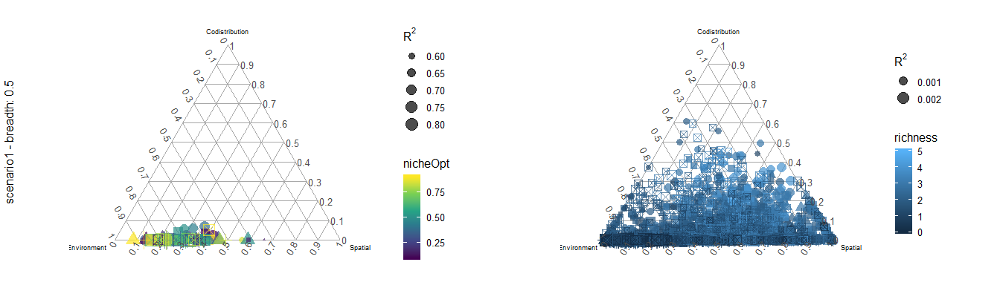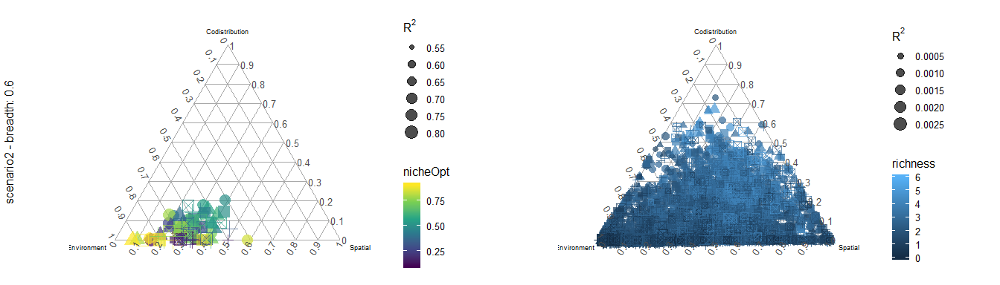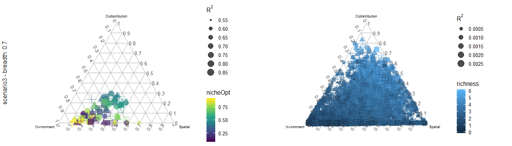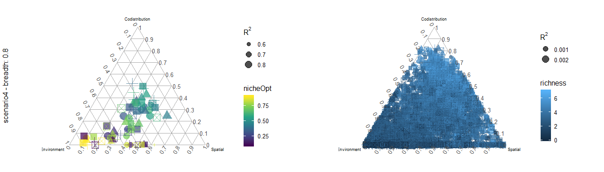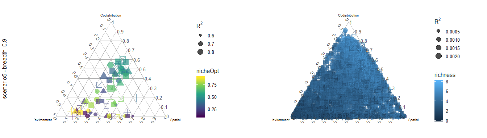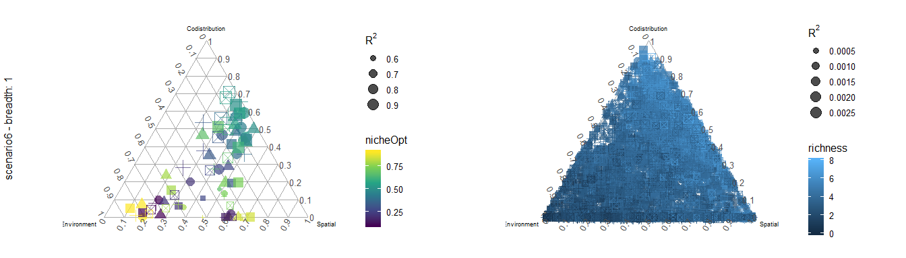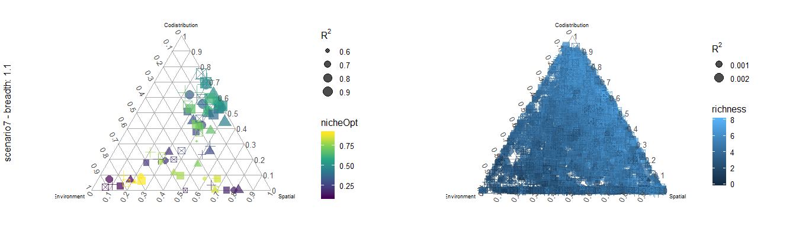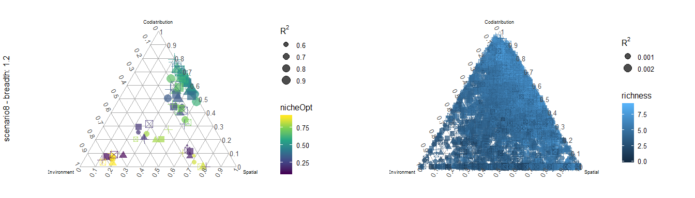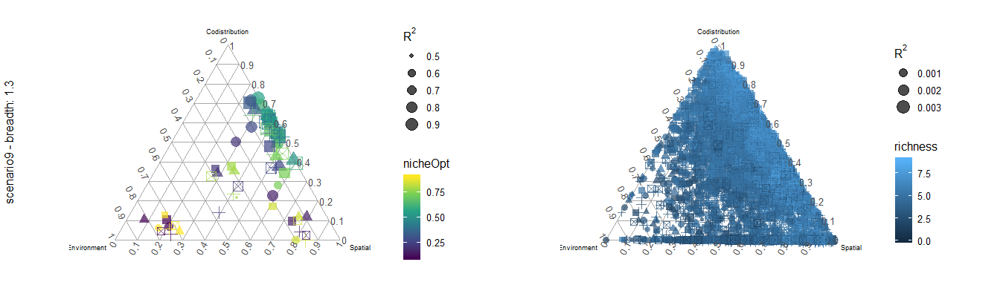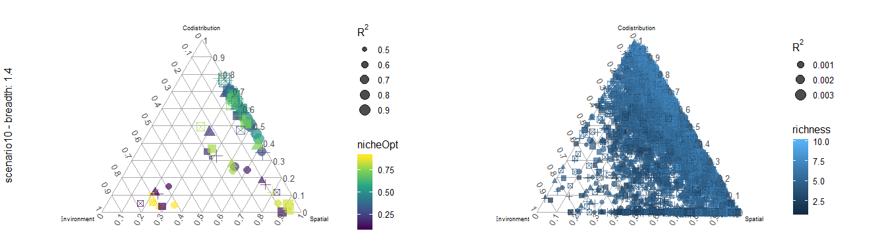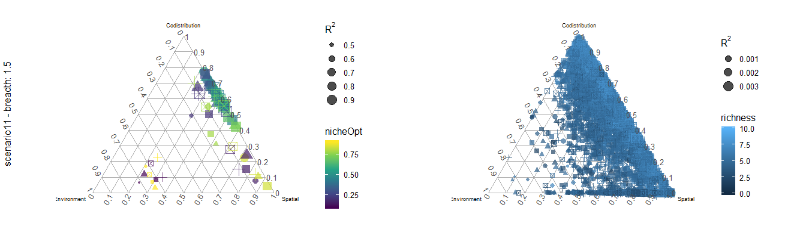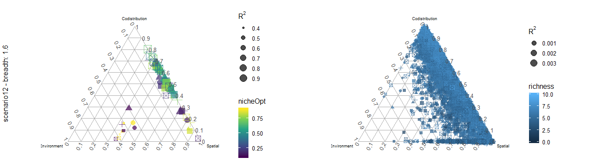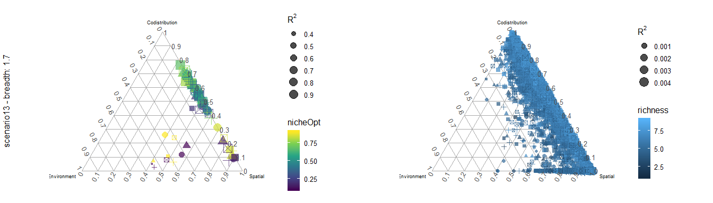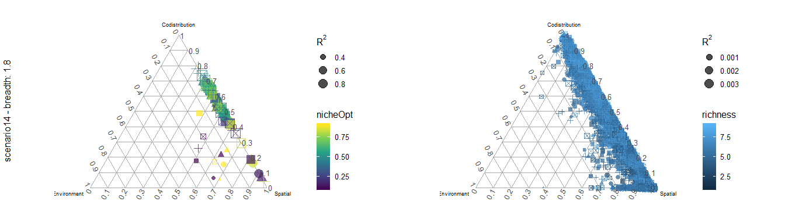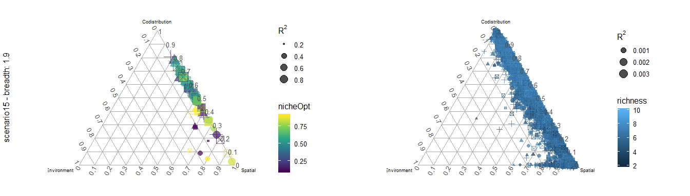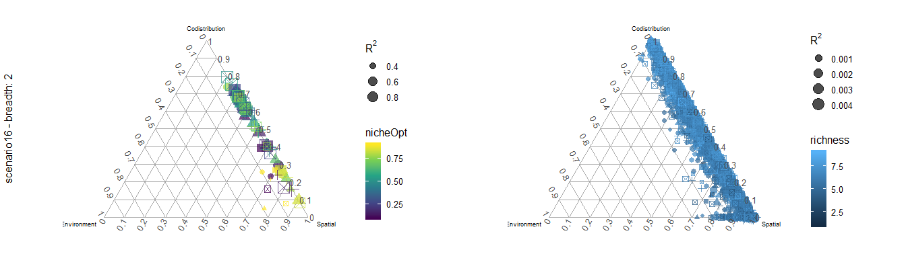

Quadratic response to environment
---------------------------------

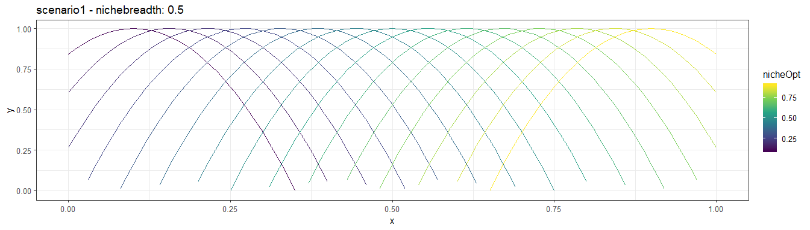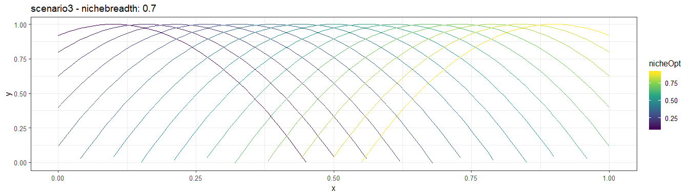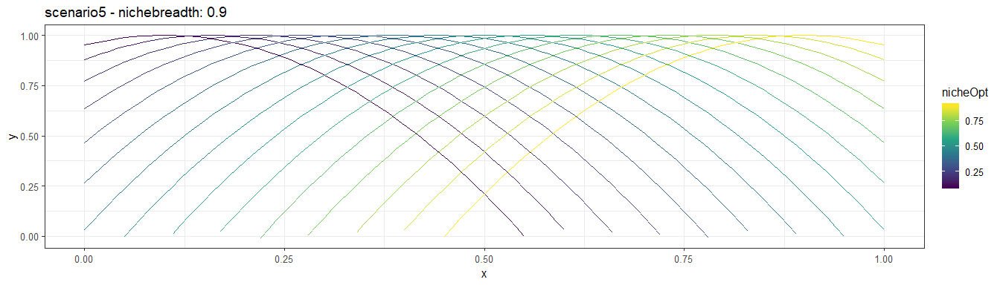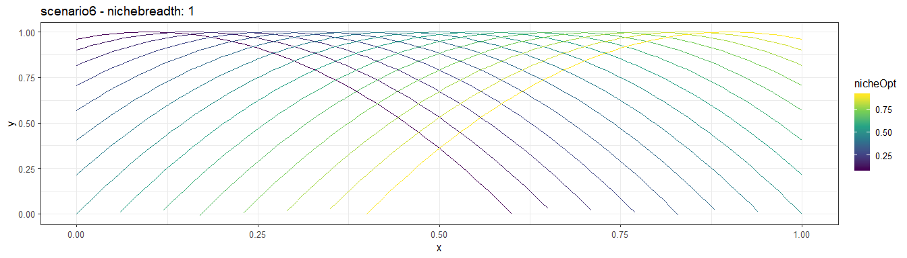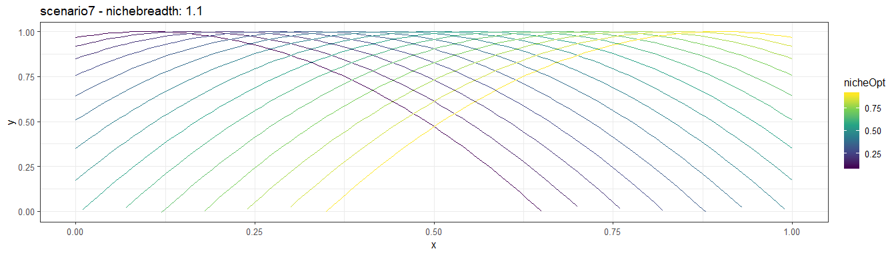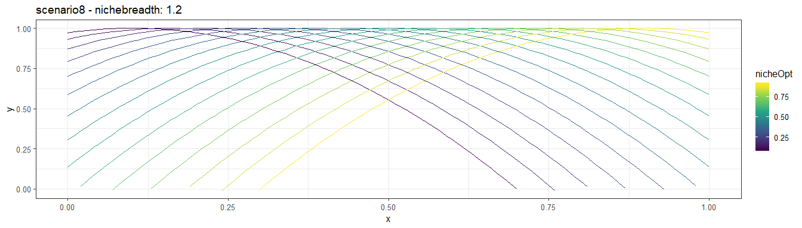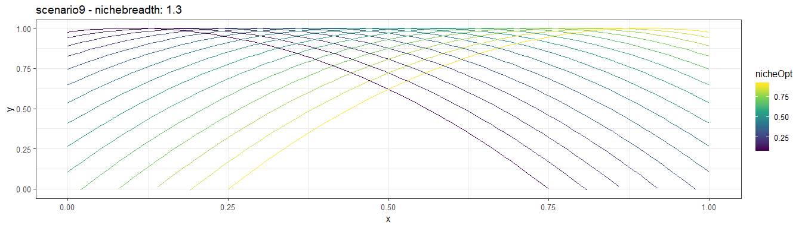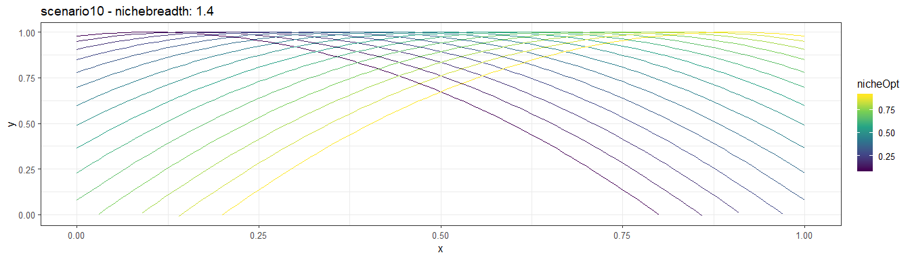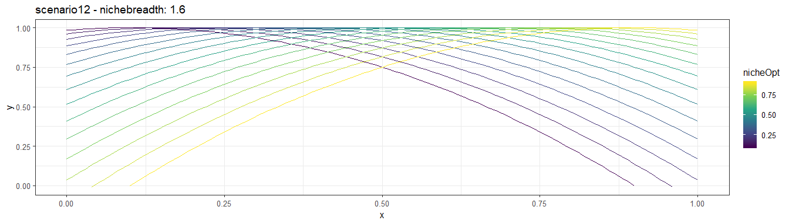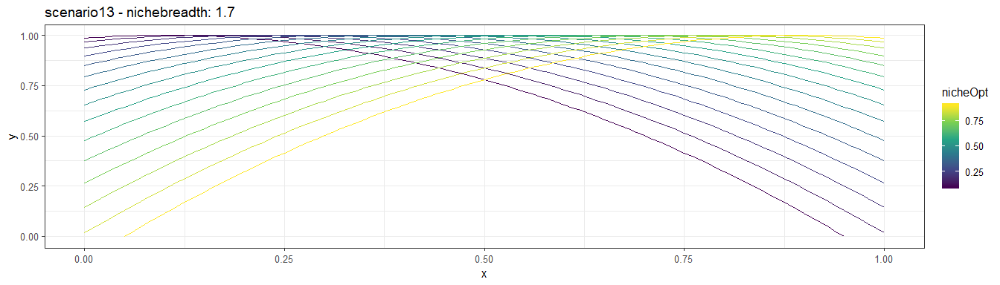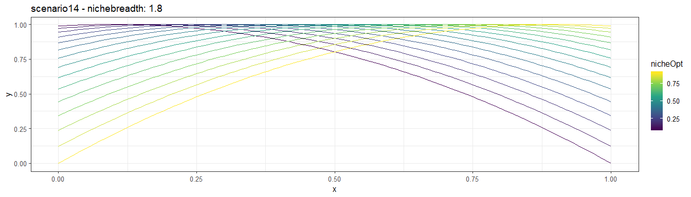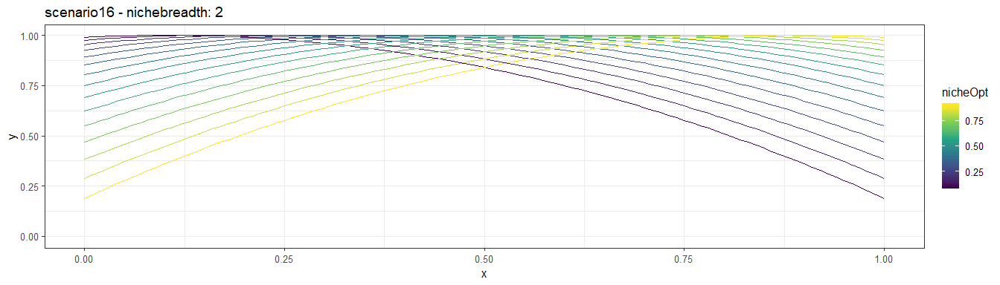
