Figure 2c - species interactions
================
Javiera Rudolph
March 21, 2019

-   [Introduction](#introduction)
-   [Ternary plots](#ternary-plots)

Introduction
------------

In all of these scenarios we are using 15 species, with a niche optima for each of them evenly spaced from 0 to 1. The niche breadth is set to 0.8 using a quadratic response to the environment. We are exploring a range of values for species interactions, from 0.5 to 1.5, which are applied to both the effect of interactions on colonization and on extinction.

Ternary plots
-------------

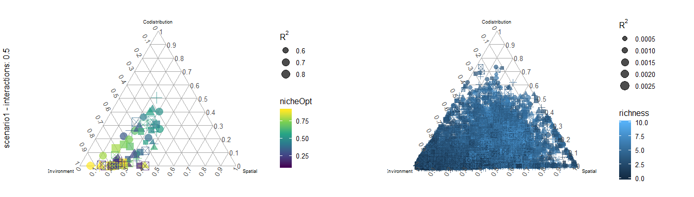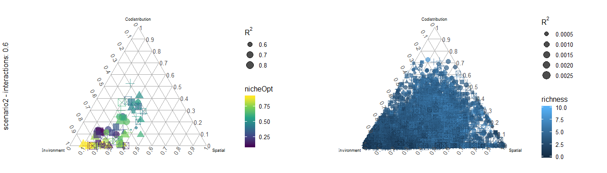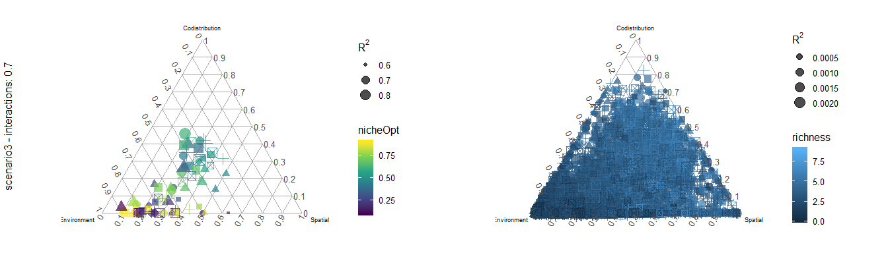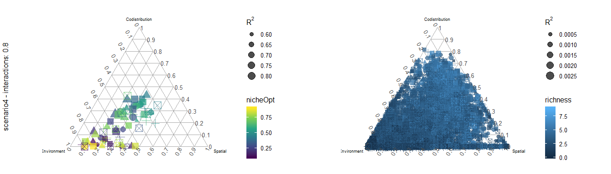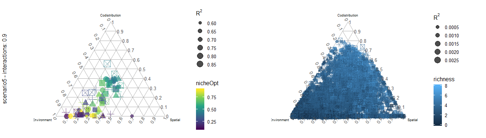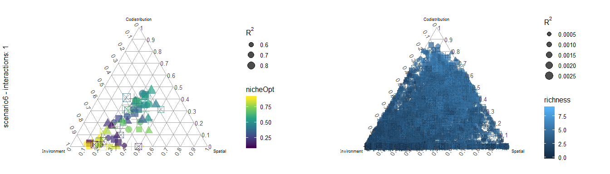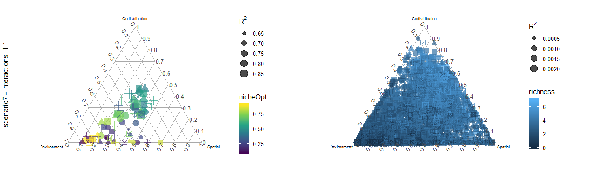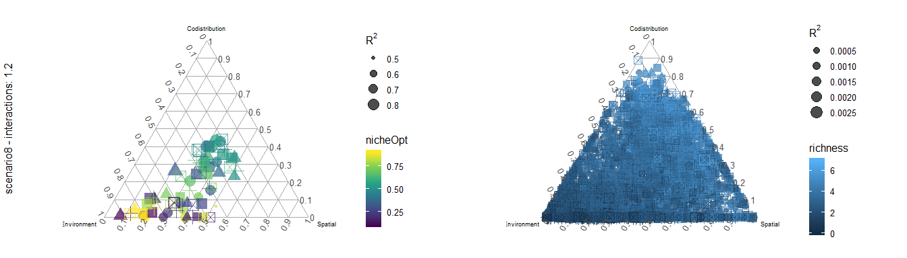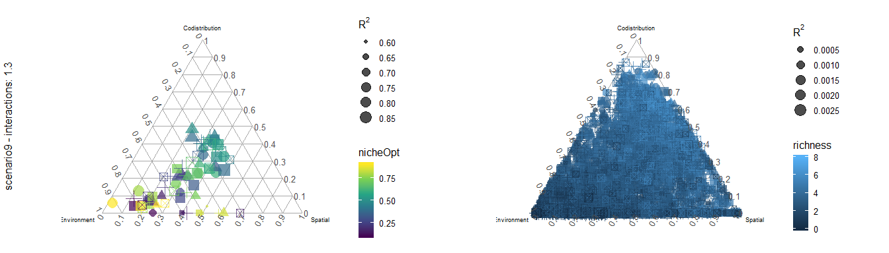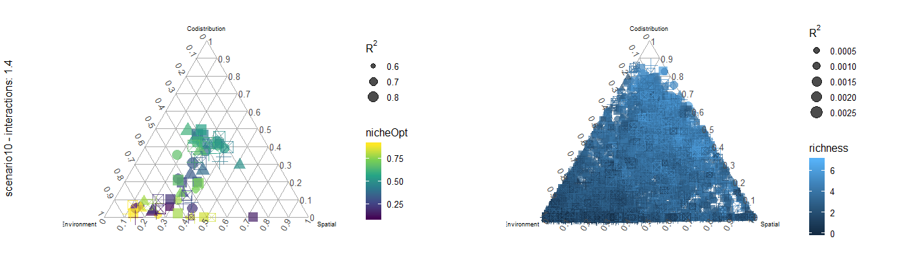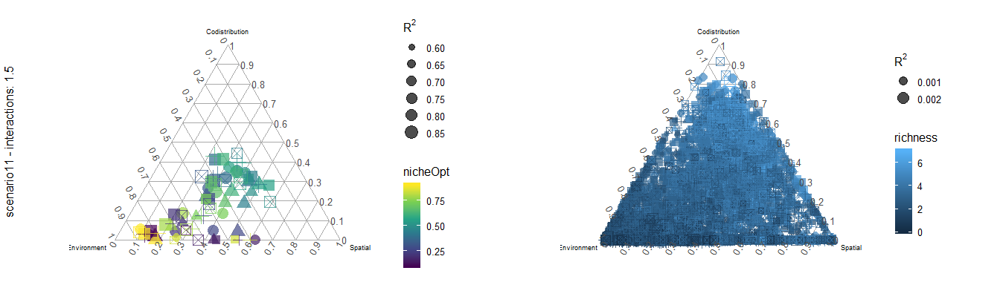
