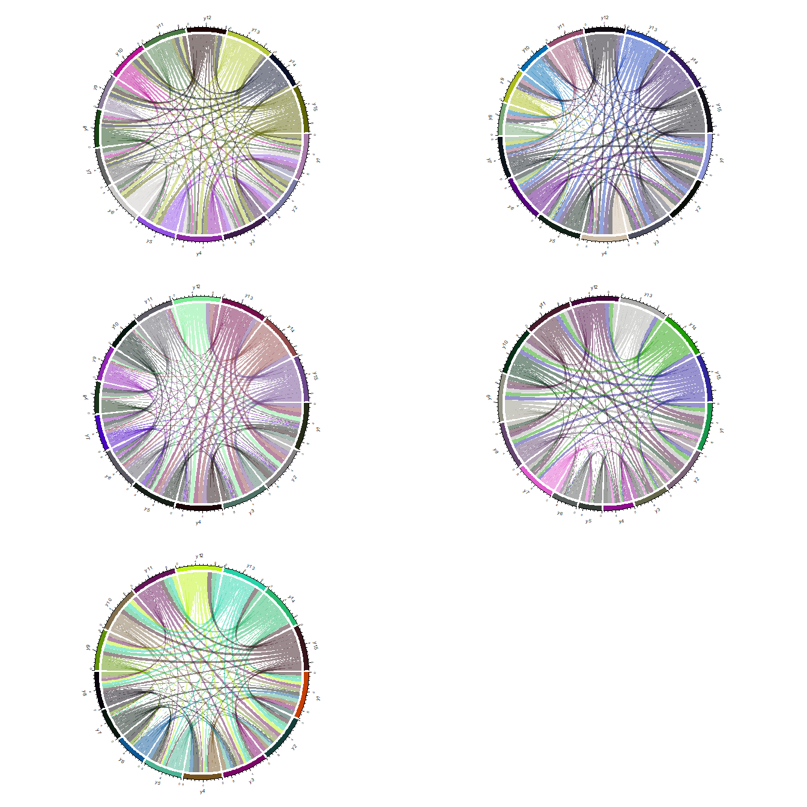

Species by Species covariance (or correlation) matrix
================
Javiera Rudolph
March 21, 2019

``` r
source("functions/rmd_figure_prep_fx.R")
```

We would like to get the species to species interaction matrices for each of the scenarios being tested. When setting up the metacommunity simulations, an interaction matrix, **A**, was used. We would like to compare the interaction matrix resulting from the model to the one used in the simulation. From the original code, this matrix **A** is defined as:

``` r
# Interaction matrix
R <- 15
A = matrix(0,nr=R,nc=R)
d = as.matrix(dist(c(1:R),upper=TRUE,diag=T))
A[d<=1] = -1
diag(A) = 0

A
```

    ##       [,1] [,2] [,3] [,4] [,5] [,6] [,7] [,8] [,9] [,10] [,11] [,12] [,13]
    ##  [1,]    0   -1    0    0    0    0    0    0    0     0     0     0     0
    ##  [2,]   -1    0   -1    0    0    0    0    0    0     0     0     0     0
    ##  [3,]    0   -1    0   -1    0    0    0    0    0     0     0     0     0
    ##  [4,]    0    0   -1    0   -1    0    0    0    0     0     0     0     0
    ##  [5,]    0    0    0   -1    0   -1    0    0    0     0     0     0     0
    ##  [6,]    0    0    0    0   -1    0   -1    0    0     0     0     0     0
    ##  [7,]    0    0    0    0    0   -1    0   -1    0     0     0     0     0
    ##  [8,]    0    0    0    0    0    0   -1    0   -1     0     0     0     0
    ##  [9,]    0    0    0    0    0    0    0   -1    0    -1     0     0     0
    ## [10,]    0    0    0    0    0    0    0    0   -1     0    -1     0     0
    ## [11,]    0    0    0    0    0    0    0    0    0    -1     0    -1     0
    ## [12,]    0    0    0    0    0    0    0    0    0     0    -1     0    -1
    ## [13,]    0    0    0    0    0    0    0    0    0     0     0    -1     0
    ## [14,]    0    0    0    0    0    0    0    0    0     0     0     0    -1
    ## [15,]    0    0    0    0    0    0    0    0    0     0     0     0     0
    ##       [,14] [,15]
    ##  [1,]     0     0
    ##  [2,]     0     0
    ##  [3,]     0     0
    ##  [4,]     0     0
    ##  [5,]     0     0
    ##  [6,]     0     0
    ##  [7,]     0     0
    ##  [8,]     0     0
    ##  [9,]     0     0
    ## [10,]     0     0
    ## [11,]     0     0
    ## [12,]     0     0
    ## [13,]    -1     0
    ## [14,]     0    -1
    ## [15,]    -1     0

Using the example from scenario in Figure 2c, fow which we used the following simulation parameters:

``` r
folderpath <- "outputs/20190318-fig2c_quad/"
params <- get_params_table(folderpath, "scenario4")
params %>% 
  knitr::kable()
```

| species |   nicheOpt|  nicheBreadth|  colProb|  dispersal|  intercol|  interext|
|:--------|----------:|-------------:|--------:|----------:|---------:|---------:|
| 1       |  0.1000000|           0.8|      0.4|      0.005|       1.5|       1.5|
| 2       |  0.1571429|           0.8|      0.4|      0.005|       1.5|       1.5|
| 3       |  0.2142857|           0.8|      0.4|      0.005|       1.5|       1.5|
| 4       |  0.2714286|           0.8|      0.4|      0.005|       1.5|       1.5|
| 5       |  0.3285714|           0.8|      0.4|      0.005|       1.5|       1.5|
| 6       |  0.3857143|           0.8|      0.4|      0.005|       1.5|       1.5|
| 7       |  0.4428571|           0.8|      0.4|      0.005|       1.5|       1.5|
| 8       |  0.5000000|           0.8|      0.4|      0.005|       1.5|       1.5|
| 9       |  0.5571429|           0.8|      0.4|      0.005|       1.5|       1.5|
| 10      |  0.6142857|           0.8|      0.4|      0.005|       1.5|       1.5|
| 11      |  0.6714286|           0.8|      0.4|      0.005|       1.5|       1.5|
| 12      |  0.7285714|           0.8|      0.4|      0.005|       1.5|       1.5|
| 13      |  0.7857143|           0.8|      0.4|      0.005|       1.5|       1.5|
| 14      |  0.8428571|           0.8|      0.4|      0.005|       1.5|       1.5|
| 15      |  0.9000000|           0.8|      0.4|      0.005|       1.5|       1.5|

And we obtained the following results:

``` r
arrange_plots(folderpath, "scenario4", colorSpp = "nicheOpt", colorSites = "richness", leftlabel = "Fig2c")
```


When we look at the structure of the HMSC object created for this scenario, it has 5 iterations. In the resulting figures, each iteration has a different shape. Does this mean that we should get a species interaction matrix for each one of these iterations?

``` r
modelfile <- readRDS(paste0(folderpath, "scenario4-model.RDS"))
```

``` r
par(mfrow=c(3,2))

for(i in 1:5){
assoMat <- corRandomEff(modelfile[[i]])
chordDiagram(assoMat[, , 1, 1], symmetric = TRUE)
}
```



When we want to look at the matrix, I am confused about the siteMean vs plotMean. Keep in mind that this site mean is using only one of the iterations.

``` r
for(i in 1:5){
  assoMat <- corRandomEff(modelfile[[i]])
siteMean <- apply(assoMat[ , , , 1], 1:2, mean)
#plotMean <- apply(assoMat[ , , , 2], 1:2, mean)

siteDrawCol <- matrix(NA, nrow = nrow(siteMean), ncol = ncol(siteMean))
siteDrawCol[which(siteMean > 0.4, arr.ind=TRUE)]<-"red"
siteDrawCol[which(siteMean < -0.4, arr.ind=TRUE)]<-"blue"
# Build matrix of "significance" for corrplot
siteDraw <- siteDrawCol
siteDraw[which(!is.na(siteDraw), arr.ind = TRUE)] <- 0
siteDraw[which(is.na(siteDraw), arr.ind = TRUE)] <- 1
siteDraw <- matrix(as.numeric(siteDraw), nrow = nrow(siteMean), ncol = ncol(siteMean))

par(mfrow=c(1,2))
Colour <- colorRampPalette(c("blue", "white", "red"))(200)
corrplot(siteMean, method = "color", col = Colour, type = "lower",
diag = FALSE, p.mat = siteDraw, tl.srt = 45)

corrplot(A, method = "color", col = Colour, type = "lower",
diag = FALSE, p.mat = siteDraw, tl.srt = 45)
}
```


