Testing range of niche breadth with and without species interactions
================
Javiera Rudolph
March 25, 2019

Testing niche breadth with and without species interactions:

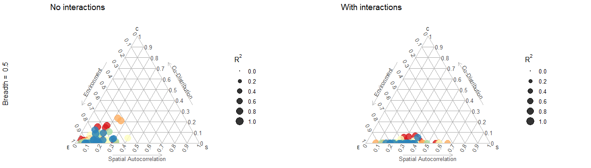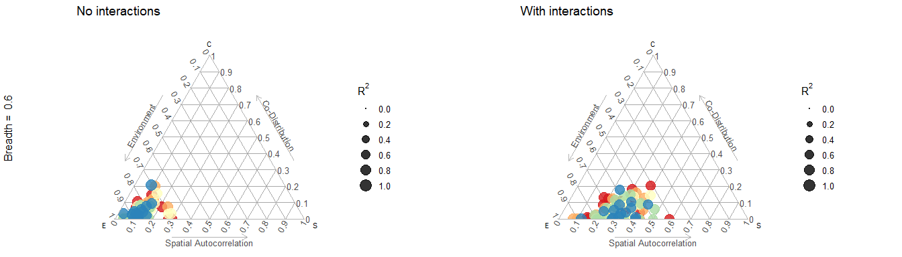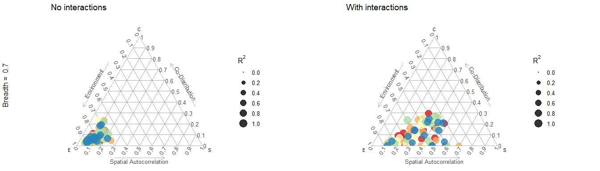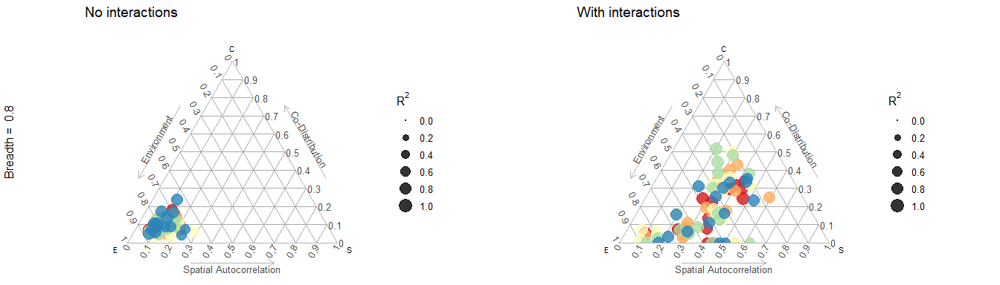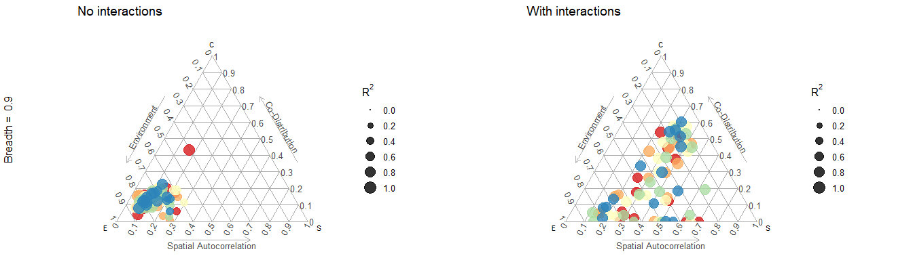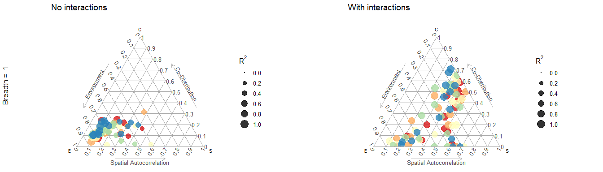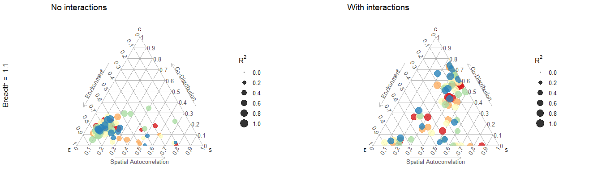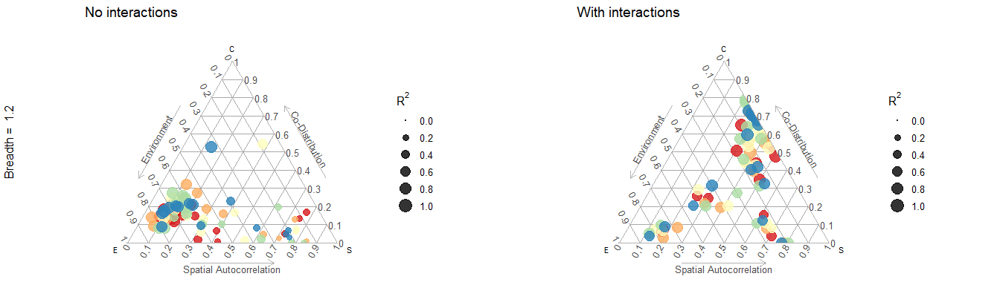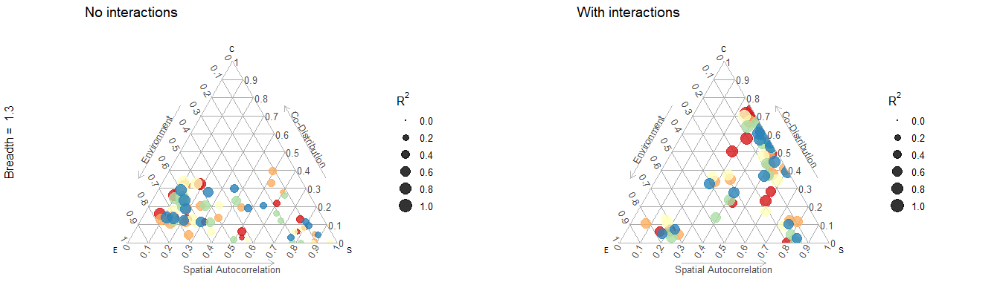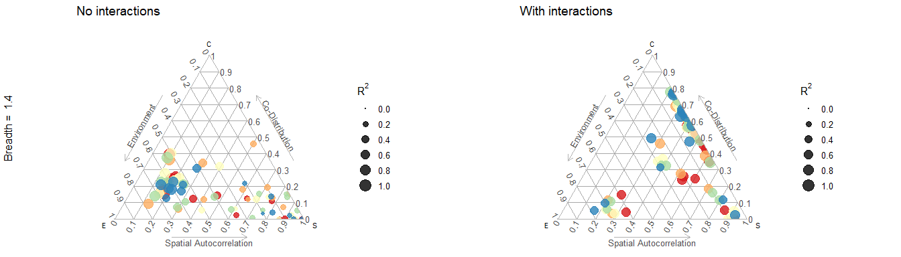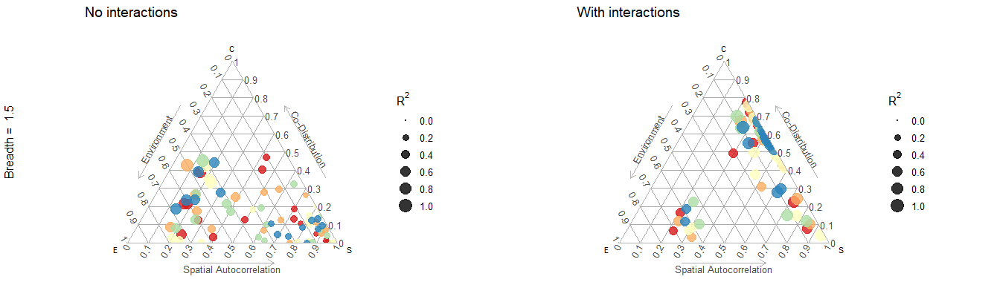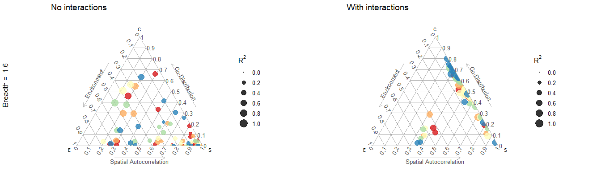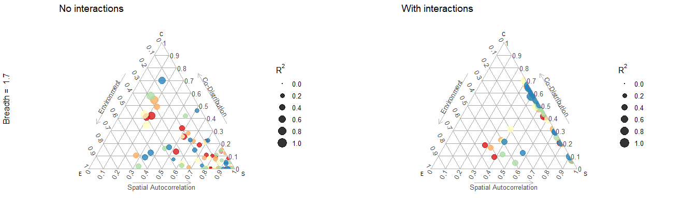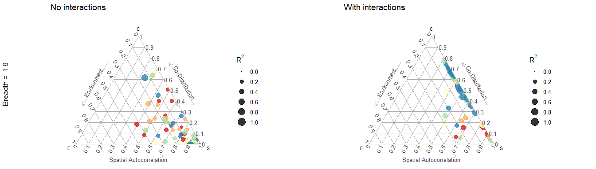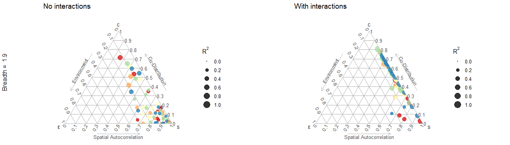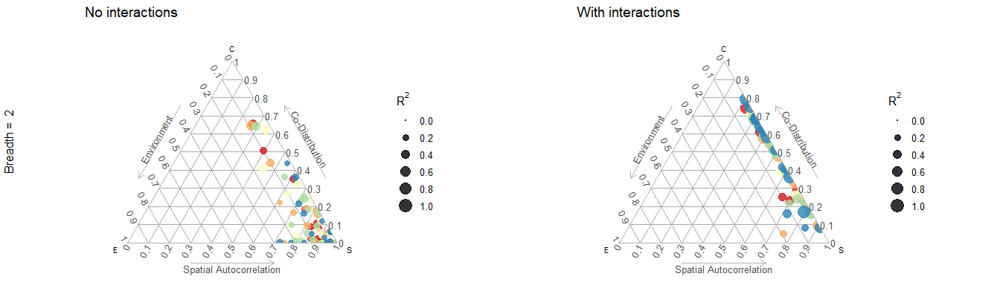

Species interaction matrices
----------------------------

This is the matrix \*\*A\* used for the simulations. 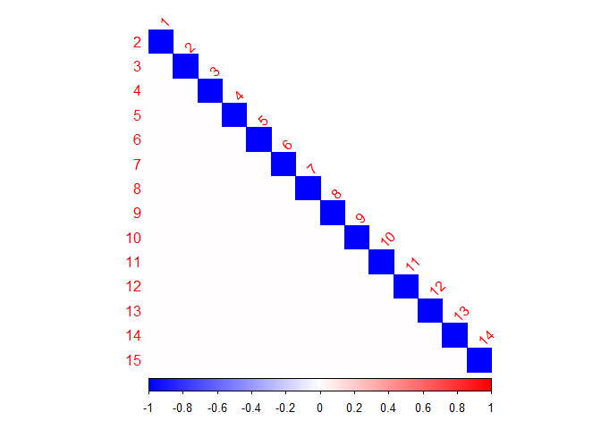

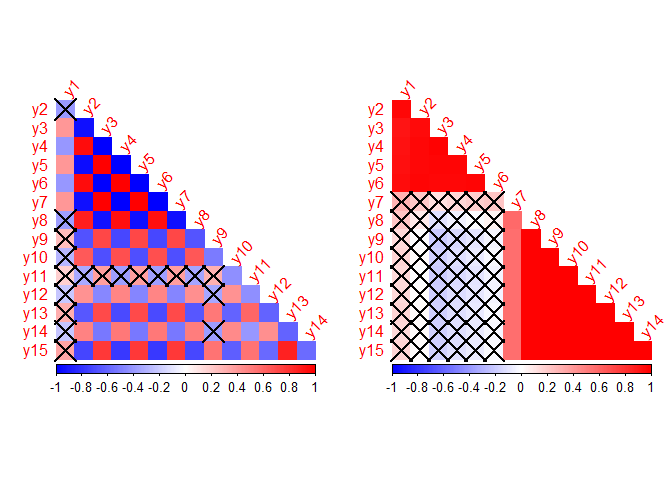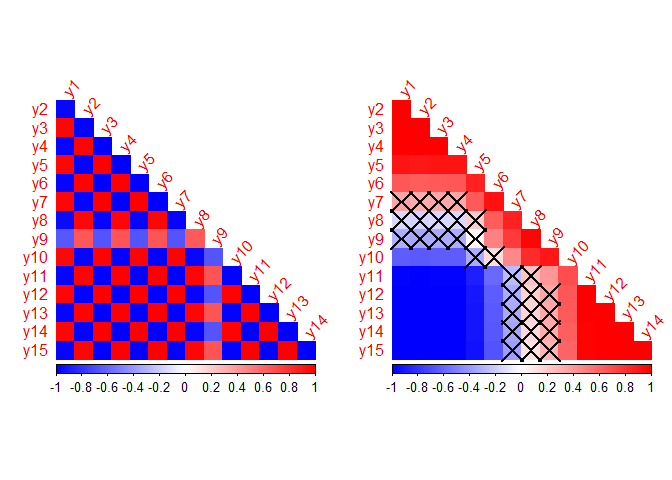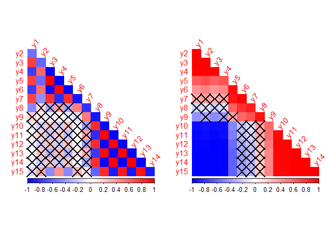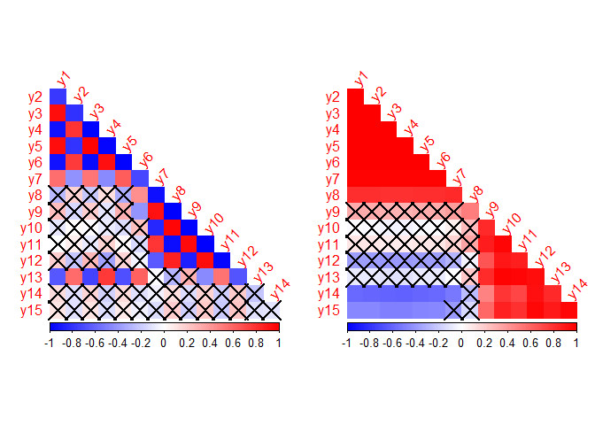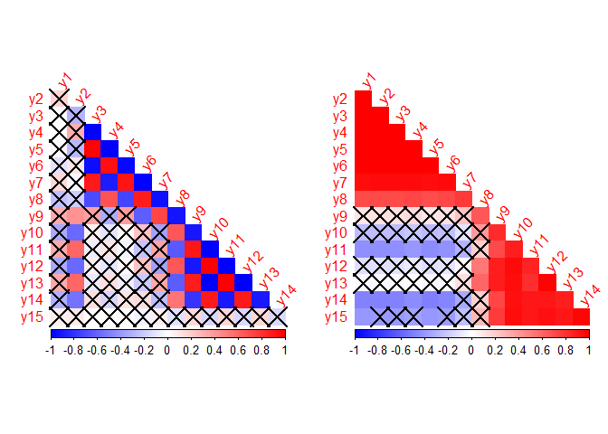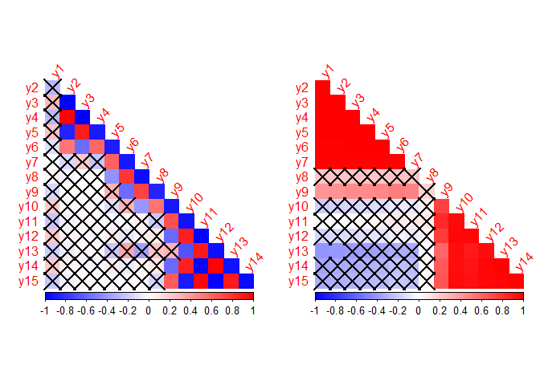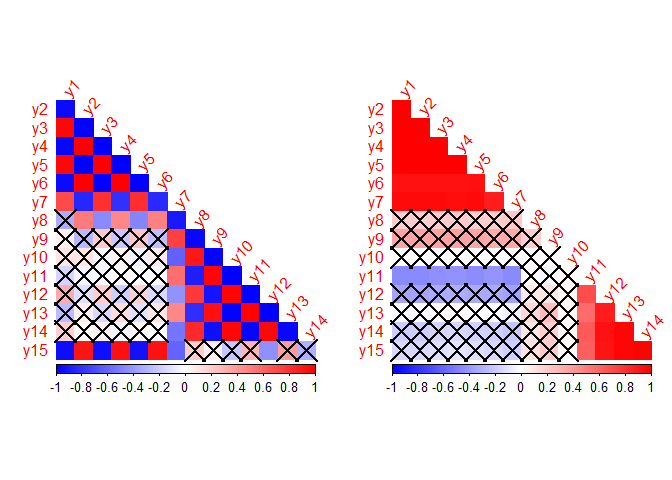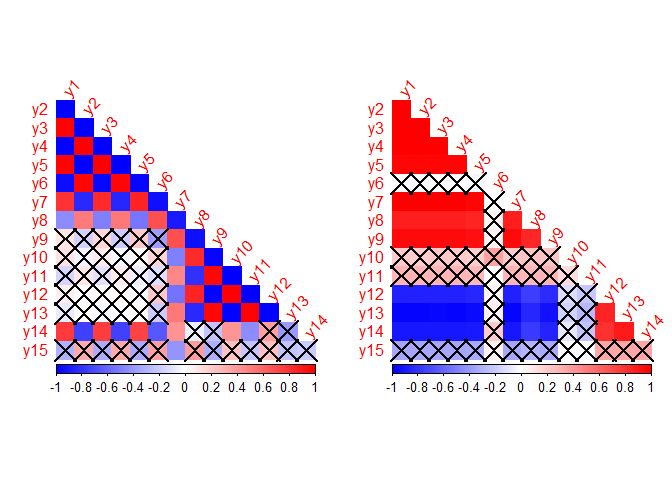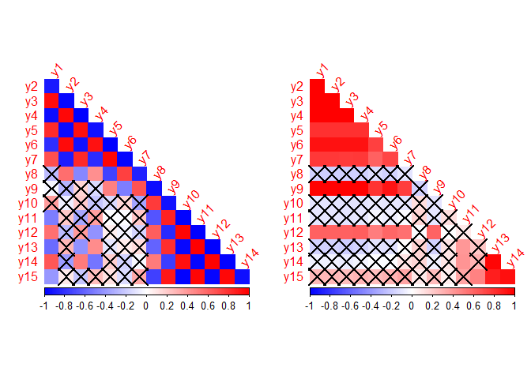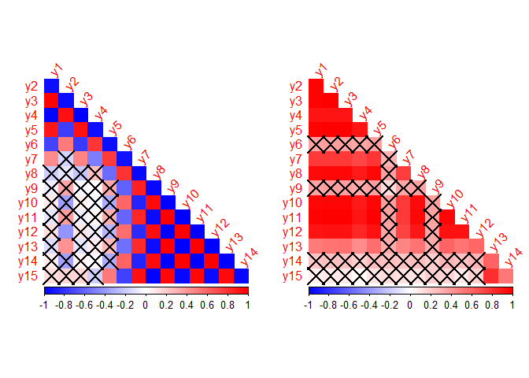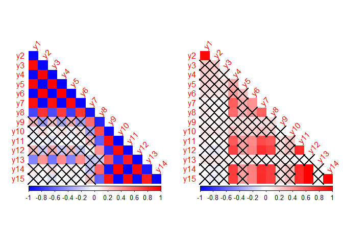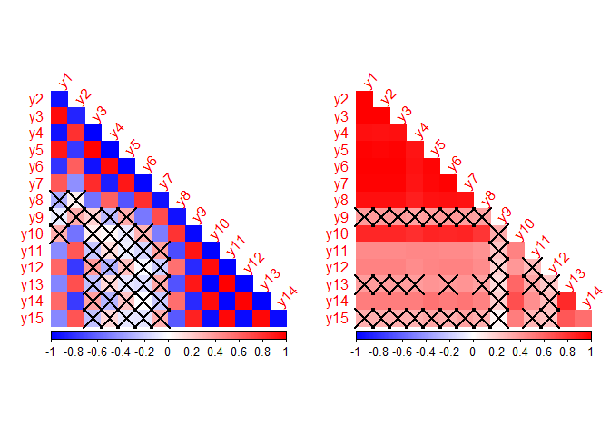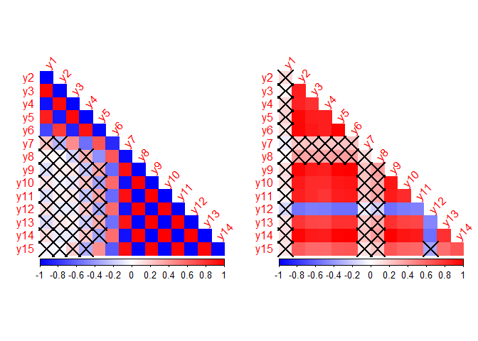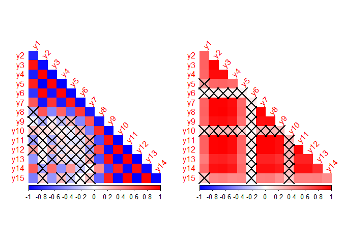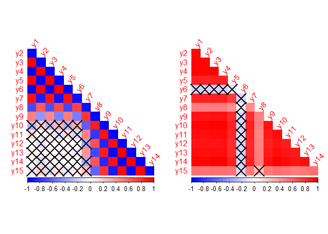
