Testing range of niche breadth with and without species interactions at different dispersal levels
================

Testing niche breadth with and without species interactions:

Dispersal at 0.001
==================

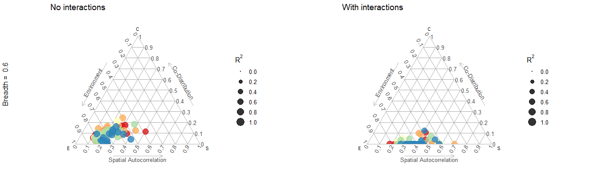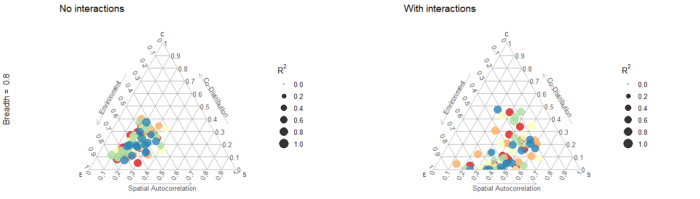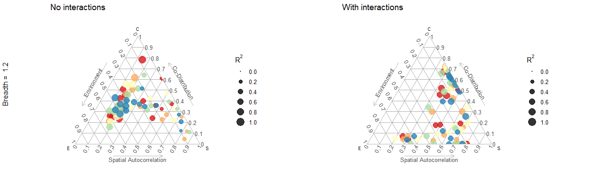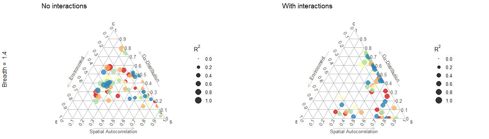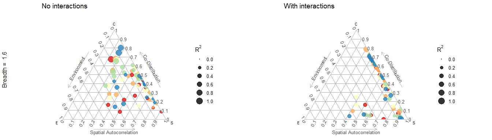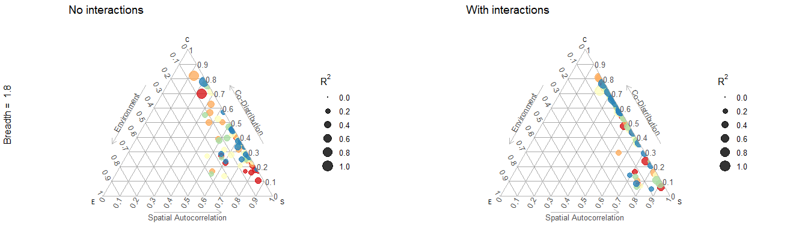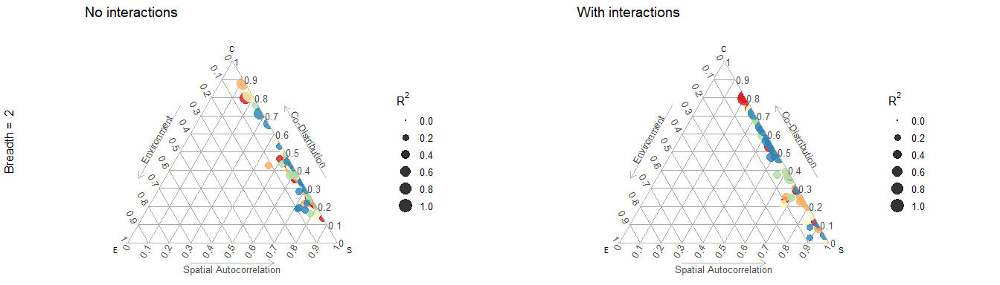

Dispersal at 0.005
==================

This is the average dispersal we used for most simulations in the past

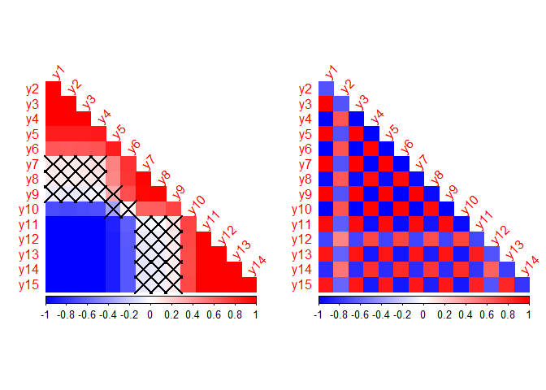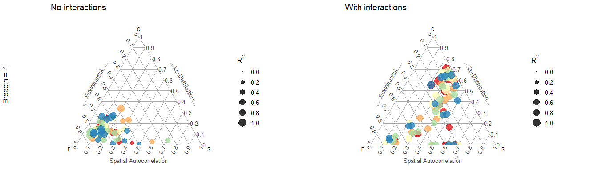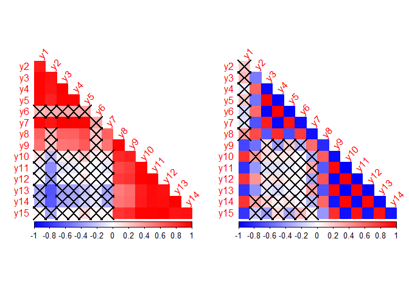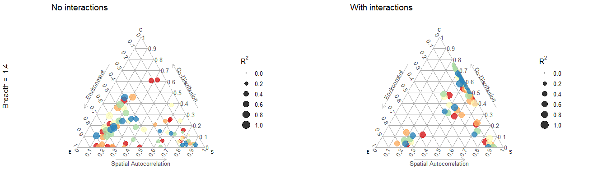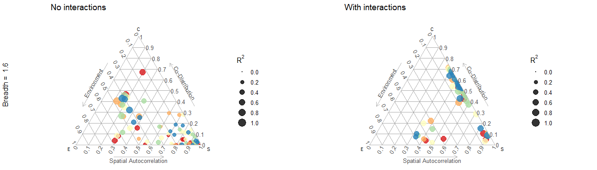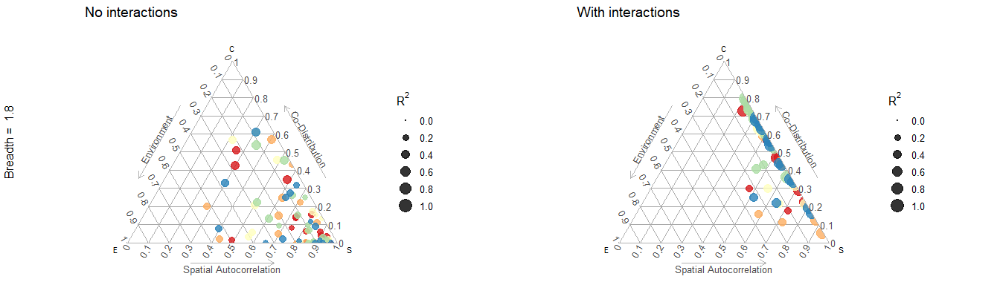

Dispersal at 0.015
==================

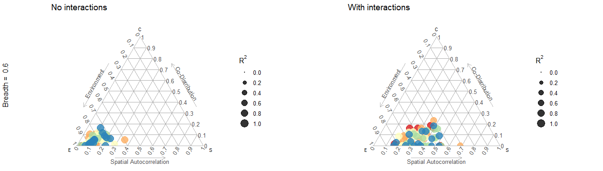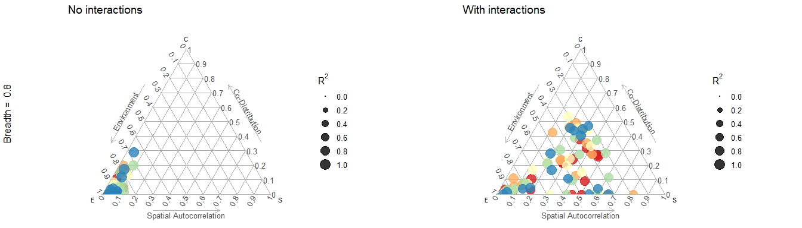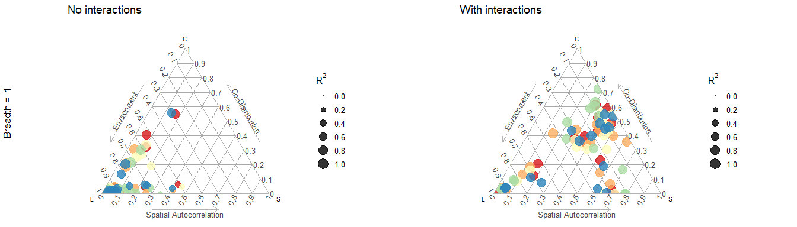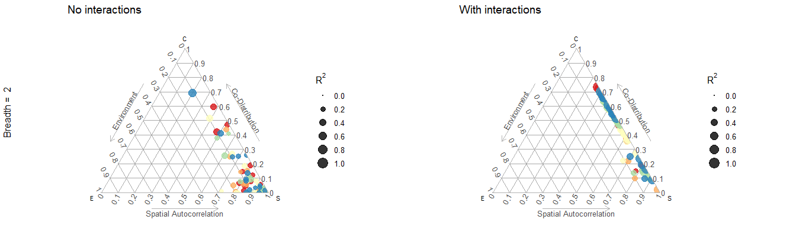

Dispersal at 0.05
=================

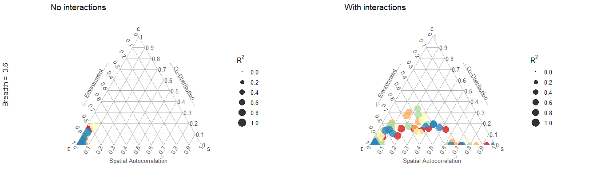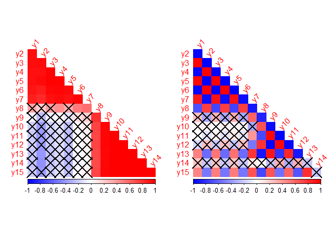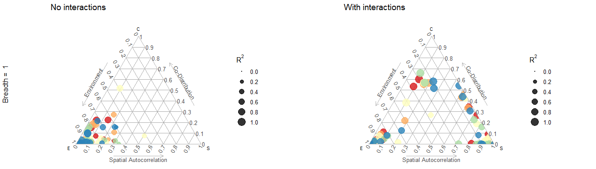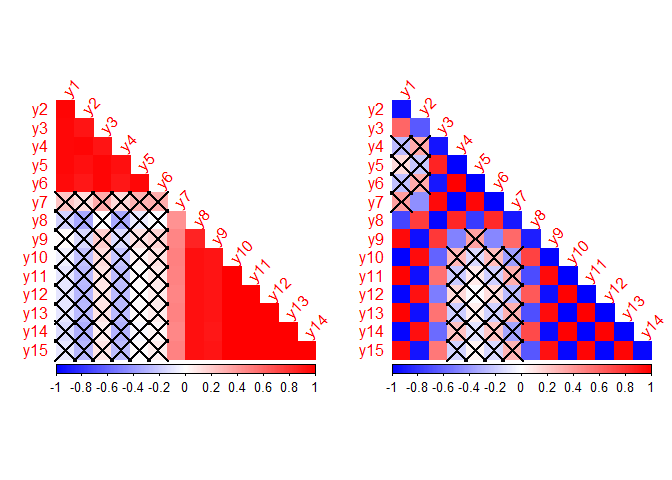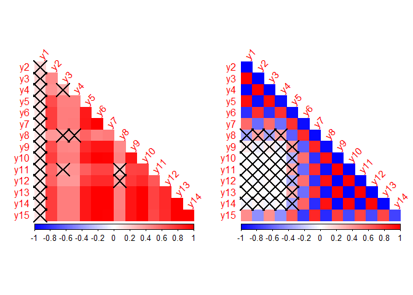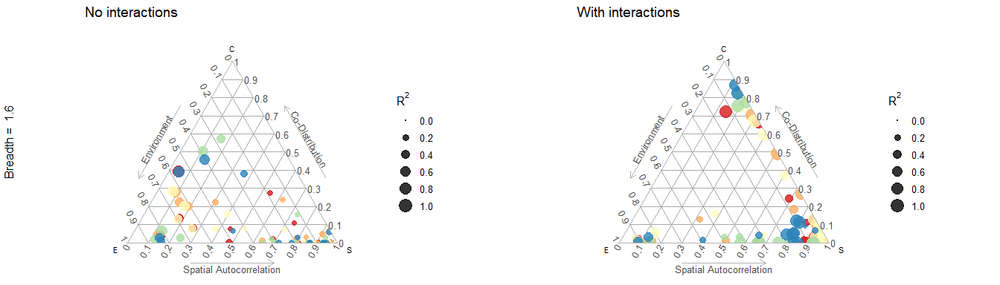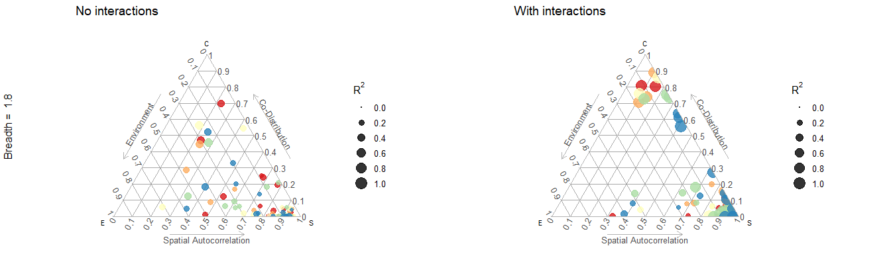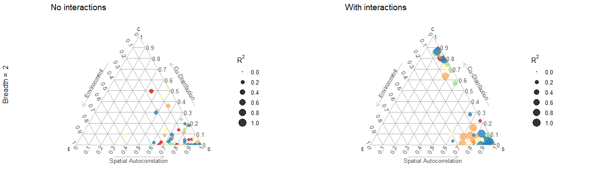

Dispersal at 0.1
================
