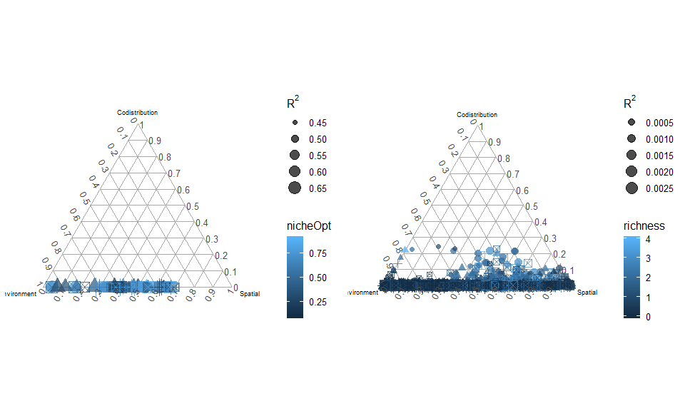

Figure 2 - comparisons between gaussian and quadratic response to environment
================
Javiera Rudolph
March 12, 2019

Scenario 1 - Parameters
=======================

| species |   nicheOpt|  nicheBreadth|  colProb|  dispersal|  intercol|  interext|
|:--------|----------:|-------------:|--------:|----------:|---------:|---------:|
| 1       |  0.1000000|           0.2|      0.4|      0.005|         0|         0|
| 2       |  0.1571429|           0.2|      0.4|      0.005|         0|         0|
| 3       |  0.2142857|           0.2|      0.4|      0.005|         0|         0|
| 4       |  0.2714286|           0.2|      0.4|      0.005|         0|         0|
| 5       |  0.3285714|           0.2|      0.4|      0.005|         0|         0|
| 6       |  0.3857143|           0.2|      0.4|      0.005|         0|         0|
| 7       |  0.4428571|           0.2|      0.4|      0.005|         0|         0|
| 8       |  0.5000000|           0.2|      0.4|      0.005|         0|         0|
| 9       |  0.5571429|           0.2|      0.4|      0.005|         0|         0|
| 10      |  0.6142857|           0.2|      0.4|      0.005|         0|         0|
| 11      |  0.6714286|           0.2|      0.4|      0.005|         0|         0|
| 12      |  0.7285714|           0.2|      0.4|      0.005|         0|         0|
| 13      |  0.7857143|           0.2|      0.4|      0.005|         0|         0|
| 14      |  0.8428571|           0.2|      0.4|      0.005|         0|         0|
| 15      |  0.9000000|           0.2|      0.4|      0.005|         0|         0|

Scenario 1 - Gaussian response
==============================

Scenario 1 - Quadratic response
===============================

Scenario 2 - Parameters
=======================

| species |   nicheOpt|  nicheBreadth|  colProb|  dispersal|  intercol|  interext|
|:--------|----------:|-------------:|--------:|----------:|---------:|---------:|
| 1       |  0.1000000|             1|      0.4|      0.005|         0|         0|
| 2       |  0.1571429|             1|      0.4|      0.005|         0|         0|
| 3       |  0.2142857|             1|      0.4|      0.005|         0|         0|
| 4       |  0.2714286|             1|      0.4|      0.005|         0|         0|
| 5       |  0.3285714|             1|      0.4|      0.005|         0|         0|
| 6       |  0.3857143|             1|      0.4|      0.005|         0|         0|
| 7       |  0.4428571|             1|      0.4|      0.005|         0|         0|
| 8       |  0.5000000|             1|      0.4|      0.005|         0|         0|
| 9       |  0.5571429|             1|      0.4|      0.005|         0|         0|
| 10      |  0.6142857|             1|      0.4|      0.005|         0|         0|
| 11      |  0.6714286|             1|      0.4|      0.005|         0|         0|
| 12      |  0.7285714|             1|      0.4|      0.005|         0|         0|
| 13      |  0.7857143|             1|      0.4|      0.005|         0|         0|
| 14      |  0.8428571|             1|      0.4|      0.005|         0|         0|
| 15      |  0.9000000|             1|      0.4|      0.005|         0|         0|

Scenario 2 - Gaussian response
==============================

Scenario 2 - Quadratic response
===============================

Scenario 3 - Parameters
=======================

| species |   nicheOpt|  nicheBreadth|  colProb|  dispersal|  intercol|  interext|
|:--------|----------:|-------------:|--------:|----------:|---------:|---------:|
| 1       |  0.1000000|           0.2|      0.4|      0.005|       1.5|       1.5|
| 2       |  0.1571429|           0.2|      0.4|      0.005|       1.5|       1.5|
| 3       |  0.2142857|           0.2|      0.4|      0.005|       1.5|       1.5|
| 4       |  0.2714286|           0.2|      0.4|      0.005|       1.5|       1.5|
| 5       |  0.3285714|           0.2|      0.4|      0.005|       1.5|       1.5|
| 6       |  0.3857143|           0.2|      0.4|      0.005|       1.5|       1.5|
| 7       |  0.4428571|           0.2|      0.4|      0.005|       1.5|       1.5|
| 8       |  0.5000000|           0.2|      0.4|      0.005|       1.5|       1.5|
| 9       |  0.5571429|           0.2|      0.4|      0.005|       1.5|       1.5|
| 10      |  0.6142857|           0.2|      0.4|      0.005|       1.5|       1.5|
| 11      |  0.6714286|           0.2|      0.4|      0.005|       1.5|       1.5|
| 12      |  0.7285714|           0.2|      0.4|      0.005|       1.5|       1.5|
| 13      |  0.7857143|           0.2|      0.4|      0.005|       1.5|       1.5|
| 14      |  0.8428571|           0.2|      0.4|      0.005|       1.5|       1.5|
| 15      |  0.9000000|           0.2|      0.4|      0.005|       1.5|       1.5|

Scenario 3 - Gaussian response
==============================

Scenario 3 - Quadratic response
===============================

Scenario 4 - Parameters
=======================

| species |   nicheOpt|  nicheBreadth|  colProb|  dispersal|  intercol|  interext|
|:--------|----------:|-------------:|--------:|----------:|---------:|---------:|
| 1       |  0.1000000|             1|      0.4|      0.005|       1.5|       1.5|
| 2       |  0.1571429|             1|      0.4|      0.005|       1.5|       1.5|
| 3       |  0.2142857|             1|      0.4|      0.005|       1.5|       1.5|
| 4       |  0.2714286|             1|      0.4|      0.005|       1.5|       1.5|
| 5       |  0.3285714|             1|      0.4|      0.005|       1.5|       1.5|
| 6       |  0.3857143|             1|      0.4|      0.005|       1.5|       1.5|
| 7       |  0.4428571|             1|      0.4|      0.005|       1.5|       1.5|
| 8       |  0.5000000|             1|      0.4|      0.005|       1.5|       1.5|
| 9       |  0.5571429|             1|      0.4|      0.005|       1.5|       1.5|
| 10      |  0.6142857|             1|      0.4|      0.005|       1.5|       1.5|
| 11      |  0.6714286|             1|      0.4|      0.005|       1.5|       1.5|
| 12      |  0.7285714|             1|      0.4|      0.005|       1.5|       1.5|
| 13      |  0.7857143|             1|      0.4|      0.005|       1.5|       1.5|
| 14      |  0.8428571|             1|      0.4|      0.005|       1.5|       1.5|
| 15      |  0.9000000|             1|      0.4|      0.005|       1.5|       1.5|

Scenario 4 - Gaussian response
==============================

Scenario 4 - Quadratic response
===============================

