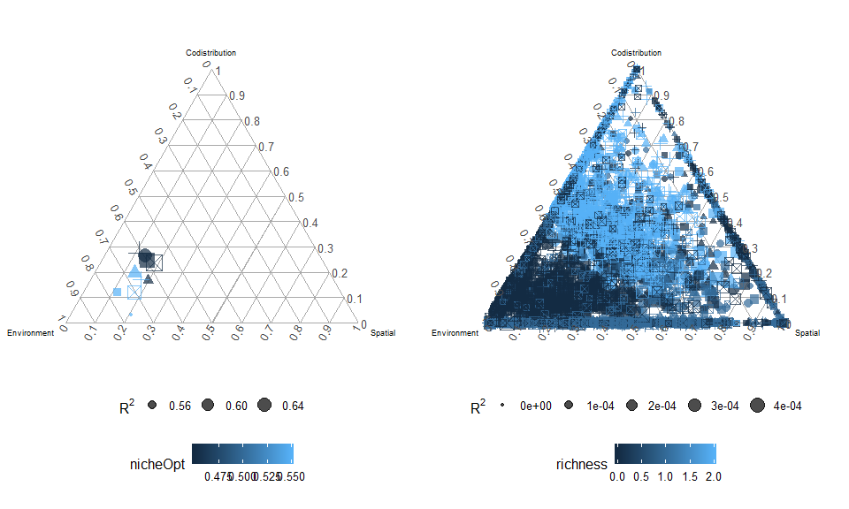
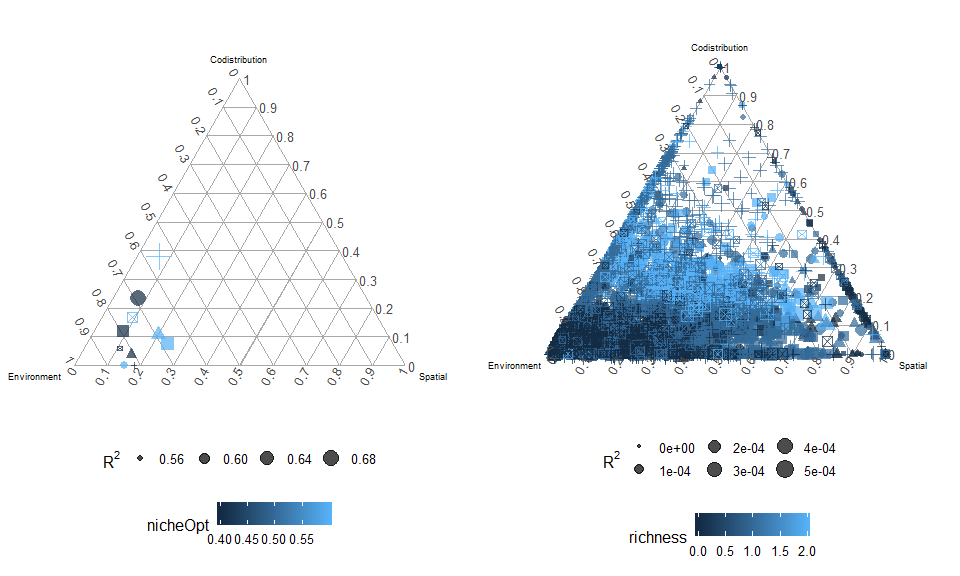
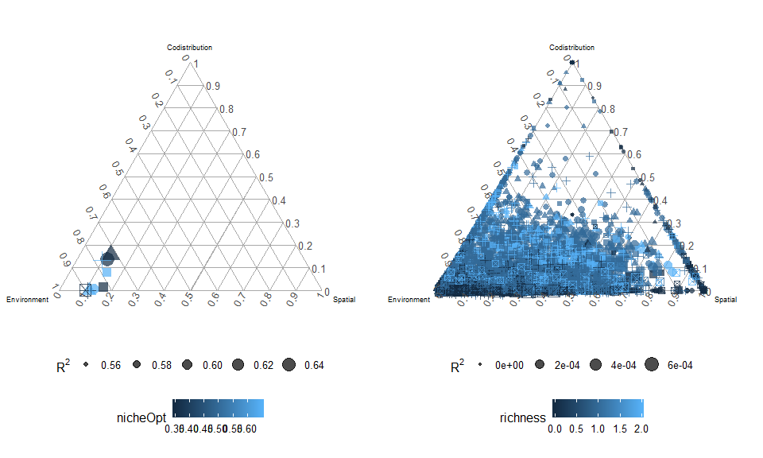
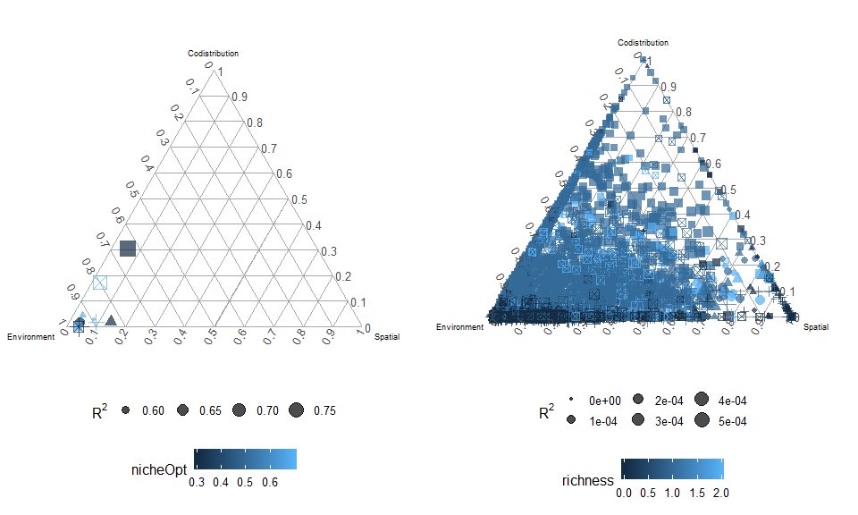
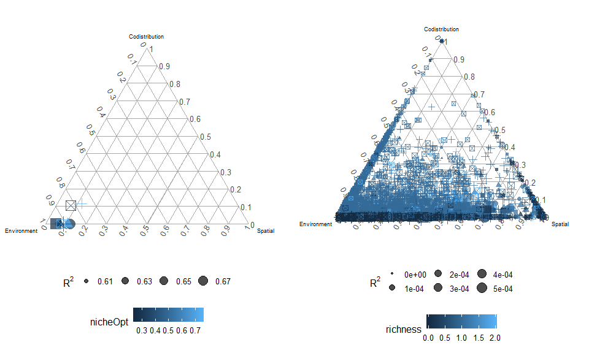
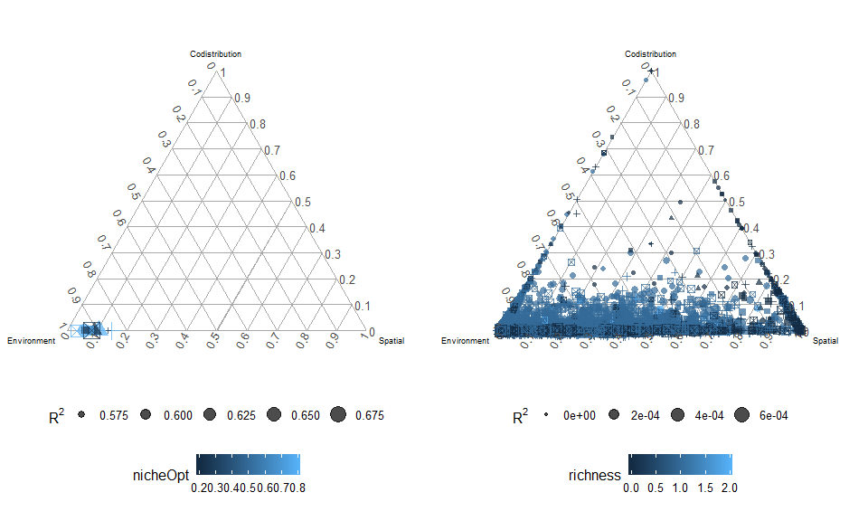
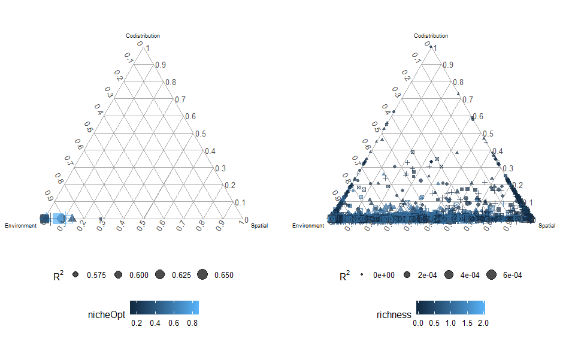
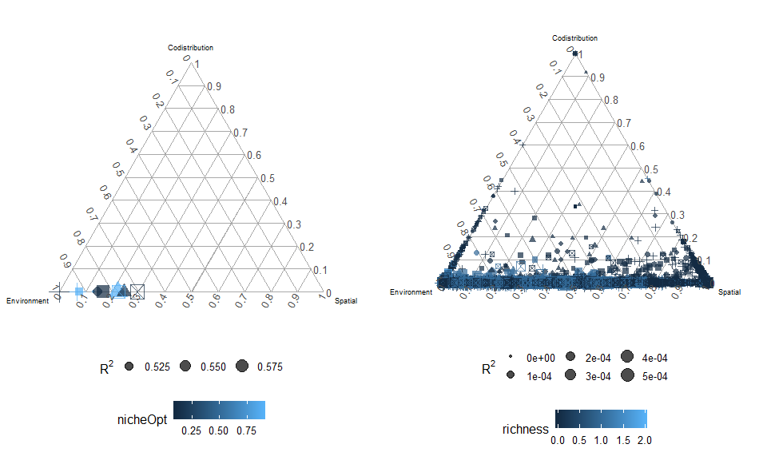

Two species niche comparisons
================
Javiera Rudolph
March 4, 2019

Scenario 1
==========

Both species have the same niche optima, starting at 0.5 

Scenario 2
==========

Species 1: 0.55, species 2: 0.45 

Scenario 3
==========

Species 1: 0.60, species 2: 0.40 

Scenario 4
==========

Species 1: 0.65, species 2: 0.35 

Scenario 5
==========

Species 1: 0.70, species 2: 0.30 

Scenario 6
==========

Species 1: 0.75, species 2: 0.25 

Scenario 7
==========

Species 1: 0.80, species 2: 0.20 

Scenario 8
==========

Species 1: 0.85, species 2: 0.15 

Scenario 9
==========

Species 1: 0.90, species 2: 0.10 
