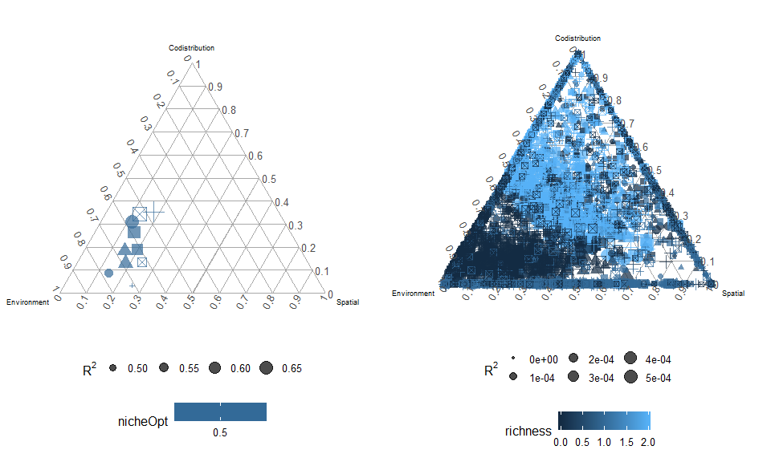

Two species niche comparisons
================
Javiera Rudolph
March 4, 2019

``` r
spp1niche <- seq(from = 0.5, to = 0.9, by = 0.05)
spp2niche <- rev(seq(from = 0.1, to = 0.5, by = 0.05))

folderpath <- "outputs/20190304-two_spp_niche_comparisons/"
```

Workflow: 1. read the files with the functions, create a dataframe that is used for plotting 2. Save that dataframe as a csv file in the output folder

Scenario 1:
===========

Both have a niche optima of 0.5

``` r
spp <- doItAll_twosppNichecomp(outPath = folderpath, scenarioNum = "scenario1", indSites = FALSE) %>% 
  make_tern_plot(., varShape = "species", varColor = "nicheOpt")
```

    ## Joining, by = "species"
    ## Joining, by = "species"
    ## Joining, by = "species"
    ## Joining, by = "species"
    ## Joining, by = "species"
    ## Joining, by = "species"
    ## Joining, by = "species"

    ## Joining, by = "identifier"

``` r
sites <- doItAll_twosppNichecomp(outPath = folderpath, scenarioNum = "scenario1", indSites = TRUE) %>% 
  make_tern_plot(., varColor = "richness")
```

    ## Joining, by = "identifier"

``` r
grid.arrange(arrangeGrob(spp), arrangeGrob(sites), ncol = 2)
```


